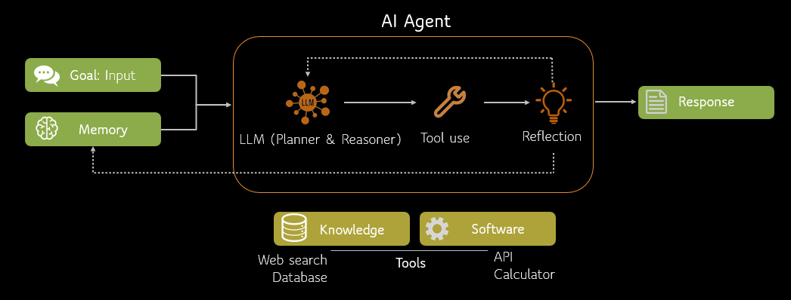
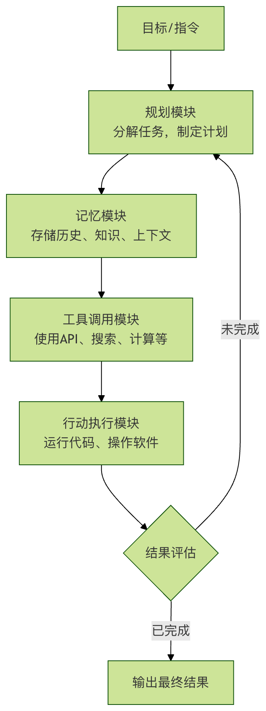
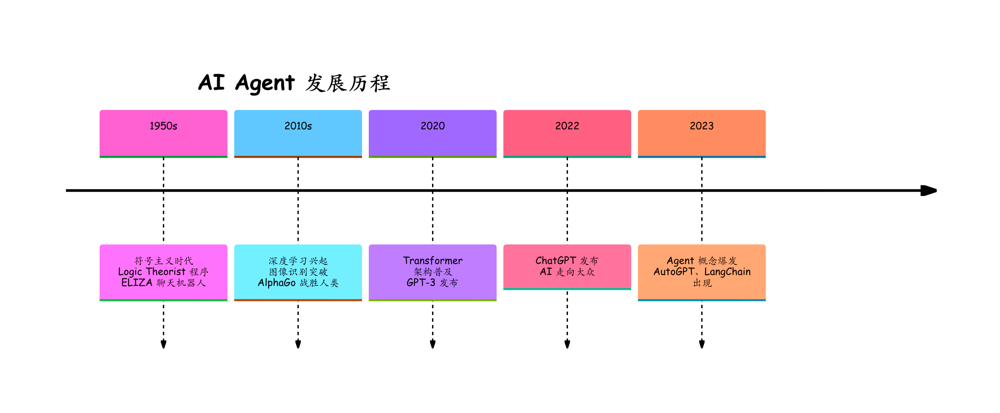

## 智能体（AI Agent） 简介
在当今科技浪潮中，人工智能（AI）深度融入生活与工作的背后，**AI Agent（智能体）** 是支撑从对话助手到自主任务程序的核心概念——它不是单纯的聊天工具，而是能像 **数字员工** 一样接任务、拆步骤、执行动作的自动化实体，只要任务可拆解为操作流程，就能被 AI Agent 接管。

<Mark>Agent = LLM (大脑) + Planning (规划) + Tool use (执行) + Memory (记忆)。</Mark>

- LLM (大脑)： 作为核心推理机，负责理解意图、生成文本和进行逻辑判断。
- Planning (规划)： 能够将复杂的目标（如"帮我策划一场技术沙龙"）拆解成可执行的步骤。
- Memory (记忆)： 记录对话历史（短期）和存储专业知识库（长期）。
- Tool Use (工具使用)： 能够根据需求去查谷歌搜索、读数据库、甚至跑 Python 代码。

### Agent 与传统 AI 模型的区别
|维度	| 传统 AI 模型	| AI Agent |
|--|--|--|
|交互方式	| 单次输入输出	| 多轮对话、持续交互 |
|决策能力	| 基于输入直接推理	| 规划、反思、迭代优化 |
|工具使用	| 无法主动调用外部工具	| 可调用搜索、计算器、API 等 |
|记忆机制	| 仅限当前上下文	| 短期+长期记忆 |
|目标导向	| 完成单一预测任务	| 完成复杂目标 |
|错误处理	| 输出即结束	| 可自我纠错、重试 |

#### 核心模式：从 Prompt 到 Reasoning Loop
普通的 LLM 只是 **One-shot（一次性）** 的响应，而 Agent 的核心在于 **Iterative（迭代）**。

**ReAct 模式 (Reason + Act)** 是目前最主流的 Agent 推理逻辑：
- Thought (思考)： 模型描述当前要做什么，为什么要这么做。
- Action (行动)： 模型选择一个工具（如：Google Search）。
- Observation (观察)： 模型读取工具返回的结果。
- Repeat (循环)： 重复上述步骤，直到得出最终答案。

### AI Agent 构成：像人一样思考与行动
一个功能完整的 AI Agent 通常模仿人类的认知和行动循环，包含以下几个关键模块：

#### 1、规划模块：任务的大脑与指挥官
这是 Agent 的思考中枢。它负责将用户模糊的、高层的目标（如：分析公司上个季度的销售数据）分解成一系列清晰的、可执行的子任务步骤。

- 任务分解：将大目标拆解为小步骤。例如：1. 连接数据库；2. 提取Q3销售数据；3. 按产品和地区分类；4. 计算环比增长率；5. 生成可视化图表。
- 反思与调整：Agent 会评估每一步行动的结果。如果失败了（比如数据库连不上），它会反思原因，并调整计划（例如尝试另一种连接方式或请求用户提供密码）。

#### 2、记忆模块：经验的笔记本
Agent 需要有记忆才能进行连贯的、基于上下文的对话和操作。
- 短期记忆：记住当前对话的上下文，确保回答不跑题。
- 长期记忆：将重要的交互信息、学到的知识存储到数据库或向量数据库中，供未来查询和使用，实现越用越聪明。

#### 3、工具调用模块：灵活的双手
这是 Agent 从思考者变为行动者的关键。它可以通过应用程序接口（API）调用外部工具来扩展自身能力。
##### 常见工具：
- 搜索工具：联网获取最新信息。
- 计算器/代码解释器：进行数学运算或运行代码处理数据。
- 软件操作：通过 API 发送邮件、操作电子表格、控制智能家居。
- 专业工具：调用专业软件进行图像生成、语音合成、数据分析等。

### 核心特征
一个合格的 AI Agent 通常具备以下特征：

#### 1. 自主性（Autonomy）

无需人类逐步指导，能够独立运作
自己决定下一步该做什么
示例：你说"帮我订明天去上海的机票"，Agent 会自动查询航班、比较价格、选择合适选项

#### 2. 反应性（Reactivity）

能够感知环境变化并及时响应
根据新信息调整行为
示例：订票时发现航班取消，自动寻找替代方案
#### 3. 主动性（Proactivity）

不仅被动响应，还能主动采取行动
有目标导向的行为
示例：发现机票价格波动，主动提醒用户最佳购买时机
#### 4. 社交能力（Social Ability）

能与人类或其他 Agent 交互
理解自然语言，进行多轮对话
示例：在订票过程中询问用户偏好（靠窗/靠走廊）
#### 5. 学习能力（Learning）

从历史交互中学习
记住用户偏好和上下文
示例：记住你喜欢早班飞机和靠窗座位

### AI Agent 的发展历程
时间线

#### 阶段一：概念萌芽期（1950s-2010s）
1950s：图灵测试提出，Agent 概念初现
1990s：多智能体系统研究兴起
2000s：规则驱动的聊天机器人（如 ELIZA）
特点：基于规则，能力有限

#### 阶段二：深度学习赋能期（2010s-2020）
2012：深度学习在 ImageNet 取得突破
2017：Transformer 架构问世
2018-2020：BERT、GPT 系列模型发布
特点：理解能力提升，但仍是"被动工具"

#### 阶段三：大模型 Agent 爆发期（2021-至今）
2022.11：ChatGPT 发布，展现强大对话能力
2023.03：GPT-4 + Plugins，首次实现工具调用
2023.03：AutoGPT 开源，自主 Agent 概念验证
2023.05：LangChain、LlamaIndex 等框架成熟
2024-2025：企业级 Agent 应用大规模落地
特点：真正的自主性、工具使用、任务规划

### AI Agent的主要类型与应用场景
根据其复杂度和自主性，AI Agent 可以分为不同类型，应用于各种场景：

|类型|特点|应用场景举例|
|--|--|--|
|单一任务 Agent|专注于完成一件特定事情，功能专一。|智能客服机器人、自动数据录入助手、个人日程提醒助手。|
|多模态 Agent|能理解和处理文本、图像、语音等多种信息。|根据草图生成网站代码、分析医学影像并生成报告、视频内容自动摘要。|
|自主 Agent|拥有较高自主性，可长期运行并主动管理复杂目标。|自动驾驶汽车、自动化股票交易系统、智能游戏 NPC（非玩家角色）。|
|模拟 Agent|在虚拟环境中进行模拟、测试和训练。|训练机器人完成抓取任务、模拟城市交通流量优化、新药研发的分子模拟。|

#### 当前热门的实际应用：
* AI 编程助手：如 Devin，能独立完成从需求分析、写代码到测试部署的全流程。
* AI 科研助手：自动阅读大量文献，提出假设，设计实验方案。
* 个人生活助理：管理你的邮件、行程，自动订餐、购物比价。
* 企业流程自动化：自动处理报销单、生成周报、跟进客户合同。
