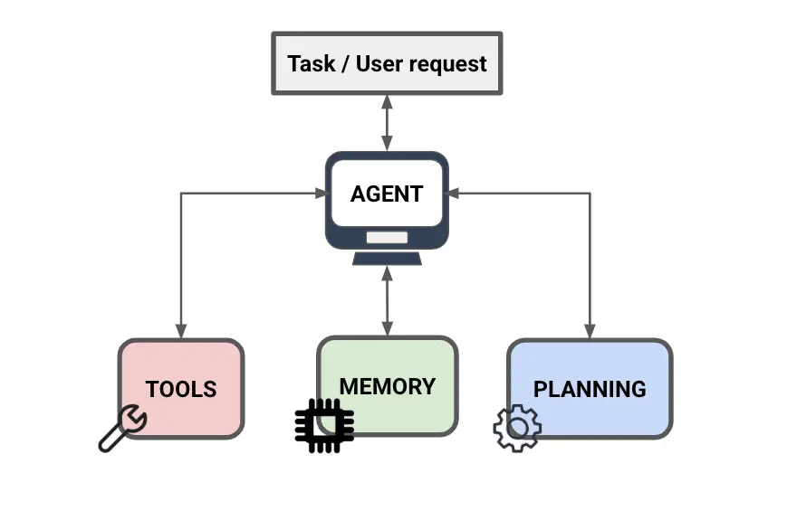
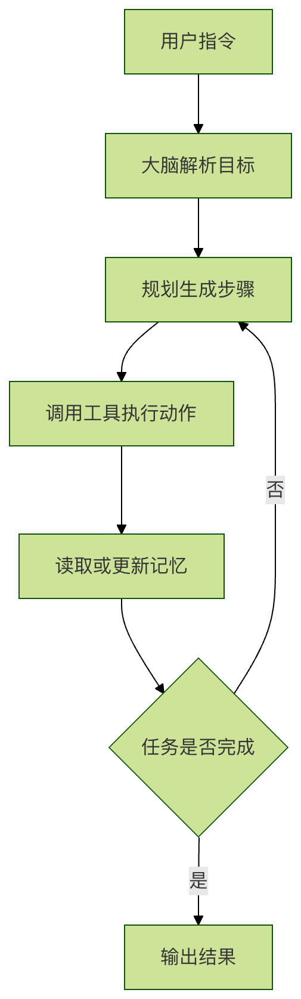

## AI Agent 核心组件
如果把一个 AI Agent 比作一家智能餐厅，它是怎么把你的需求变成菜品端上来的呢？这离不开它的四大核心组件：大脑、工具、记忆、规划。

大脑：负责听懂点单、判定目标、决定顺序，是餐厅的指挥中心。
工具：负责实际动手，包括切配、烹饪、采购等动作，把决策转成可执行操作。
记忆：负责记录顾客偏好、当前步骤、已处理内容，保证流程不混乱、不重复。
规划：负责把整道菜拆成步骤，确定先后关系，确保任务按流程推进到完成。

## 四大核心组件

### 1、大脑 (Brain) —— 也就是大模型
角色：餐厅的主厨兼经理。

这是 Agent 最核心的部分（比如 GPT-4, Claude, DeepSeek，通义千问）。

- 它负责听懂你想吃什么（理解意图）。
- 它负责指挥其他人干活（决策）。
- 如果没有它，整个餐厅就瘫痪了。
### 2、工具 (Tools) —— 厨房里的设备
角色：厨具和帮手。

光有主厨（大脑）是不够的，还得有锅碗瓢盆才能做菜。
对于 AI Agent 来说，工具就是：

- 联网搜索（像去菜市场买新鲜食材）
- 代码解释器（像精密的烤箱，处理复杂计算）
- 画图工具（像摆盘师，负责美观）
- API 接口（像外卖小哥，连接外部世界）
### 3、记忆 (Memory) —— 顾客记录本
角色：服务员的记性。

你肯定不喜欢每次去餐厅都要重新报一遍：我不吃香菜！

Agent 的记忆分为两种：

- 短期记忆：记住刚才你说了啥（比如你刚点了鱼，下一句说"要微辣"，它知道是指鱼）。
- 长期记忆：记住你的长期偏好（比如你是素食主义者，或者你的家庭住址）。
### 4、规划 (Planning) —— 烹饪流程单
角色：后厨的出餐 SOP。

当你点了一份佛跳墙，主厨不会乱做，而是会在脑子里生成一个清单：

1.先备料（鲍鱼、海参…）
2.再熬汤
3.最后慢炖

Agent 也是一样。当你给它一个复杂任务（比如"写一份竞品分析报告"），它会自己拆解：
- 第一步：去搜集竞品 A、B、C 的资料。
- 第二步：对比它们的价格和功能。
- 第三步：把对比结果写成文章。
- 第四步：检查一遍有没有错别字。

总结
当你对 Agent 说：帮我查一下明天北京的天气，如果是雨天，帮我写个提醒发给小王。

## Agent 内部是这样运转的：

1. 🧠 大脑：听到指令，分析出两个任务：查天气、发提醒。
2. 📋 规划：先查天气 -> 判断是否下雨 -> (如果是) 写提醒 -> 发送。
3. 🛠️ 工具：调用"天气查询工具"一看 —— 明天有雨。
4. 📝 记忆：去通讯录（记忆库）里找"小王"的联系方式。
5. 🛠️ 工具：调用"发送消息工具"，把提醒发出去。

运行过程示意图:

