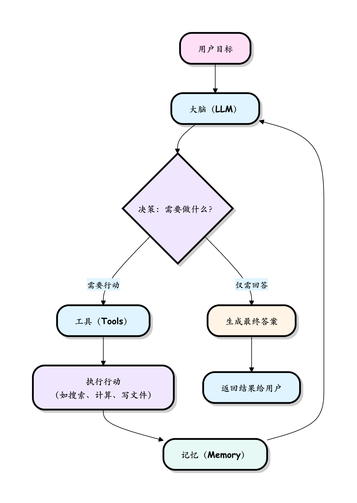
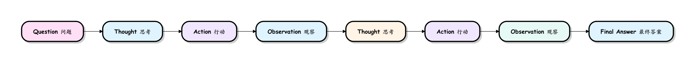
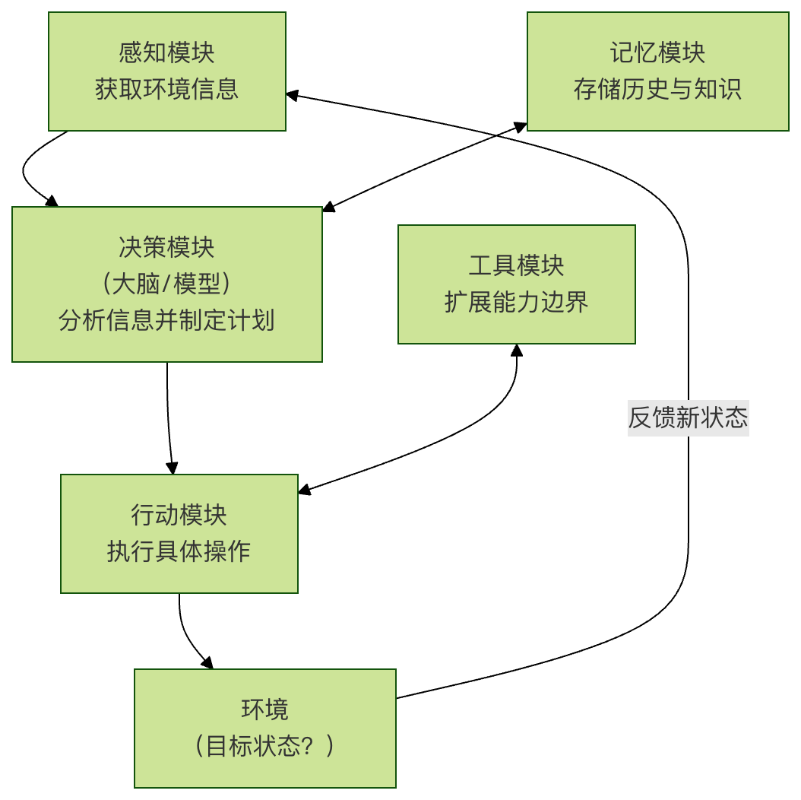

## AI Agent 工作原理
一个典型的 AI Agent 由三个关键部分协同工作，我们可以用一个生动的比喻来理解：

### 1. 大脑 (The Brain) - 大型语言模型 (LLM)

角色：Agent 的决策中心和推理引擎。
功能：理解用户输入的目标和上下文，分析当前状况，然后决定下一步该做什么（是直接回答问题，还是调用某个工具），它负责规划和分解复杂任务。
比喻：就像公司的 CEO 或指挥官，负责战略思考、任务规划和下达指令。
### 2. 工具 (Tools) - 可执行的动作

角色：Agent 的手和脚，是其能力的延伸。
功能：一个个具体的函数或 API，让 Agent 能够与外部世界互动。例如：search_web（搜索）、execute_python_code（运行代码）、read_file（读文件）、send_email（发邮件）等。
比喻：就像员工可用的 各种办公软件和技能，如 Excel、浏览器、电话、打印机。
### 3. 记忆 (Memory) - 对话与经验的存储

角色：记录工作过程，保证任务的连贯性。
功能：
短期记忆：保存当前对话的历史，让 Agent 记得之前说过什么、做过什么。
长期记忆：可以存储更持久的信息（例如用户偏好、历史任务结果），供未来任务参考。
比喻：就像员工的 工作笔记和项目档案，避免重复劳动，让每次工作都能基于之前的经验。




## 工作流程：ReAct 循环
AI Agent 通常遵循一个名为 ReAct = Reasoning（推理）+ Acting（行动） 的经典思维范式，这是一个持续的 思考-行动 循环，直到任务完成为止。

ReAct 是一种让 LLM 交替进行推理和行动的框架，通过让模型显式地展示思考过程来提高复杂任务的解决能力。



让我们用一个具体的例子来跟踪这个循环：帮我在北京找一家评分高于 4.5 的意大利餐厅，并告诉我它的地址和招牌菜。

循环步骤分解：

### 1、思考 (Think/Reason)：

大脑分析：Agent 的大脑（LLM）接收到目标，它会分析：这是一个信息查询任务，我需要先找到符合条件的餐厅，然后获取其详细信息。我应该使用搜索工具。
生成指令：大脑生成一个清晰的内部指令，例如：我需要调用 search_web 工具，关键词是北京意大利餐厅评分 4.5。
### 2、行动 (Act)：

调用工具：Agent 根据上一步的指令，调用 search_web 工具并传入关键词。
执行：工具开始工作，在互联网上执行搜索，并返回一堆原始的搜索结果列表。
### 3、观察 (Observe)：

接收反馈：Agent 获取到工具执行的结果（即搜索到的网页摘要或链接列表）。
### 4、再思考 (Think Again)：

大脑再分析：大脑看到搜索结果后，继续分析：我已经得到了一些餐厅名字。但用户要的是地址和招牌菜。我需要选择第一个结果（比如：Bottega 意库），然后调用工具获取它的详细信息。
生成新指令：调用 get_restaurant_details 工具，餐厅名称为 Bottega 意库。
### 5、再行动 (Act Again) -> 再观察 (Observe Again)：

这个思考-行动-观察的循环会继续，直到大脑认为已经收集到足够的信息来达成目标。
### 6、最终响应 (Final Answer)：

当大脑判断任务完成后，它会将所有的观察结果（记忆）整合起来，生成一个结构化、人性化的最终答案给用户："找到一家符合要求的餐厅：Bottega 意库。地址：北京市朝阳区三里屯路 XX 号。招牌菜：黑松露披萨、手工提拉米苏。"
这个 思考 -> 行动 -> 观察 -> 再思考... 的循环，就是 AI Agent 自主完成复杂任务的核心动力机制。


## Python 中实现 AI Agent
一个 AI Agent 系统通常由几个核心模块协同工作。

理解这个架构，有助于我们明白它是如何思考和行动的。



### 1. 感知模块
这是 Agent 的眼睛和耳朵，它负责从环境中获取信息，环境可以是：

数字世界：一段文本、一个网页、数据库中的记录、API 返回的数据。
物理世界（通过硬件）：摄像头图像、麦克风音频、传感器数据。
示例代码（模拟感知文本输入）：

实例
```python
# 一个简单的感知函数，用于接收用户输入
def perceive_from_environment():
    """
    从环境中感知信息。
    在此示例中，环境是命令行中的用户输入。
    """
    user_input = input("请输入您的指令或问题：")
    print(f"[感知模块] 接收到信息：'{user_input}'")
    return user_input

# 获取感知信息
current_observation = perceive_from_environment()
```

### 2. 决策模块（大脑）
这是 Agent 的核心，通常由一个AI模型（如大语言模型 LLM）驱动。它负责：

理解感知到的信息。
推理当前状况。
规划下一步或一系列行动以达到目标。
调用必要的工具。
示例代码（模拟一个基于规则的简单决策）：

实例
```python
# 根据感知信息做出简单决策
def make_decision(observation):
    """
    根据感知信息做出简单决策。
    这是一个基于规则的示例，实际中通常由复杂的AI模型完成。
    """
    print(f"[决策模块] 正在分析信息：'{observation}'")
   
    if "天气" in observation:
def make_decision(observation):
    """
    根据感知信息做出简单决策。
    这是一个基于规则的示例，实际中通常由复杂的AI模型完成。
    """
    print(f"[决策模块] 正在分析信息：'{observation}'")
   
    if "天气" in observation:
        decision = "调用天气查询工具"
    elif "计算" in observation:
        decision = "调用计算器工具"
    elif "结束" in observation:
        decision = "执行终止动作"
    else:
        decision = "进行通用对话回应"
   
    print(f"[决策模块] 决策结果：{decision}")
    return decision

# 基于感知做出决策
current_decision = make_decision(current_observation)
```
### 3. 行动模块
决策模块输出的是想法，行动模块则负责将想法变成现实。它执行具体的操作，从而影响环境。

数字行动：在屏幕上输出答案、点击按钮、调用一个函数、写入文件。
物理行动（通过控制硬件）：控制机械臂移动、让音箱播放声音。
示例代码（模拟执行行动）：

实例
```python
def execute_action(decision):
    """
    执行决策模块给出的指令。
    """
    print(f"[行动模块] 正在执行：{decision}")
   
    if decision == "调用天气查询工具":
        # 这里可以是一个真实的API调用
        result = "北京：晴，25℃。"
    elif decision == "调用计算器工具":
        result = "1+1=2"
    elif decision == "执行终止动作":
        result = "任务结束。"
        print(result)
        exit() # 结束程序
    else:
        result = f"我已理解您的意思：'{decision}'"
   
    print(f"[行动模块] 行动结果：{result}")
    return result

# 执行决策
action_result = execute_action(current_decision)
```
### 4. 记忆模块
为了让 Agent 更智能，它需要记忆。记忆模块存储了：

短期记忆/对话历史：本次交互中说过的话，避免重复回答。
长期记忆/知识库：通过向量数据库等技术存储的专属知识，用于增强模型的能力。
### 5. 工具模块
模型本身的能力是有限的（比如不知道实时天气、不能做复杂计算）。工具模块为 Agent 提供了瑞士军刀，极大地扩展了其能力边界。工具可以是一个函数、一个 API 或一个完整的软件。

示例：为 Agent 扩展一个计算工具

实例
```python
# 定义一个工具函数
def calculator_tool(expression):
    """一个简单的计算器工具，用于执行数学表达式（注意：实际使用中需考虑安全性）。"""
    try:
        # 警告：在生产环境中，直接使用eval是危险的，此处仅用于演示。
        result = eval(expression)
        return f"计算结果：{expression} = {result}"
    except Exception as e:
        return f"计算错误：{e}"

# 假设决策模块决定调用此工具
tool_result = calculator_tool("3 + 5 * 2")
print(tool_result) # 输出：计算结果：3 + 5 * 2 = 13
```


## 实践练习：构建一个简单的命令行 AI Agent
现在，让我们将上面的模块组合起来，创建一个能进行简单对话和工具调用的微型 Agent。

实例
```python
# 简单AI Agent示例
import random

# 1. 工具定义
def get_weather(city):
    """模拟天气查询工具"""
    weather_options = ["晴", "多云", "小雨", "大风"]
    temperature = random.randint(15, 35)
    return f"{city}的天气是{random.choice(weather_options)}，气温{temperature}℃。"

def simple_calculator(a, b, operator):
    """简单计算器工具"""
    if operator == '+':
        return f"{a} + {b} = {a + b}"
    elif operator == '-':
        return f"{a} - {b} = {a - b}"
    else:
        return "暂不支持此运算。"

# 2. 记忆（用列表模拟短期对话历史）
conversation_history = []

# 3. 核心Agent循环
def run_simple_agent():
    print("【简单AI Agent已启动】输入'退出'来结束对话。")
   
    while True:
        # 感知
        user_input = input("\n您：")
        conversation_history.append(f"用户：{user_input}")
       
        if user_input.lower() in ["退出", "exit", "quit"]:
            print("Agent：再见！")
            break
       
        # 决策与行动
        response = ""
        if "天气" in user_input:
            # 简单提取城市名（实际应用需要更复杂的NLP）
            city = "北京" # 默认城市
            for c in ["北京", "上海", "广州"]:
                if c in user_input:
                    city = c
                    break
            response = get_weather(city)
        elif "计算" in user_input or "+" in user_input or "-" in user_input:
            # 非常简单的模式匹配
            try:
                if "1+1" in user_input:
                    response = simple_calculator(1, 1, '+')
                elif "10-5" in user_input:
                    response = simple_calculator(10, 5, '-')
                else:
                    response = "请尝试输入'计算1+1'或'计算10-5'。"
            except:
                response = "计算时出错了。"
        else:
            # 默认的对话回应
            default_responses = [
                "我理解您的意思了。",
                "这是一个有趣的话题。",
                "我目前还在学习中，可以试试问我天气或简单计算。",
                "嗯，请继续。"
            ]
            response = random.choice(default_responses)
       
        # 记录并输出行动结果
        print(f"Agent：{response}")
        conversation_history.append(f"Agent：{response}")
   
    # 打印本次对话历史
    print("\n=== 本次对话历史 ===")
    for line in conversation_history:
        print(line)

# 4. 启动Agent
if __name__ == "__main__":
    run_simple_agent()

```

运行这个程序，你将体验到：
一个能持续对话的循环。
根据你的输入关键词（如"天气"、"计算"）触发不同的工具。
一个简单的对话历史记录。


## 总结与展望
通过本文，你应该已经掌握了 AI Agent 的基本概念：它是一个由感知、决策、行动等模块组成的，能自主追求目标的智能程序。

### 下一步学习建议
- 深入大语言模型（LLM）：学习如何使用 OpenAI GPT、DeepSeek、通义千问等模型的 API，将其作为你 Agent 强大的决策大脑。
- 学习框架：探索专业的 Agent 开发框架，如 LangChain、LlamaIndex 或 AutoGen。它们提供了构建复杂 Agent 所需的内存、工具链、流程编排等标准化组件，能让你事半功倍。
- 集成真实工具：尝试将你的 Agent 连接到真实的 API，如数据库、电子邮件系统或项目管理软件，解决实际问题。
- 理解提示工程：学习如何通过精心设计提示词（Prompt）来更好地引导和控制 LLM 的行为，这是开发高效 Agent 的关键技能。
AI Agent 的世界广阔而充满可能，从自动化个人助手到企业级智能解决方案，它正在成为人机交互的新范式。希望你以此文为起点，开始构建属于自己的智能体。