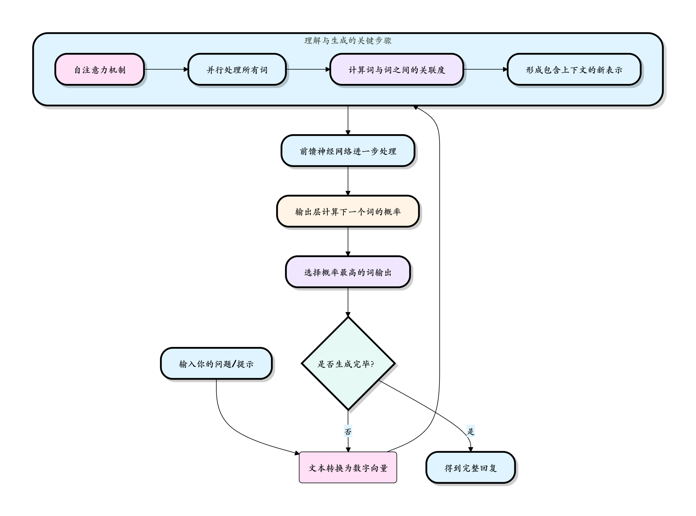

## 大语言模型基础（LLM）
大语言模型（Large Language Model，简称 LLM）是 AI Agent 的大脑，理解它是构建智能 Agent 的基础。

大语言模型基础之所以能与你对话、写文章、编程，本质上是它在根据你给出的文本（提示），一个字一个字地猜出最合理的下文。

简单来说，大语言模型是一个经过海量文本数据训练的深度学习模型，它能够理解和生成人类语言。

大语言模型通过分析互联网上的海量文本，学习到语言的统计规律和知识，当它收到输入时，会根据学习到的规律，生成最合理的续写。

我们可以把大语言模型想象成一个极其用功、记忆力超群的学生：

- 学习阶段（训练）：它阅读了互联网上几乎所有公开的文本——书籍、文章、网页、代码等等（数据量可达万亿单词级别）。在这个过程中，它不是在背诵，而是在学习一个极其复杂的语言规律。
- 应用阶段（推理）：当你向它提问或给出指令时，它就会运用学到的语言规律，一个字接一个字地生成出最合乎逻辑和语境的回答。

它的大主要体现在两个方面：
- 参数规模大：模型内部有数百亿甚至上万亿个可调节的旋钮（即参数）。这些参数记录了学到的语言知识。
- 训练数据大：用于训练的文本数据量巨大，是整个互联网公开信息的精华。
尽管 LLM 很强大，但它也有明确的局限性：

|能力|说明|局限性|
|--|--|--|
|知识截止|训练数据有截止日期|无法获知训练后的新信息|
|数学计算|能做简单计算|复杂计算容易出错|
|实时信息|需要外部工具辅助|本身无法获取实时数据|
|事实准确性|可能生成错误信息|需要事实核查|
|长文本处理|上下文长度有限制|超长文本会丢失信息|
|逻辑一致性|可能前后矛盾|需要仔细设计和验证|

重要提醒：LLM 不是全知全能的，它本质上是基于统计的模式匹配系统，理解它的局限性，才能更好地利用它的能力。


## 核心工作原理：Transformer 架构简析
LLM 的惊人能力，离不开其底层核心技术——Transformer 架构。我们不需要深究其复杂的数学原理，但可以理解它的核心思想。

想象你要写一篇关于太阳系的文章。你会怎么做？

* 通读资料：你会先看很多相关的书籍和网页。
* 抓住重点：你会注意到太阳、行星、轨道、引力这些词频繁出现且相互关联。
* 组织语言：根据你想表达的重点（比如介绍火星），你会选择性地运用之前看到的关于火星大小、颜色、位置等信息，并组织成通顺的句子。
Transformer 的工作方式与此类似：


对上述流程的通俗解释：

* 输入处理：你的话被拆分成词或字（Token），并转换成计算机能理解的数字（向量）。

* 理解上下文（核心）：自注意力机制开始工作。它让模型在处理句子中的每一个词时，都能看到并权衡句子中所有其他词的重要性。例如，在句子苹果发布了新手机，它的电池很大中，当模型处理它这个词时，自注意力机制会帮助模型判断它与苹果和手机高度相关，而不是与电池直接相关。这个过程是并行的，速度极快。

* 生成与循环：模型基于当前对所有词的理解，计算出一个概率分布，预测下一个最可能出现的词是什么。选中并输出这个词后，把这个词作为新的输入，重复整个过程，直到生成完整的回答。

正是这种能并行处理并深度理解全局上下文的能力，使得基于 Transformer 的 LLM 在语言任务上远超前辈（如 RNN）。


## 如何与 LLM 交互：Prompt 工程入门
Prompt（提示词）是你给 LLM 的输入，它告诉模型你想要什么，就像给助理下达指令，指令越清晰，结果越好。

我们通过 Prompt（提示词） 来与 LLM 交流。

Prompt 的质量直接决定了回答的质量，写好 Prompt 就像给你的 AI 助手下达清晰的指令。

基本结构：

**上下文 + 指令 + 示例 + 格式要求**

### 基本原则
- 明确具体：避免模糊。不要说写点关于狗的东西，而应该说用生动活泼的语言，为 6-8 岁儿童写一段 100 字左右的关于金毛寻回犬性格特点的简短介绍。
- 提供上下文：告诉模型你的身份、背景和目标。例如：你是一位经验丰富的 Python 编程导师。请向一个刚学完基本语法的初学者解释什么是列表推导式，并提供一个简单的例子。
- 指定格式：如果你需要特定格式的输出，请明确说明。例如：请将以下要点总结为三个 bullet points（项目符号）。" 或 "请以 JSON 格式输出。
- 分步思考（Chain-of-Thought）：对于复杂问题，鼓励模型一步步推理。例如：要解决这个问题，我们先计算第一步...，然后第二步...，最后得出结论...

### LLM 能做什么？常见应用场景
|场景类别|具体示例|说明|
|--|--|--|
|内容创作与编辑|撰写邮件、报告、博客；续写故事；润色文案；翻译不同风格文本|快速生成草稿，提供灵感和多种表达方式。|
|信息检索与总结|快速阅读长文档/多篇文章并提炼核心观点；回答基于特定知识库的问答|比传统搜索更"理解"问题，能进行归纳和整合。|
|编程辅助|解释代码、生成代码片段、调试错误、重构代码、编写测试用例|充当全天候的编程伙伴，极大提升开发效率。|
|对话与客服|智能聊天机器人、个性化导师、心理咨询模拟、角色扮演游戏|提供拟人化、上下文连贯的交互体验。|
|逻辑推理与分析|解数学题、进行基础逻辑推理、分析数据趋势、制定简单计划|在限定领域内展示出令人惊讶的推理能力。|

## API 调用与参数设置
要构建 AI Agent，你需要学会如何通过 API 调用 LLM。

本章节我们以 OpenAI API 为例，介绍基本的调用方法。

openai 是一个强大的 Python 库，用于与 OpenAI 的一系列模型和服务进行交互，详细内容参考：Python OpenAI。

开源地址：https://github.com/openai/openai-python

### 基础 API 调用
1. 安装必要的库
```shell
pip install openai
```
然后需要去 OpenAI 官网注册账号，并在 API 密钥页面生成一个 API Key。

实例
```python
import os
from openai import OpenAI

client = OpenAI(
    # This is the default and can be omitted
    api_key="你申请的 API key",
)

response = client.responses.create(
    model="gpt-4o",
    instructions="You are a coding assistant that talks like a pirate.",
    input="How do I check if a Python object is an instance of a class?",
)

print(response.output_text)
```

我们国内目前访问 openai 还是有点麻烦，国内很多也支持 openai，比如 DeepSeek、阿里的千问。

### DeepSeek
DeepSeek API 完全兼容 OpenAI 的 API 格式，只需修改少量配置，即可直接使用 OpenAI SDK 或兼容工具访问 DeepSeek API。

核心配置参数:
| 参数 | 取值/说明 |
| -- | -- | 
|base_url|	必填，固定值：https://api.deepseek.com（也可填 https://api.deepseek.com/v1，仅为兼容OpenAI，v1与模型版本无关）|
|api_key|	必填，需先在 DeepSeek 官网申请专属 API Key（申请地址：https://platform.deepseek.com/）|
|model|	必填，deepseek-chat：对应 DeepSeek 的非思考模式，响应速度快，适合常规问答；deepseek-reasoner：对应 DeepSeek 的思考模式，推理能力更强，适合复杂问题求解。|

实例
```python
import os
from openai import OpenAI

# 初始化客户端（核心配置：替换为你的API Key）
client = OpenAI(
    api_key=os.environ.get('DEEPSEEK_API_KEY'),  # 推荐通过环境变量配置，也可直接写死（不推荐）
    base_url="https://api.deepseek.com"  # DeepSeek 固定域名
)

# 调用对话API
try:
    response = client.chat.completions.create(
        model="deepseek-chat",  # 指定模型，可选 deepseek-chat / deepseek-reasoner
        messages=[
            {"role": "system", "content": "You are a helpful assistant"},  # 系统角色定义
            {"role": "user", "content": "Hello"},  # 用户提问
        ],
        stream=False  # 非流式输出（一次性返回完整结果）
    )
    # 打印回复内容
    print("回复结果：", response.choices[0].message.content)
except Exception as e:
    print("调用失败：", str(e))
```

### 阿里百炼
阿里云百炼的通义千问模型支持 OpenAI 兼容接口，您只需调整 API Key、BASE_URL 和模型名称，即可将原有 OpenAI 代码迁移至阿里云百炼服务使用。

我们需要开通阿里云百炼模型服务并获得 API-KEY。

我们可以先使用阿里云主账号访问百炼模型服务平台：https://bailian.console.aliyun.com/，然后点击右上角登录，登录成功后点击右上角的齿轮⚙️图标，选择 API key，然后复制 API key，如果没有也可以创建 API key：

开通阿里云百炼不会产生费用，仅模型调用（超出免费额度后）、模型部署、模型调优会产生相应计费。

现在要使用 API，都需要按 token 来计费，还好都不贵，我们可以先购买个最便宜的包：阿里云百炼大模型服务平台。


也可以直接使用百炼的 Coding Plan 套餐：https://www.aliyun.com/benefit/scene/codingplan。

兼容 OpenAI API 协议：

Base URL：https://coding.dashscope.aliyuncs.com/v1
API Key：填入 Coding Plan 套餐专属 API Key
Model：qwen3-coder-plus


### 使用方式
接下来我们使用 OpenAI SDK 访问百炼服务上的通义千问模型。

#### 非流式调用示例
实例
```python
from openai import OpenAI
import os

def get_response():
    client = OpenAI(
        api_key="sk-xxx",  # 请用阿里云百炼 API Key
        base_url="https://dashscope.aliyuncs.com/compatible-mode/v1",  # 填写DashScope SDK的base_url
    )
    completion = client.chat.completions.create(
        model="qwen-plus",  # 此处以qwen-plus为例，可按需更换模型名称。模型列表：https://help.aliyun.com/zh/model-studio/getting-started/models
        messages=[{'role': 'system', 'content': 'You are a helpful assistant.'},
                  {'role': 'user', 'content': '你是谁？'}]
        )
    # json 数据
    #print(completion.model_dump_json())
    print(completion.choices[0].message.content)

if __name__ == '__main__':
    get_response()
```
运行代码可以获得以下结果：

我是通义千问，阿里巴巴集团旗下的通义实验室自主研发的超大规模语言模型。我可以帮助你回答问题、创作文字，比如写故事、写公文、写邮件、写剧本、逻辑推理、编程等等，还能表达观点，玩游戏等。如果你有任何问题或需要帮助，欢迎随时告诉我！

#### 流式调用示例
实例
```python
from openai import OpenAI

def get_response():
    client = OpenAI(
        api_key="sk-xxx",
        base_url="https://dashscope.aliyuncs.com/compatible-mode/v1",
    )

    completion = client.chat.completions.create(
        model="qwen-plus",
        messages=[
            {'role': 'system', 'content': 'You are a helpful assistant.'},
            {'role': 'user', 'content': '你是谁？'}
        ],
        stream=True,
        stream_options={"include_usage": True}
    )

    for chunk in completion:
        # chunk 里可能没有 choices 或 delta
        if hasattr(chunk, "choices") and len(chunk.choices) > 0:
            choice = chunk.choices[0]
            if hasattr(choice, "delta") and hasattr(choice.delta, "content"):
                print(choice.delta.content, end='', flush=True)

if __name__ == '__main__':
    get_response()
```
运行代码可以获得以下结果：

我是通义千问，阿里巴巴集团旗下的通义实验室自主研发的超大规模语言模型。我可以帮助你回答问题、创作文字，比如写故事、写公文、写邮件、写剧本、逻辑推理、编程等等，还能表达观点，玩游戏等。如果你有任何问题或需要帮助，欢迎随时告诉我！


## 主流大语言模型
以下是主流大语言模型的官网与 API 文档地址整理：

| 模型名称 | 所属公司/组织 | 官网 | API文档地址 |
| -------- | ------------- | ---- | ----------- |
| GPT系列 (GPT-5.2/GPT-4o) | OpenAI | https://openai.com/ | https://platform.openai.com/docs/api-reference |
| Claude系列 (Opus 4.6/Sonnet 4.5) | Anthropic | https://www.anthropic.com/ | https://docs.anthropic.com/claude/reference/getting-started-with-the-api |
| Gemini系列 (Gemini 3 Pro/Flash) | Google | https://deepmind.google/technologies/gemini/ | https://docs.gemini.com/rest-api/ |
| 通义千问 (Qwen 3.0系列) | 阿里巴巴 | https://www.qianwen.com/ | https://help.aliyun.com/zh/dashscope/developer-reference/api-details |
| 文心一言 (ERNIE 5.0系列) | 百度 | https://yiyan.baidu.com/ | https://qianfan.cloud.baidu.com/docs/ |
| 智谱清言 (GLM-4.7系列) | 智谱AI | https://chatglm.cn/ | https://open.bigmodel.cn/dev/api |
| Kimi (Moonshot K2.5系列) | 月之暗面 | https://kimi.moonshot.cn/ | https://platform.moonshot.cn/docs/api/chat |
| 讯飞星火大模型 | 科大讯飞 | https://xinghuo.xfyun.cn/ | https://www.xfyun.cn/doc/spark/Web.html |
|DeepSeek系列|	DeepSeek|	https://www.deepseek.com/|	https://api-docs.deepseek.com/|
|Llama系列 (Llama 3.1/Llama 4)|	Meta|	https://www.llama.com/|	https://www.llama.com/docs/overview/|
|Grok系列 (Grok 4.1)|	xAI|	https://x.ai/	|https://docs.x.ai/overview|
|MiniMax (M2.1系列)|	MiniMax	|https://www.minimaxi.com/|	https://api.minimax.chat/docs/api/|
百川智能 (Baichuan 3系列)	|百川智能|	https://www.baichuan-ai.com/|	https://platform.baichuan-ai.com/docs/api|
| Ollama (本地部署模型) |	Ollama	|https://ollama.com/	|https://github.com/ollama/ollama/blob/main/docs/api.md|
| 豆包大模型|	字节跳动	|https://www.doubao.com/	|https://www.volcengine.com/docs/82379/1399008?lang=zh|