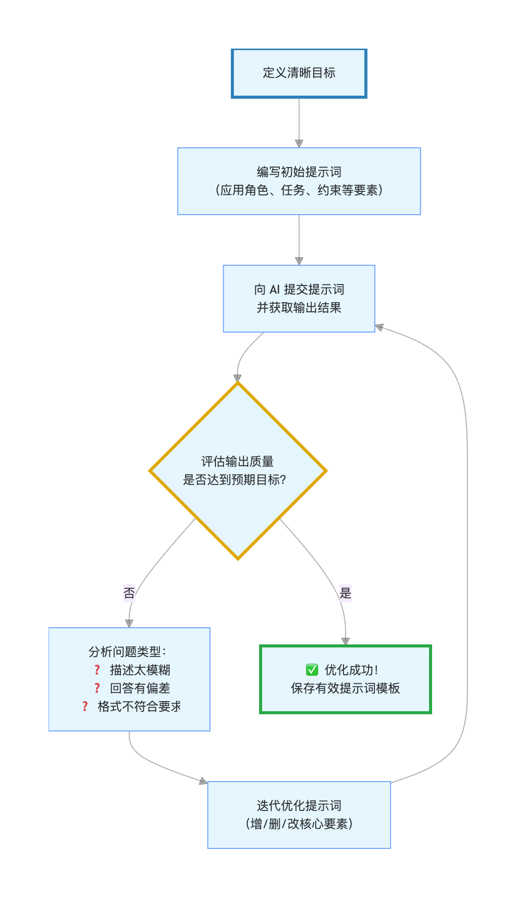

## 提示词工程（Prompt Engineering）
提示词工程（Prompt Engineering）就是一门关于如何构造和精炼你的提示词的艺术和科学，目的是最大化 AI 模型的性能，让它产出更符合你需求的、高质量的输出。

在人工智能，特别是大语言模型（如 ChatGPT、Claude、DeepSeek）的时代，提示词工程已经成为一项至关重要的技能，它不再是简单的输入问题，而是一种与 AI 高效协作、精准激发其潜能的新型编程。

提示词工程就像是你在和人工智能（AI）聊天或下指令时，学习如何更好地提问和表达，从而让 AI 更准确、更有效地给出你想要的答案或结果。

**简单来说，这是一个与 AI 高效沟通的技巧。**

- 提示词（Prompt）：就是你输入给 AI 模型（比如大型语言模型 LLM，如 GPT-4 或 Gemini）的指令、问题、或文本输入。
- 工程（Engineering）：在这里指的是设计、优化和改进你的输入文本的过程。

**为什么需要学习提示词工程？**
- 提高准确性：不好的提示词可能导致 AI 给出错误、跑题或无用的回答。好的提示词能让 AI 直击核心。

- 节省时间：通过一次到位的指令，减少你和 AI 之间的来回修改和尝试。

- 解锁能力：有些复杂的任务，如总结长文、扮演特定角色、或进行复杂的推理，需要特殊的提示词技巧才能激发 AI 的潜力。

**核心思想：AI 是超级执行者**
你可以把大语言模型看作一个拥有海量知识、强大推理和生成能力的超级执行者，但它没有自主意图，完全依赖于你给的指令（提示词）来行动。

优化前：

- 模糊的指令：写一篇关于猫的文章。

- 结果：AI 可能会生成一篇泛泛而谈、没有重点的文章。

**使用提示词工程优化后：**

- 经过工程化的指令：你是一位宠物科普作家。请以轻松幽默的口吻，为养猫新手写一篇 800 字左右的文章，重点介绍如何选择第一只猫和接猫回家前三天的必备准备。文章需要包含三个小标题，并在结尾给出一个简洁的 checklist。

- 结果：AI 生成的回答会更具针对性、结构清晰，且符合你的具体需求。


### 为什么提示词工程如此重要？
理解其重要性，可以从两个角色来看：

#### 对普通用户：解锁 AI 的真正潜力
很多人觉得 AI 不好用、回答空泛，往往是因为使用了过于简单的提示词。

学习提示词工程，可以能让你：

获得更准确的答案：减少 AI 胡言乱语或答非所问的情况。

提高工作效率：一次性得到结构完整、可直接使用的文案、代码、方案，无需反复修改。

激发创造性应用：用 AI 来头脑风暴、模拟对话、转换风格，完成以前想不到的任务。

#### 对开发者：构建 AI 应用的基础
对于基于大语言模型开发应用（如智能客服、写作助手、代码生成工具）的开发者来说，提示词工程是核心环节：
- 它是模型的配置接口：通过精心设计的提示词（常称为 系统提示），可以定义 AI 助手的角色、行为准则和知识范围。
- 影响应用效果和成本：好的提示词能用更短的交互、更低的 API 调用成本，获得更优的结果。


## 提示词工程的关键要素与基础技巧
一个有效的提示词通常包含以下几个要素，我们可以用 CRISPE 等框架来记忆（并非唯一标准，但很有帮助）：

|要素|英文|说明|示例|
|--|--|--|--|
|角色与背景|Capacity & Role|为 AI 设定一个身份或场景，引导其使用特定的知识体系和表达方式。|你是一位经验丰富的 Python 编程导师。|
|任务与指令|Insight & Statement|清晰、具体地说明你要 AI 完成什么任务。这是提示词的核心。|请解释 列表推导式 的概念，并给出三个由易到难的例子。|
|步骤与约束|Procedure & Steps|将复杂任务分解为步骤，或添加格式、长度、风格等限制条件。|请按以下步骤回答：1. 一句话定义。2. 语法说明。3. 示例代码及注释。|
|输出格式|Format & Output|明确指定你希望的回答格式，如 JSON、Markdown、表格、代码块等。|请将对比结果以表格形式呈现，包含方法、优点、缺点三列。|
|输入示例|Examples|提供一两个输入-输出的例子，让 AI 更准确地模仿你想要的模式（少样本学习）。|例如，如果我问苹果，你应该回答它是一种水果。那么，当我问香蕉时…|


### 基础技巧实践
让我们通过一个简单的例子，看看如何应用这些要素优化提示词。

#### 场景：你想让 AI 帮你生成产品特点描述。

- 基础版（效果一般）：
```
写一下我们这个新款智能水杯的特点。
```

- 优化版（应用提示词工程）：
```

【角色】你是一位顶尖的电子产品营销文案写手。
【任务】为我公司的新款 HydraTech 智能保温杯撰写一段吸引人的产品特点描述。
【约束】描述需面向都市白领群体，突出健康提醒、长效保温、设计简约三大核心卖点，语言简洁有力，充满科技感。
【格式】最终输出为一段不超过 150 字的文案，并额外用 - 列出三个最突出的技术参数。
```

显然，优化后的提示词能引导 AI 生成更符合商业用途的高质量文案。

**提示词工程的核心就是**：像教一个新员工一样，清晰、完整、有结构地给出指令。

```
记住四要素：角色、指令、背景、限制。
```


## 提示词工程的核心原则（像这样提问）
要写出好的提示词，请记住以下几个关键要素：

### 1. 明确的角色定位（Persona）
让 AI 扮演一个特定的专家或角色。这能帮助 AI 调整它的语气、知识范围和输出格式。

|元素|示例|作用|
|--|--|--|
|角色|你是一位资深的历史学家。|确保回答专业、严谨。|
|角色|你是一位幽默的朋友。|确保回答轻松、口语化。|

### 2. 清晰的任务指令（Task/Goal）
准确地告诉 AI 你想让它做什么。使用动词和明确的结果要求。

|元素|示例|作用|
|--|--|--|
|指令|总结以下文章的三个核心要点。|明确数量和动作。|
|指令|列出一个包含步骤和材料的食谱。|明确格式要求。|

### 3. 提供足够的背景信息（Context）
AI 不是神，它需要知道更多关于你的情况才能给出个性化的答案。

|元素|示例|作用|
|--|--|--|
|背景|我正在为五年级的学生准备一堂课。|AI 会使用简单易懂的语言。|
|背景|我的预算是5000元，地点在上海。|AI 会基于这些限制条件提供建议。|

### 4. 限制条件和格式要求（Constraints/Format）
告诉 AI 不要说什么，或者必须以什么形式呈现结果。

|元素|示例|作用|
|--|--|--|
|格式|请用Markdown表格输出。|强制使用结构化数据。|
|限制|回答长度不超过100字。|避免冗长，保持简洁。|

### 场景：写一封感谢信
|元素|示例|作用|
|--|--|--|
|❌ 坏提示词（模糊、无要求）|帮我写一封感谢信。|AI 会根据默认设置生成。|
|✅ 好提示词（遵循原则）|帮我写一封感谢信。	角色/Persona：请扮演一位专业的公关人员。
指令/Task：为我的老板写一封简短的感谢信，感谢他批准了我的年假。
格式/Format：信件语气要正式且诚恳，长度控制在五行以内。|AI 会根据提示词生成专业、正式的感谢信。|

### 场景：学习一个新概念
|元素|示例|作用|
|--|--|--|
|❌ 坏提示词（空泛）|什么是黑洞？|AI 会根据默认设置生成。|
|✅ 好提示词（提供背景和限制）|什么是黑洞？	背景/Context：我是一个对科学感兴趣的高中生，刚接触天文学。
指令/Task：请用生活中的比喻来解释黑洞是什么。
格式/Format：请确保解释清晰易懂，并避免复杂的数学公式。|AI 会根据提示词生成专业、易懂的解释。|

### 从理论到实践：一个完整的提示词工作流
提示词工程往往不是一蹴而就的，而是一个"编写 - 测试 - 分析 - 迭代"的循环过程。



迭代示例：
- 第一轮：你让 AI 总结一篇文章，结果太笼统。
- 第二轮：你修改为用三个要点总结这篇文章的核心论点，结果好一些，但要点是原文片段的复述。
- 第三轮：你再次优化为假设你是中学生，用通俗易懂的语言，分三个部分总结这篇文章的主要观点，并每部分举一个生活中的例子，这次你得到了一个结构清晰、易于理解的总结。

## 进阶概念与未来展望
### 进阶技术
- 思维链（Chain-of-Thought, CoT）：在提示词中要求 AI 让我们一步步思考，可以显著提升其在复杂推理、数学问题上的准确性。
- 少样本提示（Few-Shot Prompting）：在提示词中提供几个输入输出的例子，让 AI 快速掌握任务模式。
- 提示词模板与库：将验证有效的提示词保存为模板，用于类似任务，或使用社区共享的提示词库。

### 未来展望
随着 AI 模型能力的进化，提示词工程也在发展：
- 从文本工程到多模态工程：未来需要对图像、声音等多模态输入进行精心设计。
- 自动化提示词优化：可能出现 AI 工具自动帮你优化和生成提示词。
- 核心技能的普及：就像使用搜索引擎一样，如何与 AI 对话将成为数字时代每个人的基础素养。


### 总结与行动建议
提示词工程不是魔法，而是一种可学习的、结构化的沟通技能。 它的本质是 降低模糊性，提升对齐度，确保你的意图被 AI 精准理解。

#### 给你的建议：
- 从模仿开始：多观察和分析优秀的提示词案例（如 GitHub 上的 Awesome-Prompts 项目）。
- 实践并迭代：不要满足于 AI 的第一次回答。多问自己：如何能让它更好？，然后修改提示词再试。
- 建立自己的工具箱：将工作中常用的有效提示词（如邮件润色、周报生成、代码调试）保存下来，形成个人生产力工具箱。


