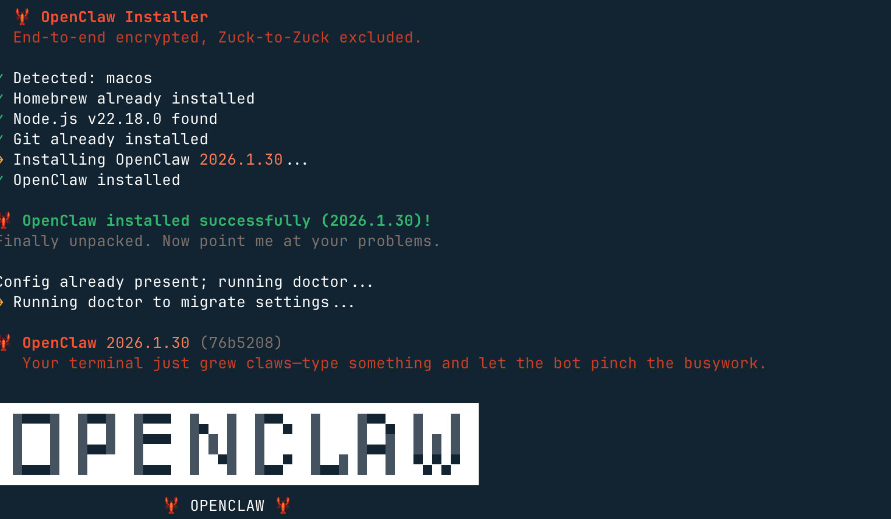
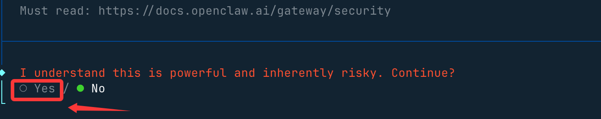
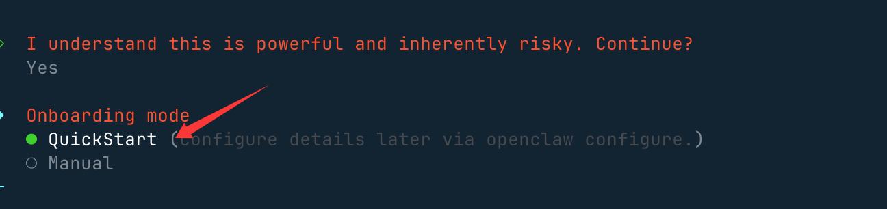
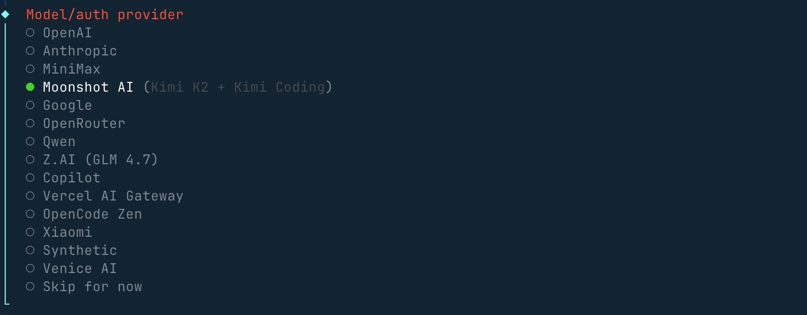
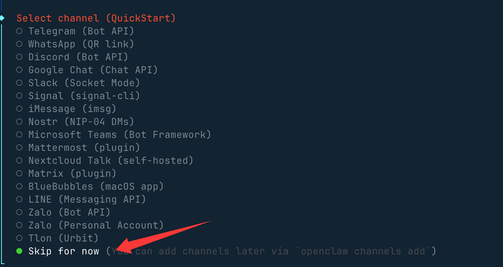
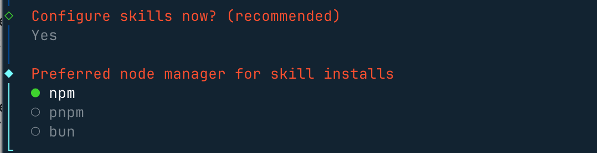
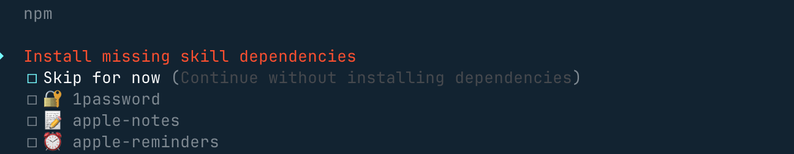
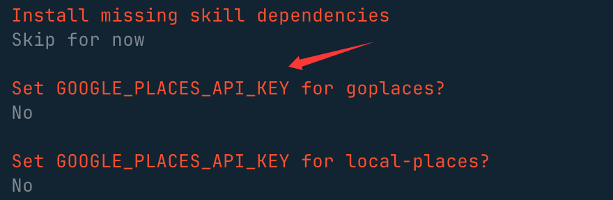
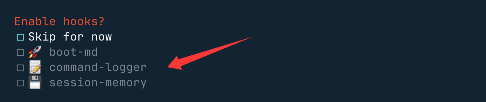
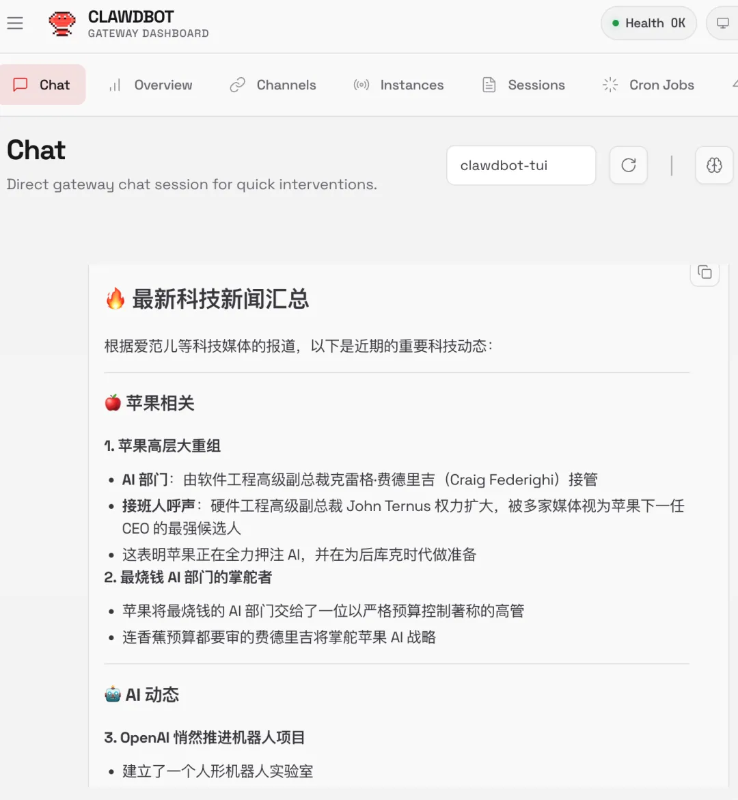

## OpenClaw (Clawdbot) 教程
OpenClaw（原名 Clawdbot，过渡名 Moltbot）是 2026 年 1 月突然爆火的开源个人 AI 助手项目，由 Peter Steinberger（PSPDFKit 创始人）开发。

OpenClaw 是一个可执行任务的智能体，我们给指令，它不仅回答，还能主动操作系统、访问网页、处理邮件、整理文件、发起提醒甚至自动编写代码。

OpenClaw 是一个把 **本地算力 + 大模型 Agent 自动化** 玩到极致的开发者效率工具。

OpenClaw 目标是让 AI 不只是给建议，而是直接完成完整工程任务。


因为 Anthropic 在 1 月 27 日发律师函称 Clawd / Clawdbot与 Claude 太像，项目在当天紧急更名为 Moltbot（脱皮龙虾之意，吉祥物是小龙虾 Molty 🦞），但功能完全一致，旧命令 clawdbot 仍然兼容。

Moltbot 是项目组为了应对侵权风险想出的过渡名字，OpenClaw 这是目前的最终官方名称。

- OpenClaw 官网: https://openclaw.ai/

- Github 地址：https://github.com/openclaw/openclaw

- OpenClaw 技能合集: https://github.com/VoltAgent/awesome-openclaw-skills

Clawbot、Moltbot 和 OpenClaw 其实是同一个开源项目，名字演进顺序为：
```
Clawdbot → Moltbot → OpenClaw
```

|名称|	时间线|	背景/原因|	本质关系|
|--|--|--|--|
|Clawdbot / Clawbot|	2025 年末至 2026 年 1 月初|	最初项目名；灵感来自 Claude 和 claw（龙虾爪）梗|	原始名称，是最早出现在 GitHub 的身份|
|Moltbot|	2026 年 1 月 27 日|	因 Anthropic 商标顾虑被要求更名|	中间过渡名字；功能、代码与 Clawdbot 一致|
|OpenClaw|	2026 年 1 月 30 日之后|	抛弃版权冲突、强调开源性/长线品牌|	当前官方名称，也是今后文档、仓库等统一标识|


### 安装方法
OpenClaw 的安装被设计得极为友好，即使是非开发者也能快速上手。

系统要求（不一定 Mac mini）：

- 硬件：极低，2GB RAM 即可运行。
- 环境：支持 Mac, Windows, Linux，需要安装 Node.js (pnpm) 或使用 Docker。
#### 1、推荐安装方式（一键脚本）：
直接通过终端，执行以下命令。

macOS/Linux 系统:
```
curl -fsSL https://openclaw.ai/install.sh | bash
```
Windows 系统：
```
#PowerShell
iwr -useb https://openclaw.ai/install.ps1 | iex

#CMD
curl -fsSL https://openclaw.ai/install.cmd -o install.cmd && install.cmd && del install.cmd
```
这会自动安装 Node.js（≥22）并完成基本配置。

#### 2、手动安装
需要 Node.js ≥22并完成基本配置。

使用 npm：
```
npm i -g openclaw
```
或使用 pnpm：
```
pnpm add -g openclaw
```
安装完成后，初始化并安装后台服务（launchd / systemd 用户服务）：
```
openclaw onboard
```

#### 3、从源码安装（开发模式）
```
git clone https://github.com/openclaw/openclaw.git
cd openclaw

pnpm install

pnpm ui:build   # 首次运行会自动安装 UI 相关依赖并构建前端界面
pnpm build      # 构建整个项目（包含后端与相关模块）

# 初始化 OpenClaw 并安装为系统后台服务（开机自动运行）
pnpm openclaw onboard --install-daemon

# 开发模式：监听 TypeScript 代码变更并自动重载网关服务
pnpm gateway:watch

```


### 配置说明
我们推荐使用一键脚本安装。

macOS/Linux 系统:
```
curl -fsSL https://openclaw.ai/install.sh | bash
```
Windows 系统：
```
#PowerShell
iwr -useb https://openclaw.ai/install.ps1 | iex

#CMD
curl -fsSL https://openclaw.ai/install.cmd -o install.cmd && install.cmd && del install.cmd
```
它会完成环境检测，并且安装必要的依赖，还会启动 onboarding 流程。



然后，会提醒你这个龙虾能力很强，当然风险也很大，我们选 yes（no 就不安装了） 就好了：



接下来我们就选快速启动 QuickStart 选项：



接下来我们需要配置一个大模型，Model/Auth Provider 选择 AI 供应商，国内外的供应商基本都支持。



如果没有海外的账号，配置咱们国内的 Qwen、MiniMax、智谱的 API key 也是可以的。

然后会出现选择聊天工具的选项，海外的一般都没有可以选最后一个：



其他配置，比如端口的设置 Gateway Port，按默认的 18789 即可，比如 Skills、包的安装管理器选 npm 或其他，可以一路 Yes 下去。



选一些自己喜欢的 skills，也可以直接跳过，使用空格按键选择：



这些 API key，没有的直接选 no：



最后这三个钩子可以开启，主要做内容引导日志和会话记录：



安装完后，就会自动访问 http://127.0.0.1:18789/chat，就可以打开聊天界面让它开始工作。

比如搜索最新的科技新闻：



启动后，我们可以使用 openclaw status 命令查看状态：
```
openclaw status
```
#### 常用命令
```
openclaw gateway           # 运行 WebSocket 网关服务（可加 --port 指定端口）
openclaw gateway start     # 启动
openclaw gateway stop      # 停车
openclaw gateway restart   # 重启
openclaw channels login    # WhatsApp QR 配对登录
openclaw channels add      # 添加 Telegram/Discord/Slack 机器人（可加 --token）
openclaw channels status --probe      # 检查通道健康状态
openclaw onboard # 交互式设置向导（可加 --install-daemon）
openclaw doctor --deep     # 健康检查与快速修复
openclaw config get|set|unset    # 读取 / 写入配置值
openclaw models list|set|status  # 模型管理与认证状态
openclaw models auth setup-token # Anthropic 认证流程设置

```

#### 通道管理
- WhatsApp：openclaw channels login（或扫描 QR）
- Telegram：openclaw channels add --channel telegram（需 Bot Token）
- Discord：openclaw channels add --channel discord（需 Bot Token）
- iMessage：macOS 原生桥接
- Slack：openclaw channels add --channel slack（需 Bot Token）

#### 工作区结构（Workspace Anatomy）
- AGENTS.md：指令说明
- USER.md：偏好设置
- MEMORY.md：长期记忆
- HEARTBEAT.md：检查清单
- SOUL.md：人格/语气
- IDENTITY.md：名称/主题
- BOOT.md：启动配置
- 根目录：~/.openclaw/workspace


#### 聊天内斜杠命令
- /status：健康 + 上下文
- /context list：上下文贡献者
- /model <m>：切换模型
- /compact：释放窗口空间
- /new：全新会话
- /stop：中止当前运行
- /tts on|off：切换语音
- /think：切换推理模式

#### 关键路径映射（Essential Path Map）
- 主配置：~/.openclaw/openclaw.json
- 默认工作区：~/.openclaw/workspace/
- 代理状态目录：~/.openclaw/agents/<cid>/
- OAuth & API 密钥：~/.openclaw/credentials/
- 向量索引存储：~/.openclaw/memory/<cid>.sqlite
- 全局共享技能：~/.openclaw/skills/
- 网关文件日志：/tmp/openclaw/*.log

#### 语音与 TTS
- 付费：OpenAI / ElevenLabs
- 免费：Edge TTS（无需 API Key）
- 自动 TTS：messages.tts.auto: "always"
#### 内存与模型
- 向量搜索：memory search "X"
- 模型切换：models set <model>
- 认证设置：models auth setup
- 日志：memory/YYYY-MM-DD.md
#### Hooks 与技能
- ClawHub：clawhub install <slug>
- Hook 列表：openclaw hooks list
#### 故障排除
- 无 DM 回复 → 配对列表 → 批准
- 群组中静音 → 检查提及模式配置
- 认证过期 → models auth setup-token
- 网关关闭 → doctor --deep
- 内存 Bug → 重建内存索引
#### 自动化与研究
- 浏览器：browser start/screenshot
- 子代理：/subagents list/info
- 定时任务：cron list/run <cid>
- 心跳：heartbeat.every: "30m"

### 通过第三方云直接安装配置
现在各大平台都已经支持这个智能体，如果不想安装在本机，可以一键部署云上OpenClaw：

阿里云：https://www.aliyun.com/activity/ecs/clawdbot
腾讯云：https://cloud.tencent.com/developer/article/2624973

#### 使用阿里云的轻量级服务器安装：https://www.aliyun.com/activity/ecs/clawdbot。
https://www.aliyun.com/activity/ecs/clawdbot


可以使用它们的镜像，一键安装：

#### 使用腾讯云的轻量级服务器安装： https://cloud.tencent.com/developer/article/2624973


### 常用命令
OpenClaw 常用命令如下：

| 命令 | 作用 | 备注 / 参数 |
| --- | --- | --- |
| openclaw status | 查看 Gateway 当前运行状态 | 包含健康度与上下文信息 |
| openclaw health | 健康检查 | 检测 core、依赖与运行环境 |
| openclaw doctor | 综合诊断与修复建议 | 支持 --deep 深度检查 |
| openclaw onboard | 交互式初始化向导 | 首次使用推荐 |
| openclaw onboard --install-daemon | 安装系统守护进程 | 后台常驻运行 Gateway |
| openclaw onboard --uninstall-daemon | 卸载守护进程 | 不删除数据 |
| openclaw configure | 交互式配置向导 | 模型、通道、凭据等 |
| openclaw config get <path> | 获取配置值 | JSON Path |
| openclaw config set <path> <value> | 设置配置项 | 支持 JSON5 / raw 文本 |
| openclaw config unset <path> | 清除配置项 | 移除单个键值 |
| openclaw channels list | 列出已登录通道 | WhatsApp / Telegram / Discord 等 |
| openclaw channels login | 登录新的通道账号 | 扫码或授权流程 |
| openclaw channels add | 添加通道 | Telegram / Discord / Slack |
| openclaw channels status --probe | 通道健康检查 | 检测连接可达性 |
| openclaw skills list | 列出技能 | 已安装 / 可用技能 |
| openclaw skills info <skill> | 技能详情 | 参数、版本信息 |
| clawhub install <slug> | 从 ClawHub 安装技能 | 官方技能市场 |
| openclaw hooks list | 列出 Hook 列表 | 事件钩子机制 |
| openclaw plugins list | 列出插件 | 查看已安装插件 |
| openclaw plugins install <id> | 安装插件 | 例如 @openclaw/voice-call |
| openclaw plugins enable <id> | 启用插件 | 通常需要重启 Gateway |
| openclaw models list | 列出可用模型 | 包含鉴权状态 |
| openclaw models status | 模型状态 | 当前可用性 |
| openclaw models auth setup-token | 模型鉴权配置 | Cheatsheet 推荐方式 |
| openclaw memory search "X" | 搜索长期记忆 | 向量搜索 |
| openclaw memory index | 重建记忆索引 | 修复 memory 异常 |
| openclaw logs	| 查看日志	| 默认聚合输出| 
| openclaw logs --follow	| 实时日志	| --json / --plain / --limit |
| openclaw gateway install	| 安装 Gateway 系统服务	| 注册为系统守护进程 |
| openclaw gateway start	| 启动 Gateway 服务	| system service 模式 |
| openclaw gateway stop	| 停止 Gateway 服务	|  |
| openclaw gateway restart	| 重启 Gateway 服务	| 配置变更后使用 |
| openclaw gateway status	| Gateway 系统服务状态	| 不同于 openclaw status |
| openclaw browser start	| 启动浏览器代理	| Automation 能力 |
| openclaw browser screenshot	| 网页截图	|  |
| openclaw subagents list	| 列出子代理	|  |
| openclaw cron list	| 列出定时任务	|  |
| openclaw cron run <id>	| 执行定时任务	|  |
| openclaw uninstall	| 卸载 Gateway 服务及数据	| 官方推荐 |
| openclaw uninstall --all --yes --non-interactive	| 全自动卸载	| 状态 / workspace / 插件 |
| openclaw uninstall --state	| 删除状态文件	| 不删除 workspace |
| openclaw uninstall --workspace	| 删除工作区	| agent / workspace 数据 |
| openclaw uninstall --service	| 仅卸载系统服务	| 不删除数据 |
| openclaw uninstall --dry-run	| 模拟卸载	| 仅展示结果 |


### 为什么最近这么火？
真正做到了"像JARVIS一样"：能读写文件、跑终端命令、操作浏览器、收发邮件、日历、写代码、订机票、清空收件箱……
本地优先 + 长期记忆：所有对话跨平台共享上下文，USER.md 和 memory/ 目录会越用越聪明
支持几乎所有大模型：Claude、Gemini、OpenAI、Ollama 本地模型、Pi 等
社区技能生态爆炸：ClawdHub 上已有 500+ 社区技能（Slack、Discord、GitHub、浏览器控制、macOS UI 自动化……）
安装简单像 npm install，实际能力却很 spicy （开发者原话）

**其核心能力包括：**
- 将自然语言目标拆解为可执行步骤
- 自动调用终端命令
- 创建与修改项目文件
- 运行代码并检测结果
- 根据报错自动修复

相比 Claude Code/OpenCode 这种代码补全工具，OpenClaw 更接近一个具备执行权限的工程型智能体。
- Claude Code 与 OpenCode等 强在代码质量与理解
- OpenClaw 强在自动完成整个工程流程

| 能力维度 | OpenClaw | Claude Code | OpenCode |
| --- | --- | --- | --- |
| **任务规划** | 强 | 中 | 中 |
| **自动执行** | 完整 | 部分 | 部分 |
| **自我修复** | 有 | 无 | 无 |
| **工程级操作** | 强 | 强 | 中 |
| **本地自动化** | 原生支持 | 较弱 | 较弱 |
