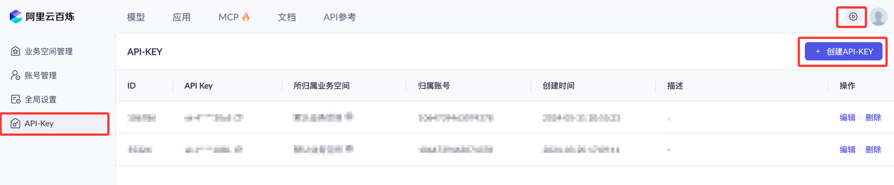
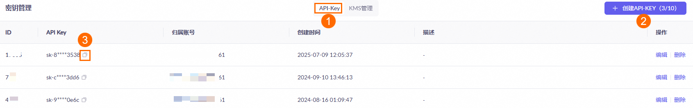
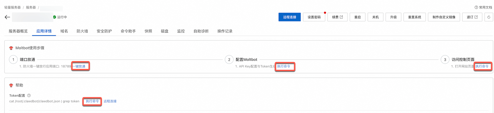
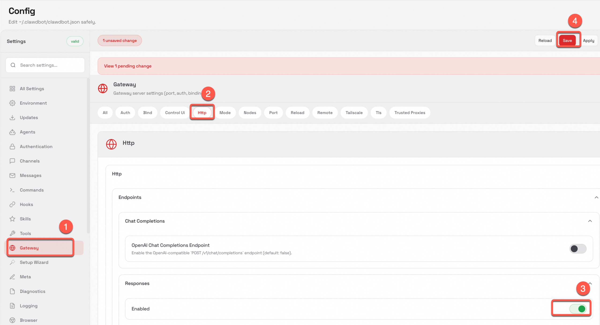
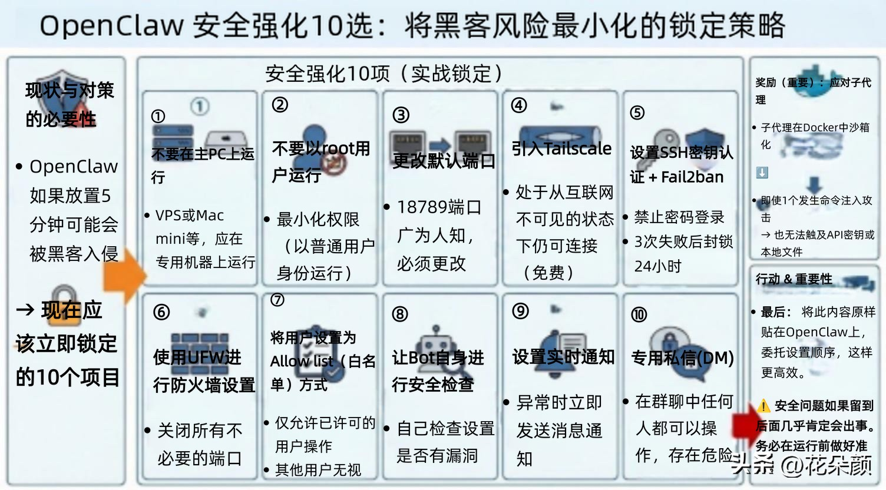

## OpenClaw 一键部署
现在各大平台都已经支持这个智能体，如果不想安装在本机，可以一键部署云上 OpenClaw：

阿里云：https://www.aliyun.com/activity/ecs/clawdbot
腾讯云：https://cloud.tencent.com/developer/article/2624973

### 阿里云部署 OpenClaw
本章节将详细介绍如何使用阿里云部署 OpenClaw，访问 https://www.aliyun.com/activity/ecs/clawdbot，选择一键购买并部署：

### 配置 OpenClaw
现在要使用 API，都需要按 token 来计费，还好都不贵，我们可以先购买个最便宜的包：。

我们可以先使用阿里云主账号访问百炼模型服务平台：https://bailian.console.aliyun.com/，然后点击右上角登录，登录成功后点击右上角的齿轮⚙️图标，选择 API key，然后复制 API key，如果没有也可以创建 API key：

开通阿里云百炼不会产生费用，仅模型调用（超出免费额度后）、模型部署、模型调优会产生相应计费。

OpenClaw 还是比较消耗 token 的，如果要长期使用，我们可以先购买个最便宜的包：阿里云百炼大模型服务平台。

另外，使用百炼的 Coding Plan 套餐更便宜：https://www.aliyun.com/benefit/scene/codingplan

在服务器页面，单击服务器卡片中的实例 ID，进入服务器概览页面。

单击应用详情页签，配置 OpenClaw。

- 端口放通：需要放通对应端口的防火墙，单击一键放通即可。
- 配置 OpenClaw：单击执行命令，输入百炼的 API-Key，单击下一步。
- 访问控制页面：单击执行命令可获取 Clawdbot 对话的地址。
- 查看 Token: 在帮助 < Token配置中单击执行命令，获取 Token。

开启 ResponseAPI 访问，后续 AppFlow 会通过 API 访问 OpenClaw。

- 在 Clawdbot 页面左侧导航栏，单击Setting > Config。
- 在 Config 页面左侧导航栏单击 Gateway，切换至 Http 页签，在 
Responses 区域将 Enabled 切换至开启，单击 Save。

### （可选）配置联网搜索功能
目前中国内地地域（除香港）暂不支持联网搜索。香港和海外地域若需使用联网功能，可参考 OpenClaw 官网配置。

## 🦞为了防止黑客攻击，你的openclaw🦞务必做以下10个设置：
1. 在 VPS 或 Mac mini 上运行，不要在你的主力电脑上运行。
2. 切勿以 root 用户身份运行
3. 更改默认端口（18789 是公开信息）
4. 安装 Tailscale（对互联网不可见，免费）
5. SSH 密钥 + Fail2ban（3 次错误尝试 = 24 小时封禁）
6. 使用 UFW 防火墙（关闭所有不需要的端口）
7. 将你的用户添加到允许列表（其他所有用户都将被忽略）
8. 让你的机器人审核自身的安全性
9. 设置实时警报（当出现故障时会向您发送消息）
10. 仅限私信（群聊=所有人都可以控制）
额外提示：将你的子代理部署在 Docker 容器中，并进行沙盒隔离。这样，即使某个子代理被注入了恶意代码，它也无法访问你的密钥或文件。

如何设置？小龙虾就是一个超级大脑，把上面的10条内容直接复制粘贴到你的 OpenClaw 中就可以了，它会自己记住设置。
#ai龙虾# #cmd黑客工具# #反黑客指南# #AI智囊# #AI妙生图#

