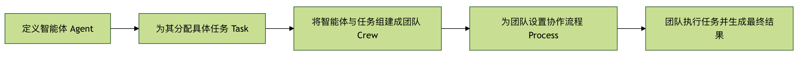
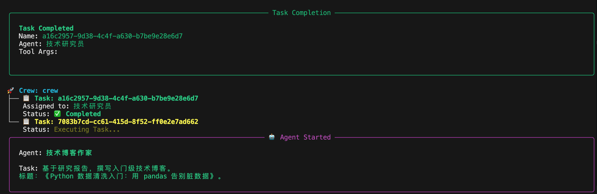
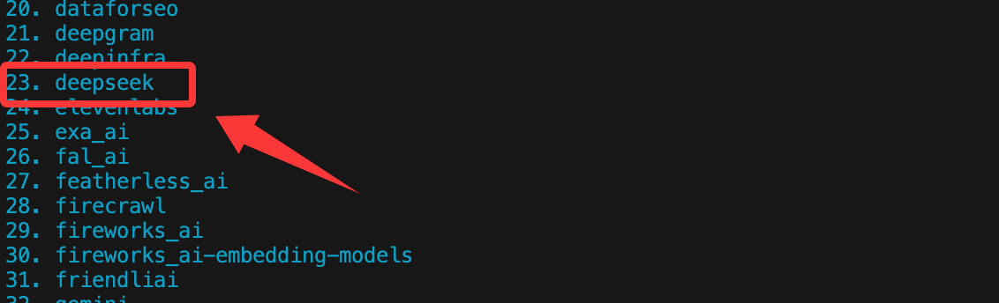
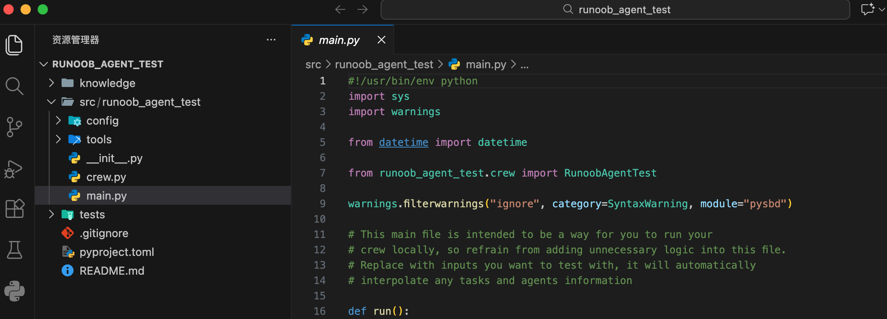

## CrewAI 制作智能体
CrewAI 是一个多智能体协作的开源框架，专门用于编排和协调多个 AI Agent 进行协作。

CrewAI 可以把一个复杂任务，拆成多个角色，各自负责一部分，通过流程协作完成。

**对比理解：**

**单 Agent：** 一个大模型，从头干到尾
**CrewAI：** 产品经理 + 工程师 + 分析师 + 编辑，各司其职，通过协作完成项目
CrewAI 是一个协调、管理和框架化 AI Agent 的工具，它基于 LangChain 和 Pydantic 构建，用于促进角色扮演、自治和协作的 Agent 团队。

- **Crew（团队）：** 一个由多个 Agent 组成的项目组。
- **Agent（成员）：** 团队中的个体，每个都有明确的 role（角色）、goal（目标）和 backstory（背景故事）。
- **Task（任务）：** 需要团队完成的具体工作。一个 Crew 包含多个有序或并行的 Task，并分配给合适的 Agent。
- **Process（流程）：** 定义团队的工作流程，例如是顺序执行还是同时执行任务。
简单来说，crewAI 提供了一个结构化的方式来定义谁（Agent）在什么流程（Process）下，完成哪些事（Task），最终达成团队目标。

下面的流程图清晰地展示了 crewAI 框架中各个核心组件是如何协同工作的：



流程始于定义具备特定角色和目标的智能体（Agent），然后为其创建具体的任务（Task）。

接着，将这些智能体及其任务组建成一个团队（Crew），并为团队选择协同工作的流程（Process），如顺序执行或并行执行。最终，团队按照既定流程执行所有任务，产出最终结果。


## 环境搭建与安装
开始构建前，我们需要准备好开发环境。

### 前置条件
Python 版本要求：

- 必须：Python ≥ 3.10 且 < 3.14
- 可以在终端输入 python --version 来检查，不满足版本范围，后续问题会非常多，不建议硬扛
CrewAI 使用 UV 做依赖和包管理，目的只有一个：
让多 Agent 项目更稳定，不被环境问题拖垮

UV 入门教程参考：UV - Python 包与环境管理工具。

API 密钥：

crewAI 本身不提供 AI 模型，它需要连接像 OpenAI 的 GPT、Anthropic 的 Claude 等大语言模型。

### 安装 crewAI
打开你的终端或命令行工具，使用 pip 命令安装 crewAI 包。

```
# 正常安装
pip install crewai
# 其他依赖
pip install langchain
pip install openai


# 如果安装慢，可以使用国内镜像安装
pip install crewai -i https://mirrors.aliyun.com/pypi/simple/
pip install langchain -i https://mirrors.aliyun.com/pypi/simple/
pip install openai -i https://mirrors.aliyun.com/pypi/simple/
```


如果希望使用 crewAI 内置的一些高级工具（如网络搜索），可以安装额外的依赖项：

```
# 正常安装
pip install 'crewai[tools]'

# 如果安装慢，可以使用国内镜像安装
pip install 'crewai[tools]' -i https://mirrors.aliyun.com/pypi/simple/

```

国内我们可以采用 DeepSeek 大模型来测试，如果还没有需要先去 https://platform.deepseek.com/api_keys 创建一个 API key。

DeepSeek 的 API 文档参考：https://api-docs.deepseek.com/zh-cn/。

安装完成后，创建一个新的 Python 文件，例如 my_first_crew.py，并导入必要的库。

CrewAI 的 LLM 对第三方模型（包括 DeepSeek）底层必须通过 LiteLLM，使用前我们需要先安装：
```
pip install -U litellm
```
实例
```python
from crewai import Agent, Task, Crew, Process
from crewai.llm import LLM


# =====================================================
# LLM 配置（DeepSeek｜LiteLLM 规范写法）
# =====================================================
llm = LLM(
    model="deepseek/deepseek-chat",  # 关键： 必须包含服务商 deepseek，然后再写模型名
    api_key="sk-xxxxx",   # 设置 API key
    api_base="https://api.deepseek.com/v1",
    temperature=0.7,
)

# =====================================================
# Agents
# =====================================================
researcher = Agent(
    role="技术研究员",
    goal="寻找最新、准确、可验证的技术资料，并给出代码证明。",
    backstory="擅长系统性分析技术问题，注重事实和可复现性。",
    llm=llm,
    verbose=True,
    allow_delegation=False,
)

writer = Agent(
    role="技术博客作家",
    goal="将研究成果整理成适合初学者阅读的技术文章。",
    backstory="擅长将复杂概念拆解为清晰步骤，并提供完整示例。",
    llm=llm,
    verbose=True,
    allow_delegation=True,
)

# =====================================================
# Tasks
# =====================================================
research_task = Task(
    description=(
        "深入研究：使用 Python 进行自动化数据清洗。\n"
        "重点包括：pandas、numpy、缺失值、重复值、格式不一致问题。\n"
        "必须提供完整、可运行的代码示例。"
    ),
    agent=researcher,
    expected_output=(
        "一份研究报告，包含问题分类、解决方案代码和完整清洗流程。"
    ),
)

write_task = Task(
    description=(
        "基于研究报告，撰写入门级技术博客。\n"
        "标题：《Python 数据清洗入门：用 pandas 告别脏数据》。"
    ),
    agent=writer,
    context=[research_task],
    expected_output="不少于 800 字的 Markdown 技术博客。",
)

# =====================================================
# Crew
# =====================================================
crew = Crew(
    agents=[researcher, writer],
    tasks=[research_task, write_task],
    process=Process.sequential,
    verbose=True,
)

# =====================================================
# Run
# =====================================================
if __name__ == "__main__":
    result = crew.kickoff()

    output = result.raw

    with open("python_data_cleaning_blog.md", "w", encoding="utf-8") as f:
        f.write(output)
```

接下来，就会开始执行任务，输出相关信息：



完成后就会把输出的内容写入到 python_data_cleaning_blog.md 文件中。

以下是代码中相关属性的说明。


### LLM（模型层）关键属性

|属性 |	示例值	| 作用	|错误后果|
|--|--|--|--|
|model	|deepseek/deepseek-chat	|LiteLLM 规范写法：服务商/模型名	|少了 deepseek/ 会直接报 LLM Provider NOT provided|
|api_key |	sk-xxxxx	|模型鉴权|	为空或错误直接 401 / LLM Failed|
|api_base|	https://api.deepseek.com/v1	|DeepSeek API 地址	|根据具体模型的地址来|
|temperature|	0.7	|控制输出随机性	|过高内容发散，过低文本僵硬|


### Agent（智能体）关键属性
|属性	|作用	|本质|
|---|---|---|
|role	|Agent 的"身份标签"	|写进 system prompt|
|goal	|当前 Agent 的核心目标	|决定回答方向|
|backstory	|行为约束与风格	|稳定输出质量|
|llm	|使用哪个模型	|必须显式绑定|
|verbose	|打印执行过程	|仅影响日志|
|allow_delegation	|是否允许转派任务	|极易踩坑|


### researcher（研究员）
|属性	|值	|设计意图|
|--|--|--|
|allow_delegation	|False	|防止无限拆任务|
|goal	|找资料 + 给代码	|输出是"原料"|


### writer（写作）
|属性	|值	|风险|
|--|--|--|
|allow_delegation	|True	|可能触发 delegate 再研究|
|context	|[research_task]	|已有输入，其实不需要再 delegate|

结论	
  顺序流水线中，写作 Agent 应关闭 delegation，否则容易二次委托失败。

### Task（任务）关键属性
#### Task 通用字段:

|属性	|作用	|关键点|
|--|--|--|
|description	|实际发给 LLM 的任务文本	|越具体越稳|
|agent	|谁来执行	|必须唯一|
|expected_output	|结果约束	|不强制，但强烈建议|
|context	|依赖的上游任务	|顺序执行核心|

#### research_task:
|属性	|说明|
|--|--|
|agent=researcher	|绑定研究员|
|无 context	|第一阶段任务|
|输出	|结构化研究内容|

#### write_task:
|属性	|说明|
|--|--|
|context=[research_task]	|强制读取研究结果|
|agent=writer	|只做整理与表达|
|输出	|最终 Markdown 文本|


### Crew（执行器）关键属性
|属性	|示例值	|作用	|错误后果|
|--|--|--|--|
|agents	| [researcher, writer]	|所有可用 Agent	|少一个直接报错|
|tasks	| [research_task, write_task]	|执行队列	|顺序按列表|
|process	| Process.sequential	|执行策略	|并行会打乱依赖|
|verbose	| True	|日志开关	|只能是 bool|


### kickoff() 与输出结构
|表达式	|类型	|用途|
|--|--|--|
|crew.kickoff()	|CrewOutput	|执行结果容器|
|result.raw	|str	|最终文本输出|
|result.tasks_output	|list/dict	|每个 Task 的输出|
|result.token_usage	|dict	|统计信息|


### crewai 命令
我们可以使用 crewai 命令生成完整工程结构：
```
crewai create crew <项目名>
```
例如我们创建一个项目 runoob-agent-test，还行以下命令：
```
crewai create crew runoob-agent-test
```
接下来出现以下内容，可以先选择大模型的提供商：
```
Creating folder runoob_agent_test...
Cache expired or not found. Fetching provider data from the web...
Downloading  [####################################]  1102019/56339
Select a provider to set up:
1. openai
2. anthropic
3. gemini
4. nvidia_nim
5. groq
6. huggingface
7. ollama
8. watson
9. bedrock
10. azure
11. cerebras
12. sambanova
13. other
q. Quit
```
本章节，我们就选 DeepSeek，先输入 13 选 other，然后可以鼠标滚动看下 DeepSeek 在 23，输入序号 23 即可：


如果你有其他模型的 API key ，根据序号选择即可。
完成后，可以看到生成的目录如下：




项目结构说明:
```
my_project/
├── .env                # 环境变量（API Key）
├── pyproject.toml      # 项目依赖声明
├── README.md
└── src/
    └── my_project/
        ├── main.py     # 程序入口
        ├── crew.py     # Crew 与 Agent 的核心逻辑
        ├── tools/      # 自定义工具
        └── config/
            ├── agents.yaml  # Agent 定义
            └── tasks.yaml   # Task 定义
```


### 运行你的 Crew

进入项目根目录：
```
cd my_project
```
锁定并安装依赖：
```
crewai install
```
运行：
```
crewai run
```
或直接：
```
python src/my_project/main.py
```
#### 配置 API 密钥
为了安全起见，不建议将 API Key 直接写在代码里，我们可以将其设置为环境变量。

**在代码中设置（仅用于测试）：**
```python
import os
os.environ["OPENAI_API_KEY"] = "你的-openai-api-key-here"
```
**推荐方式：使用 .env 文件**

在项目根目录创建一个名为 .env 的文件。

在文件中写入：OPENAI_API_KEY=你的-openai-api-key-here

在 Python 代码中，使用 python-dotenv 包来加载。

安装命令：
```shell
pip install python-dotenv
```
接下来在代码中载入：
```python
from dotenv import load_dotenv
load_dotenv() # 这会自动加载 .env 文件中的变量
# 现在 os.environ["OPENAI_API_KEY"] 就已经有了值
```

## 核心组件详解与实战
现在，让我们像组建公司一样，一步步创建我们的 AI 团队，我们将模拟一个技术博客创作团队。

### 第一步：定义智能体 (Agent)
Agent 是你的团队成员。创建时需要定义几个关键属性：

|参数	|说明	|示例|
|--|--|--|
|role	|代理的角色或职位。	|资深技术作家|
|goal	|代理的最终目标。	|创作深入浅出、实用的技术教程|
|backstory	|角色的背景故事，用于塑造其行为和语气。	|你是一位拥有10年全栈开发经验的开发者，热爱分享，擅长将复杂概念简单化。|
|llm	|指定代理使用的大语言模型。	|ChatOpenAI(model="gpt-4", temperature=0.7)|
|verbose	|设置为 True 时，会输出代理的详细思考过程。	|True (调试时很有用)|
|allow_delegation	|是否允许此代理将任务委托给其他代理。	|True|

让我们创建两个代理：一个研究员和一个作家。

实例
```python
# 首先，定义一个共享的LLM，这样所有代理可以使用相同的模型配置
llm = ChatOpenAI(model="gpt-3.5-turbo", temperature=0.7)

# 创建研究员代理
researcher = Agent(
    role='技术研究员',
    goal='为你分配的主题，寻找最新、最准确、最相关的技术信息。',
    backstory='你是一位专注且严谨的技术分析师，擅长从海量信息中筛选出关键点，并验证其来源的可靠性。',
    llm=llm, # 使用上面定义的模型
    verbose=True, # 输出详细日志
    allow_delegation=False # 研究员不需要委托任务
)


# 创建作家代理
writer = Agent(
    role='技术博客作家',
    goal='根据研究员提供的资料，撰写结构清晰、生动有趣、代码示例完整的技术博客文章。',
    backstory='你是一位广受欢迎的技术博主，文风亲切，逻辑严谨，尤其擅长通过比喻和实例来解释复杂概念。',
    llm=llm,
    verbose=True,
    allow_delegation=True # 作家如果觉得需要，可以委托任务（比如回去让研究员补充资料）
)
```

### 第二步：创建任务 (Task)
Task是具体的工作项，需要分配给 Agent 去完成。关键属性包括：

|参数	|说明	|示例|
|--|--|--|
|description	|对任务的清晰描述。	|研究 "Python异步编程asyncio" 在 2023 年后的核心应用场景和最佳实践。|
|agent	|负责执行此任务的 Agent 对象。	|researcher|
|expected_output	|对任务产出物的详细描述。	|一份结构化的研究报告，包含概述、3-4个核心应用场景、2-3个代码片段示例以及总结。|

我们为研究员和作家各创建一个任务。

实例
```python
# 创建研究任务
research_task = Task(
    description=(
        "对 '使用 Python 进行自动化数据清洗' 这个主题进行深入研究。\n"
        "重点关注 pandas 和 numpy 库的最新用法（2023年后），常见的脏数据问题（如缺失值、重复值、格式不一致），以及高效的清洗流程。\n"
        "请提供具体的代码片段来说明每个步骤。"
    ),
    agent=researcher, # 这个任务交给研究员
    expected_output=(
        "一份完整的研究报告，格式如下：\n"
        "1. 主题概述\n"
        "2. 常见数据问题分类（至少3类）\n"
        "3. 针对每类问题的 pandas/numpy 解决方案（附代码片段）\n"
        "4. 一个完整的端到端清洗流程示例\n"
        "5. 总结与建议"
    )
)


# 创建写作任务
write_task = Task(
    description=(
        "利用研究员提供的研究报告，撰写一篇面向初学者的技术博客文章。\n"
        "文章标题为：'Python 数据清洗入门：用 pandas 告别脏数据'。\n"
        "文章要求：语言通俗易懂，逻辑层层递进，包含研究员提供的所有关键代码片段并添加详细注释。\n"
        "最后，提供一个完整的、可运行的示例，演示清洗一个模拟数据集的全过程。"
    ),
    agent=writer, # 这个任务交给作家
    expected_output=(
        "一篇不少于800字的 Markdown 格式博客文章。\n"
        "包含引言、正文（分小节）、代码块、总结。\n"
        "文末必须附上一个完整的、包含模拟数据和清洗代码的 Python 脚本。"
    ),
    # context 参数非常重要！它指定了此任务的依赖，即需要先完成 research_task
    context=[research_task]
)
```
注意 write_task 中的 context=[research_task]，这建立了任务间的依赖关系，意味着作家需要等研究员完成任务后才能开始工作。

### 第三步：组建团队与设置流程 (Crew & Process)
现在，将Agent和Task组装成Crew，并定义他们的工作Process。

实例
```python
# 组建团队
blog_crew = Crew(
    agents=[researcher, writer], # 团队由哪些成员构成
    tasks=[research_task, write_task], # 团队有哪些任务
    process=Process.sequential, # 流程类型：顺序执行。研究员做完，作家再做。
    verbose=2 # 设置团队执行时的日志详细程度 (0=安静, 1=基础, 2=详细)
)
```
crewAI 主要支持两种流程：
Process.sequential： 任务按在列表中的顺序依次执行。适合有严格依赖关系的流水线作业。
Process.hierarchical： 配合一个管理者（Manager）Agent，由它来协调和分配任务。适合更复杂、动态的协作场景。

### 第四步：执行任务并获取结果
一切就绪，启动你的 AI 团队！

实例
```python
# 执行团队任务
result = blog_crew.kickoff()

# 打印最终结果
print("###################### 最终成果 ######################")
print(result)
```

运行你的 Python 脚本 (python my_first_crew.py)。由于我们设置了 verbose=True 和 verbose=2，你将在终端看到每个 Agent 的思考过程和任务执行日志，最后看到生成的博客文章。


### 进阶技巧：为 Agent 配备工具 (Tools)
crewAI 可以让 Agent 调用外部 Tool，如搜索网络、查询数据库、执行计算等。

以下示例为研究员配备网络搜索和计算工具：

实例
```python
from crewai_tools import SerperDevTool, CalculatorTool

# 初始化工具
# 注意：SerperDevTool 需要单独的 API Key，请在 https://serper.dev/ 注册获取
search_tool = SerperDevTool(serper_api_key="你的-serper-api-key")
calc_tool = CalculatorTool()

# 创建配备工具的研究员
advanced_researcher = Agent(
    role='高级技术研究员',
    goal='搜索最新的技术动态并进行量化分析',
    backstory='你不仅善于查找信息，还能对数据进行简单的计算和对比。',
    tools=[search_tool, calc_tool], # 将工具列表赋予代理
    llm=llm,
    verbose=True
)

# 创建一个使用工具的任务
analysis_task = Task(
    description=(
        "搜索并比较 'FastAPI' 和 'Django' 在 GitHub 上过去一年的 Star 增长数量。\n"
        "计算两者的增长率，并分析可能的原因。"
    ),
    agent=advanced_researcher,
    expected_output="包含具体数据、计算过程和原因分析的简短报告。"
)
```

