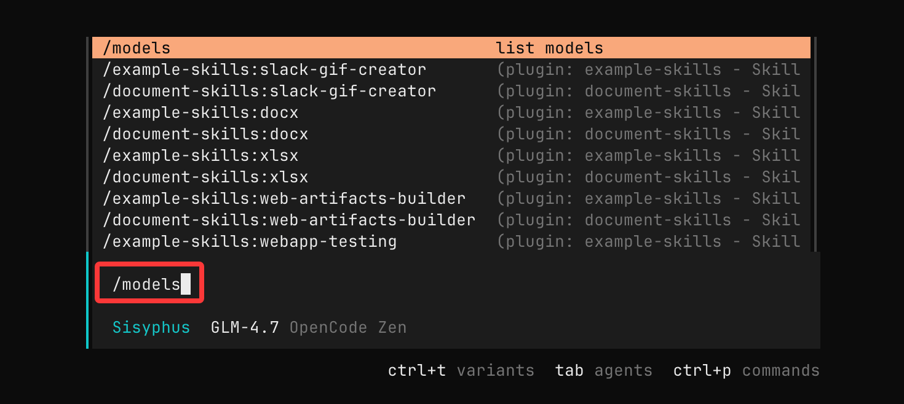
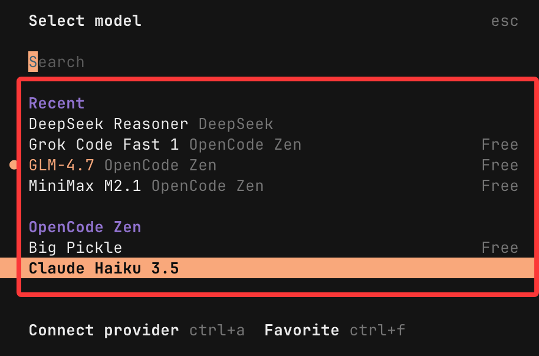
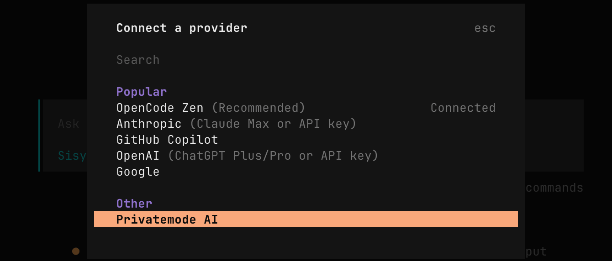
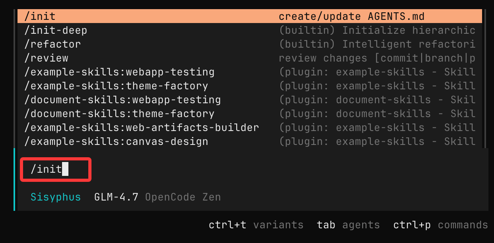
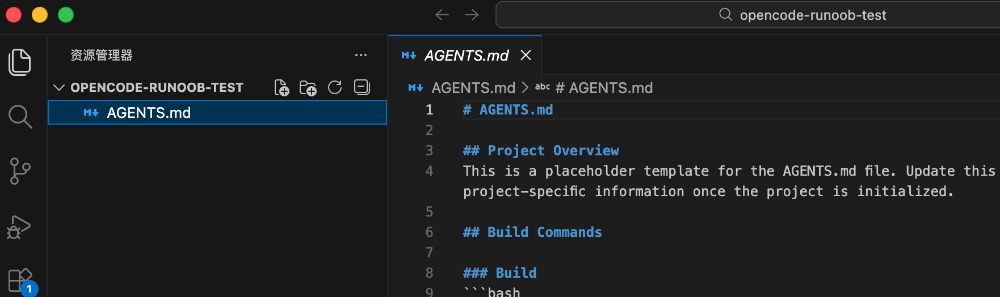
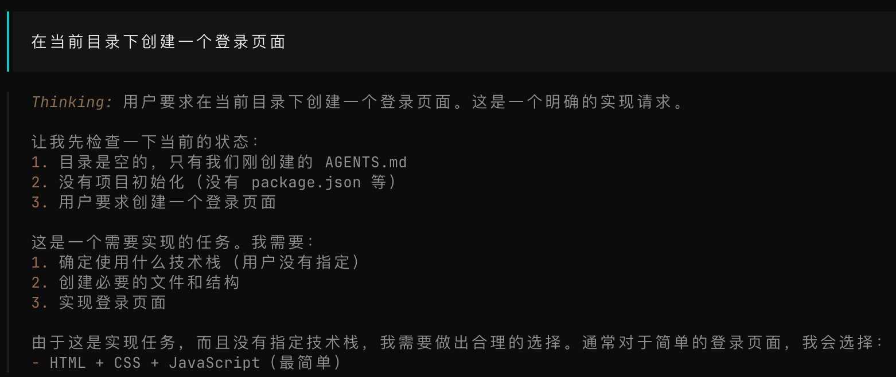
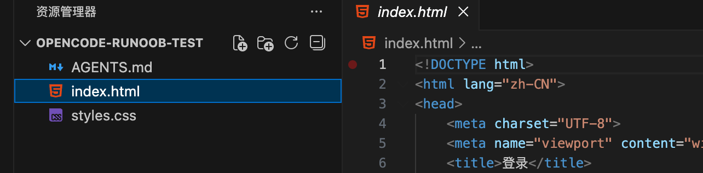
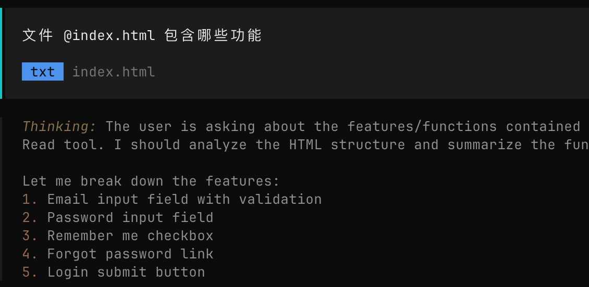

## OpenCode 入门教程
OpenCode 是一个开源的 AI 编程代理（AI coding agent），支持在终端（Terminal）、桌面应用和主流 IDE（如 VS Code）中与 AI 交互完成代码相关任务。

OpenCode 可以帮助我们理解代码库、编写新功能、重构代码、修复 Bug 等，大幅提升开发效率。

OpenCode 类似于 Claude 的 Code 模式或 Cursor 的 Agent 功能，但完全开源、隐私优先，支持多种大语言模型（LLM），并强调终端体验。

OpenCode 支持 75+ 家模型提供商，内置 GLM-4.7、MiniMax M2.1 等免费模型，可对接 OpenAI、Anthropic、Google 等商业模型，也能配置本地模型（如 Llama 3），按需适配轻量脚本、复杂架构等不同场景。

#### 关键特性
##### 两种内置 Agent 模式：
- Build 模式：全权限，可直接编辑文件、执行命令。
- Plan 模式：只读规划，默认拒绝编辑，需要确认。
工具集：bash 执行、文件读写、grep 搜索、LSP 诊断等。
上下文感知：自动分析项目结构，生成 AGENTS.md 指南。
分享与协作：一键生成会话分享链接。


## 安装 OpenCode
OpenCode 支持 macOS / Windows / Linux 多平台安装。

通用一键安装脚本这是最简单的方法：
```
curl -fsSL https://opencode.ai/install | bash
```
安装完成后，你应该能通过命令行运行：
```
opencode --version
```
如果输出类似 1.1.19 这种的版本号信息表示安装成功。


### 包管理器安装
macOS / Linux
```
brew install opencode
```
或者：
```
npm install -g opencode-ai
```
Windows
```
choco install opencode
```
或者：

```
scoop bucket add extras
scoop install extras/opencode
```

Arch Linux
```
paru -S opencode-bin
```
OpenCode 是在终端运行的，我们可以使用默认系统自带的终端，也可以使用一些好用的现代化的终端工具：

- WezTerm, 跨平台
- Alacritty, 跨平台
- Ghostty, Linux 与 macOS
- Kitty, Linux 与 macOS
### 桌面应用
OpenCode 也提供桌面端应用，可直接从 发布页面 或 opencode.ai/download 下载。

|系统平台|下载安装包|
|---|---|
|macOS（苹果芯片）|opencode-desktop-darwin-aarch64.dmg|
|macOS（英特尔芯片）|opencode-desktop-darwin-x64.dmg|
|Windows|opencode-desktop-windows-x64.exe|
|Linux|.deb、.rpm 或 AppImage 格式|


## 启动与使用
启动 OpenCode 只需要终端输入启动命令：
```
opencode
```
首次启动会引导完成基础配置：

- 模型选择：默认展示可用模型列表，可直接选择标注 Free 的免费模型（如 MiniMax M2.1、GLM-4.7），无需 API Key 即可使用。
- 登录选项：可选择跳过登录，后续需对接商业模型时再配置 API Key，也可登录 Claude Code Pro 账号调用专属模型。
启动成功后进入 TUI 界面，即可开始使用核心功能。

我们可以在终端输入 /models 查看可用的免费模型：



弹出的查看，右边有 Free 字样的就是免费的：




### 配置 API 密钥与模型
如果你连接一个 AI 提供商的 API 密钥，例如 OpenAI 或 Anthropic Claude，运行：
```
opencode auth login
```
或者在终端启动后输入：
```
/connect
```
选择模型。按照提示登录并粘贴你的 API Key。



你也可以使用 Zen 模型集合（由 OpenCode 官方推荐、经过测试的高质量模型），省去自己管理多个外部账户的麻烦。

如果不想用了，可以使用以下命令退出：
```
/exit 
```


## 基本使用
### 启动 OpenCode
进入你想处理的项目目录：
```
cd /path/to/your/project
opencode
```
例如，我们创建目录 opencode-runoob-test：
```
mkdir opencode-runoob-test
cd opencode-runoob-test
```
然后执行命令：
```
opencode
```
如果有权限问题，可以使用：
```
sudo opencode
```
这会打开 OpenCode 的终端交互界面（TUI）。

项目初始化
在 OpenCode 界面中，运行：
```
/init
```


这会生成一个 .opencode/ 文件夹，用于存储项目的向量化索引和自定义指令。

它会扫描当前目录的代码结构，并生成一个用于记录项目信息的 AGENTS.md 文件。


opencode-runoob-test 目录下可以看到 AGENTS.md 文件：



然后我们使用自然语言描述你的需求来发起任务：
```
在当前目录下创建一个登录页面
```
接下来大模型就会开始思考，并创建登录页面：



生成的文件




#### 提问解释代码
你可以直接用自然语言向 OpenCode 询问代码库细节：
文件 @index.html 包含哪些功能
其中 @ 用来引用项目里的文件路径。



#### 日常交互
- 直接提问：例如 "解释 src/main.ts 中的认证逻辑"。
- 添加功能：描述需求，如 "添加用户注册 API，支持邮箱验证"。
- 切换模式：按 Tab 键切换 Plan/Build 模式（Plan 更安全，用于规划）。
- 撤销变更：/undo
- 重做：/redo
- 分享会话：/share

#### 交互模式（脚本化）：
```
opencode -p "修复 login 函数中的 bug"
```

####  内置工具介绍
OpenCode 的 AI Agent 通过以下工具操作代码库（可在 opencode.json 中控制权限：allow/deny/ask）：

- bash：执行 shell 命令（如 git status、npm test）。
- write/edit/patch：创建/修改/打补丁文件。
- read：读取文件内容（支持行范围）。
- grep/glob/list：搜索和列出文件（尊重 .gitignore）。
- webfetch：抓取网页内容（查文档）。
- lsp（实验性）：代码跳转、悬停提示等。
- question：向你提问确认。
- todo：维护任务清单。
- 自定义工具和 MCP（Model Context Protocol）服务器支持扩展（如连接数据库）。

#### 高级用法
- **自定义命令**：在 ~/.config/opencode/commands/ 创建 Markdown 文件，如 prime-context.md，内容为预加载指令。
- **主题与按键**：在设置中自定义外观和快捷键。
- **多会话**：同时开启多个 Agent 处理不同任务。
- **IDE 集成**：目前支持 VS Code 扩展（搜索 OpenCode extension），或通过客户端/服务器架构远程控制。
- **权限控制**：在配置文件中为工具设置 ask 以手动确认敏感操作。
#### 创建一个简单的 Node.js API
1. 新建目录：mkdir my-api && cd my-api
2. 初始化：npm init -y
3. 启动 OpenCode：opencode
4. 输入 /init
5. 提问：创建一个 Express.js 服务，支持 /hello 路由返回 JSON { message: 'Hello World' }，并添加 README。

## oh-my-opencode
oh-my-opencode 是一个为 OpenCode（设计的强大插件/扩展层。它将单个 AI 代理升级为一个多智能体协作团队，提供开箱即用的高级功能。

GitHub 仓库：https://github.com/code-yeongyu/oh-my-opencode

**核心亮点包括：**
- Sisyphus 主智能体：负责持续执行复杂任务，直至完成。
- 支持并行运行专业子智能体（如 Oracle 预言者、Librarian 文档专家、Frontend Engineer 前端工程师、Explore 探索者等）。
- 内置 LSP/AST 工具（代码重构）、MCP（模型调用插件，如搜索、文档检索）、钩子系统（25+ 种事件触发）。
- 多模型调度：自动分配任务给最适合的模型（例如 Gemini 处理前端、Claude 处理规划）。
- 关键词触发完整自动化（如 ultrawork 或 ulw），支持后台任务、Todo 强制执行、上下文注入等。
- 完全兼容 Claude Code 工作流，强调高性能、自动化和可定制性。

### 安装
推荐让 OpenCode 自动完成安装，复制以下提示并粘贴到你的 OpenCode 对话框：
```
按照以下说明安装和配置 oh-my-opencode：
https://raw.githubusercontent.com/code-yeongyu/oh-my-opencode/refs/heads/master/docs/guide/installation.md
```

安装后，默认开箱即用，无需额外配置即可体验大部分功能。

###基本触发
在 OpenCode 的提示词中加入关键词 ultrawork（或简写 ulw），例如：
```
ultrawork: 请帮我实现一个 React 组件，支持暗黑模式。
```
这会激活完整模式：Sisyphus 主智能体接管，自动分配子任务给专业代理，并行执行（后台映射代码库、深度探索、自动重构等），直至任务 100% 完成。


## OpenCode TUI 常用 Slash 命令速查表
OpenCode 的 Slash 命令（以 / 开头）主要在终端用户界面（TUI）中使用，用于快速控制会话、配置和操作。

**核心配置与初始化**
|命令|	描述|	别名/快捷键|
|---|---|---|
|/connect|	添加或配置 LLM 提供商（API Key）	|无|
|/init|	创建或更新项目 AGENTS.md 文件（分析代码库）|	Ctrl+X I|
|/models|	列出可用模型并切换	| Ctrl+X M|

**会话管理**
|命令|	描述|	别名/快捷键|
|---|---|---|
|/new|	开始新会话（清除当前）	|/clear / Ctrl+X N|
|/sessions|	列出并切换会话	|/resume / /continue / Ctrl+X L|
|/share|	分享当前会话（生成链接）	|Ctrl+X S|
|/unshare|	取消分享当前会话	|无|
|/compact|	压缩/总结当前会话	|/summarize / Ctrl+X C|

**编辑与撤销**
|命令|	描述|	别名/快捷键|
|---|---|---|
|/undo|	撤销最后操作（需 Git 仓库，支持文件变更回滚）	|Ctrl+X U|
|/redo|	重做已撤销的操作（需 Git 仓库）|	Ctrl+X R

**视图与辅助**
|命令|	描述|	别名/快捷键|
|---|---|---|
|/details|	切换工具执行详情显示	|Ctrl+X D|
|/thinking|	切换思考/推理过程可见性	|无|
|/theme|	列出并切换主题	|Ctrl+X T|
|/help|	显示帮助对话框	|Ctrl+X H|
|/editor|	使用外部编辑器撰写消息	|Ctrl+X E|
|/export|	导出当前对话为 Markdown 并打开编辑	|Ctrl+X X|

**退出**
|命令|	描述|	别名/快捷键|
|---|---|---|
|/exit|	退出 OpenCode	|/quit / /q / Ctrl+X Q|

注意：

- 这些命令在 TUI 聊天界面中直接输入 / + 命令名即可触发（会弹出自动补全）。
- /undo 和 /redo 需要项目是 Git 仓库才能回滚文件变更。
- 你可以创建自定义 Slash 命令（放在 ~/.config/opencode/commands/ 或项目目录下），它们会覆盖内置命令。
- 更多详情见官方文档：https://opencode.ai/docs/tui

## OpenCode CLI 常用参数速查表
OpenCode 的命令行接口（CLI）主要用于启动 TUI（终端界面）、非交互模式运行提示，或设置基本选项。默认运行 opencode 会直接启动交互式 TUI。

以下是常用全局参数（flags）：

|参数|	简称|	描述|	示例|
|---|---|---|---|
|--help|	-h|	显示帮助信息（列出所有可用参数）|	opencode --help|
|--debug|	-d|	启用调试模式（输出更多日志，便于排查问题）|	opencode -d|
|--cwd|	-c|	指定当前工作目录（启动时切换到该路径）|	opencode -c /path/to/your/project|
|--prompt|	-p|	非交互模式：直接运行单个提示并输出响应（适合脚本/自动化）|	opencode -p "修复这个 bug"|
--output-format	-f	非交互模式下的输出格式（text 或 json，默认 text）	opencode -p "解释代码" -f json
--quiet	-q	非交互模式下隐藏加载动画（spinner）	opencode -p "生成 README" -q
### 基本用法示例
- 启动交互式 TUI：opencode
- 带调试启动：opencode -d
- 指定项目目录启动：opencode -c ~/my-app
- 非交互单次提示：opencode -p "添加一个登录接口" -f json

### 注意：
- 这些参数是全局的，可组合使用。
- 非交互模式（-p）特别适合 CI/CD、脚本或快速查询，不进入 TUI。
- 更多高级配置（如模型选择）通常通过环境变量或配置文件 ~/.opencode.json 处理，而非 CLI 参数。
- 运行 opencode --help 可查看最新完整列表（推荐，因为工具可能更新）。

## 参考地址
- 官方网址：https://opencode.ai/
- GitHub 仓库：https://github.com/anomalyco/opencode
- 文档：https://opencode.ai/docs