## OpenCode skills 使用
在之前的内容，我们已经了解了 OpenCode 和 skills，如果还没阅读，可以参阅：

- OpenCode 入门教程 [text](<06-OpenCode 入门教程.md>)
- Skills 教程 [text](<07-Agent Skills教程(含ClaudeCode Skills).md>)
接下来我们将将介绍如何在 OpenCode 中使用 skills。

现在市面上已经有很多现成的 skills，我么可以直接拿来使用，我们可以在 https://skills.sh/ 查找更多的 skill。

安装方式：
```
npx skills add <owner/repo>
```
注：如果对 npx 不了解，可以参阅：npx 入门教程


## ui-ux-pro-max
接下来我们使用 ui-ux-pro-max 这个 skill 演示，地址：https://skills.sh/nextlevelbuilder/ui-ux-pro-max-skill/ui-ux-pro-max。

UI/UX Pro Max 是一个 AI 设计智能技能（AI Skill），为构建专业级 用户界面（UI）和用户体验（UX） 提供结构化设计知识和自动化辅助，主要用于与 AI 编码助手集成（例如 Claude Code、Cursor、Windsurf 等）。

UI/UX Pro Max 包含一个可搜索的设计数据库，可根据自然语言提示智能推荐界面风格、配色、排版与组件实现方式。

安装命令：
```
npx skills add https://github.com/nextlevelbuilder/ui-ux-pro-max-skill --skill ui-ux-pro-max
```
安装过程，可以勾选我们需要的环境，比如 OpenCode：

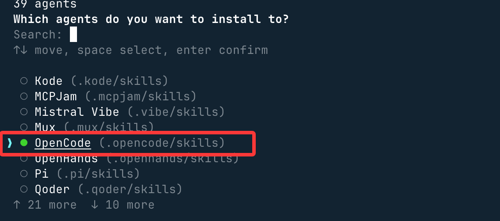

接下来这里选择当前目录也就是我们之前创建的 opencode-runoob-test，另一个选项 Global 是全局安装：

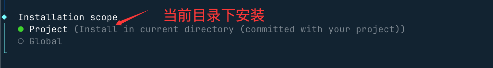

接下来一路回车就好了。

使用 opencode 命令打开 OpenCode，输入 /ui 就可以看到安装的 skill：

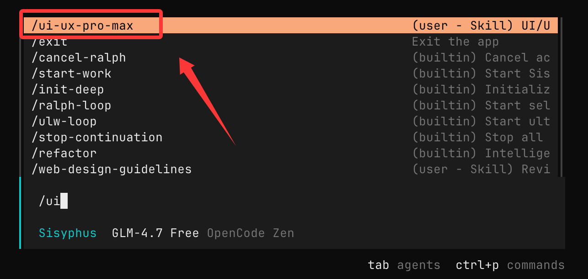

接下来我们就可以直接输入需求：
```
为宠物美容服务搭建一个着陆页，风格活泼亲和，并设置预约类行动召唤按钮。
```
AI 会自动调用我们安装的 skill 来设计，一路回车就好了：

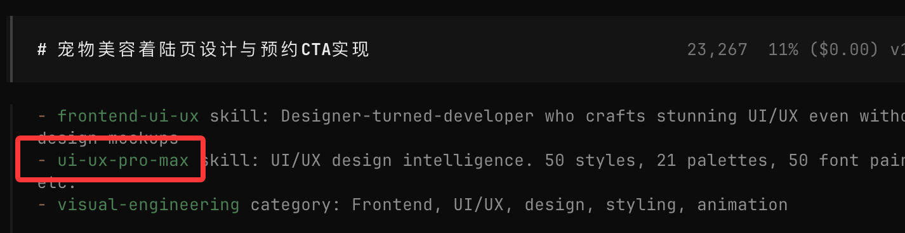

接下来自动生成目录与文件：

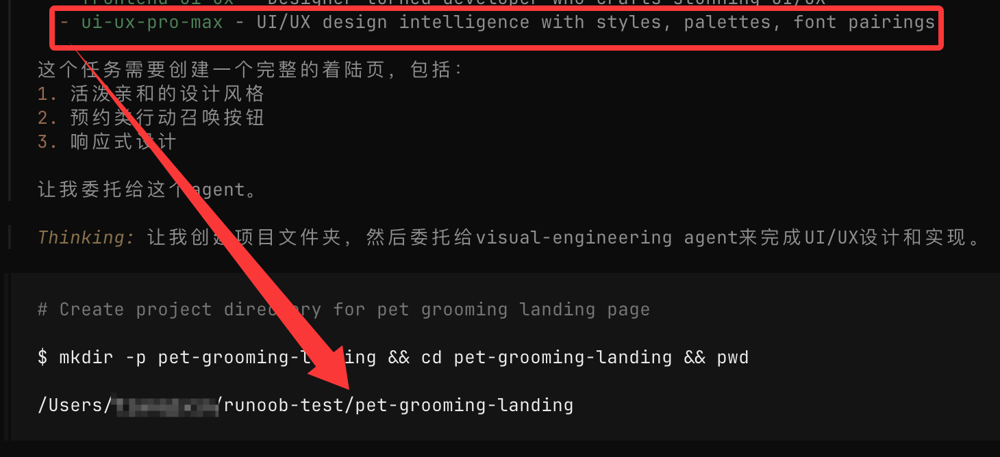

然后查看最终效果，好看很多：


## remotion-best-practices
接下来使用 remotion-best-practices 这个 skill 来演示。
- Opencode：一个负责让 AI 写代码自动化流程
- remotion-best-practices：一个负责用 React 直接生成视频的 skills

remotion-best-practices 是针对 Remotion 的专门技能，包含数十个规则文件（基于官方最佳实践），例如：
- 三维内容（3D）
- 动画基础
- 媒体导入（图片、音频、字体）
- 字幕与字幕同步
- 序列与场景组织
- 透明视频与剪辑
- 文本动画 & 插值方法 …
skill 地址：https://skills.sh/remotion-dev/skills/remotion-best-practices

#### 安装与使用
开始前我们先创建一个目录 **opencode-runoob-test:**
```
mkdir opencode-runoob-test
cd opencode-runoob-test
```
在 opencode-runoob-test 目录下我们可以使用 npx 命令来安装：
```
npx skills add remotion-dev/skills
```

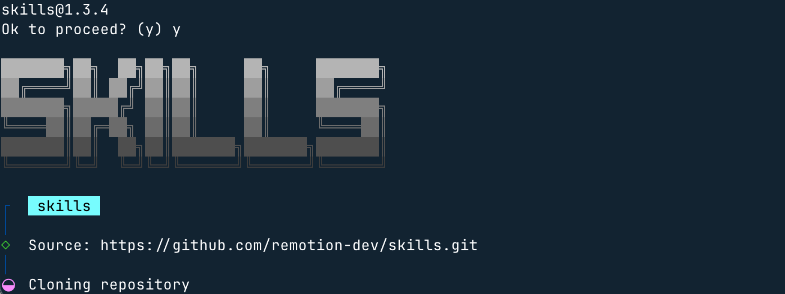

安装过程，可以勾选我们需要的环境，比如 OpenCode：


接下来这里选择当前目录也就是我们之前创建的 opencode-runoob-test，另一个选项 Global 是全局安装：


接下来一路回车就好了，之后会显示安装目录及支持的开发工具：

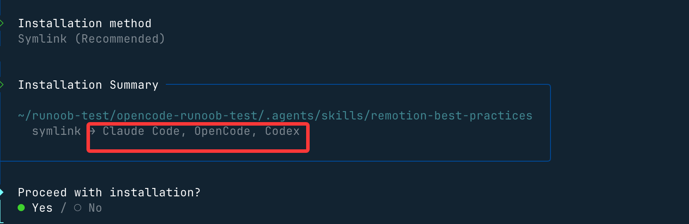

用 VS Code 打开 目录 opencode-runoob-test就可以看到这个 skill 了：
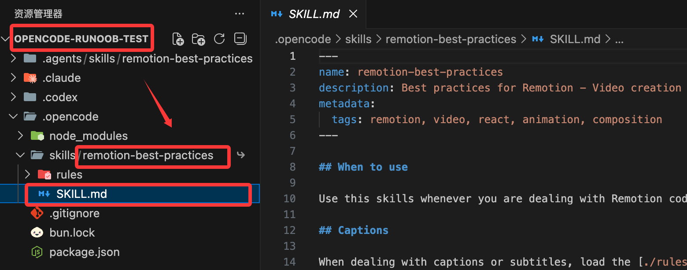

我们也可以打开 OpenCode，输入 /remotion 就可以看到这个 skill：

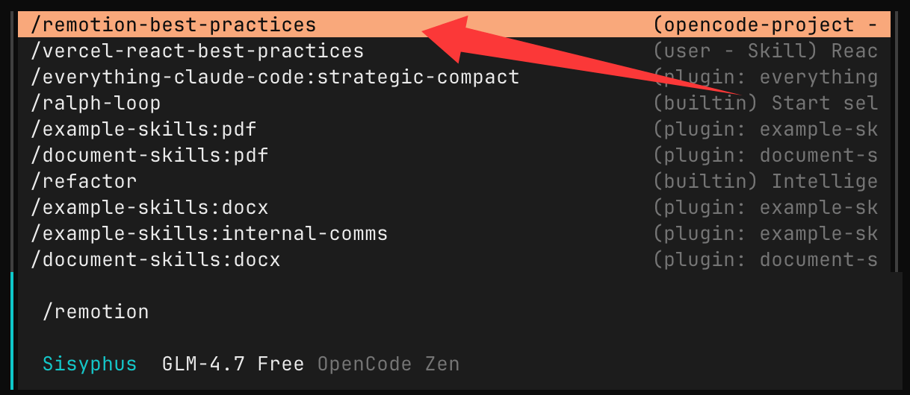

然后在输入框输入：
```
生成一个 Hello Runoob！的演示视频
```
接下来 AI 就会找到这个 skill（技能）：

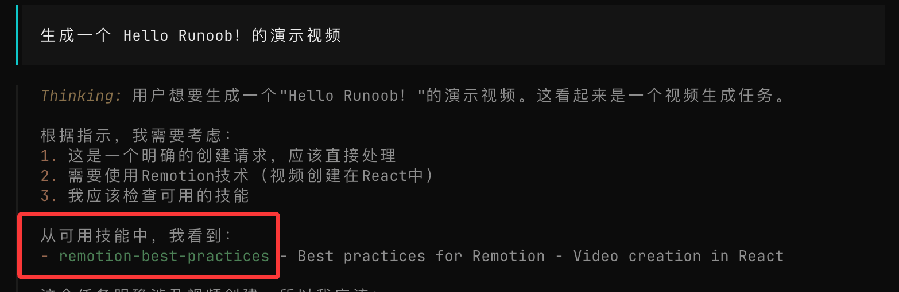

然后 AI 就会使用这个 skill 来开始设计编写：

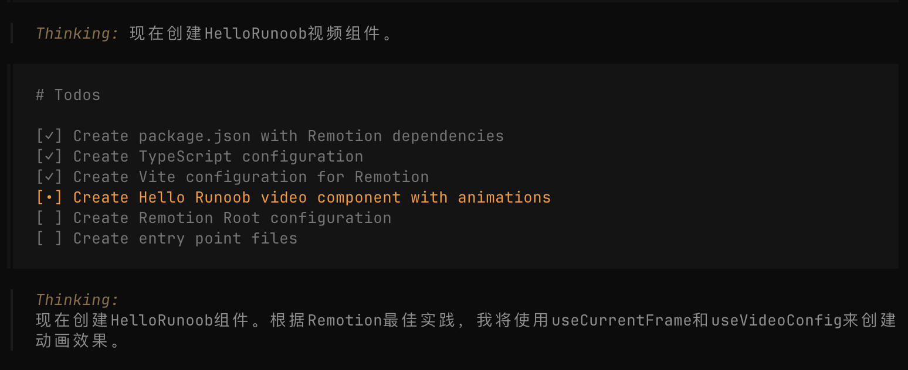