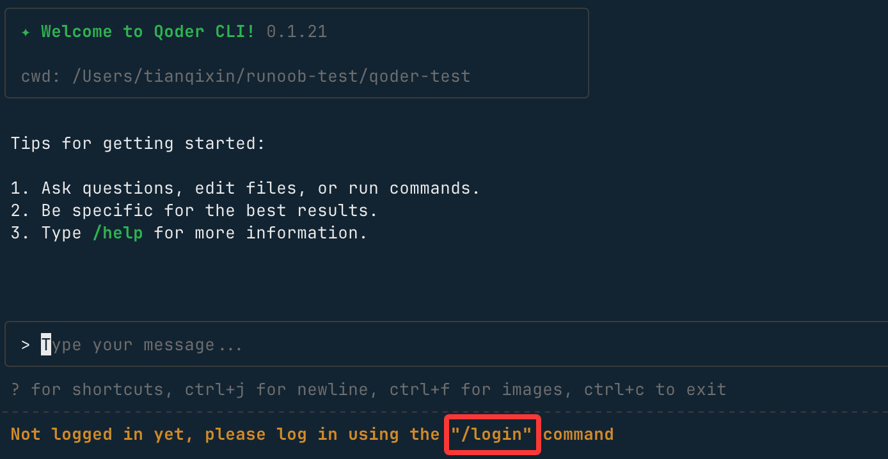
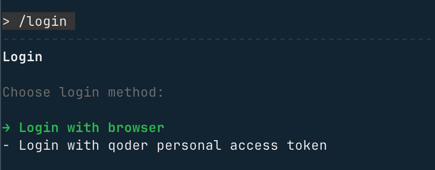
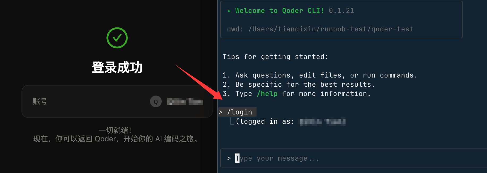
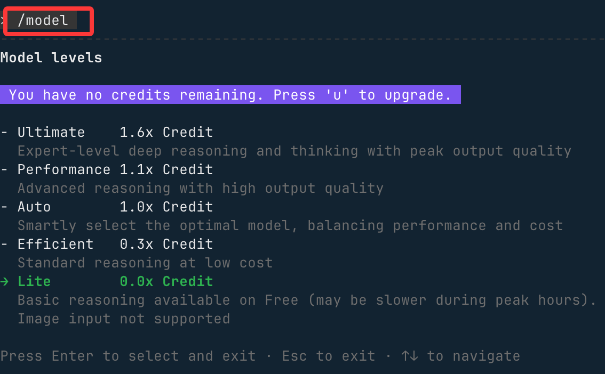

## Qoder CLI
Qoder CLI 是一款类似 Calude Code 的命令行工具，支持在终端中完成各类操作，适用于开发、自动化脚本等多种场景。

Qoder CLI 是 Qoder（https://qoder.com/）平台提供的官方命令行客户端，支持以下系统和架构：
- 操作系统：macOS、Linux、Windows（推荐使用 Windows Terminal）
- CPU 架构：arm64、amd64（Windows arm64 暂不支持）

### 安装方法
可以通过以下几种方式安装。

1、cURL
```
# 安装
curl -fsSL https://qoder.com/install | bash

# 升级
curl -fsSL https://qoder.com/install | bash -s -- --force
```
2、Homebrew（macOS、Linux）
```
brew install qoderai/qoder/qodercli --cask
```
3、NPM
```
npm install -g @qoder-ai/qodercli
```
安装完成后，运行下列命令。
```
qodercli --version
```
如果打印出 CLI 版本号类似 0.1.21，则表示安装成功。

接下来就可以开始进入你创建的项目目录，开始使用 Qoder Cli：
```
cd your-project
qodercli
```
登录您的账户
使用 qodercli 命令启动交互式会话时，您需要登录：
```
qodercli
```
首次使用时会提示您登录:



```
/login
```
按照提示使用您的账户登录，这里选 Login with browser（使用浏览器登录）：




如果还没账号，可以在打开的网页中点击底部的立即注册链接注册个账号，或使用 Google 或 GitHub 账号直接注册。


登录成功后，就会显示用户信息：




当你需要登出 Qoder 时，可使用 /logout 命令退出登录。
```
# 在交互式提示符中
/logout
```
退出 Qcoder Cli 使用以下命令：
```
/quit
```
另外我们可以使用 /model 命令来查看和切换模型：



接下来我们就可以在输入框开始编写需求了，比如让他创建一个 Vue 项目，输入后 Qoder 就会开始整理需求，编写代码：


制作过程中会出现权限的请求，选择 **Allow** 回车即可：


一会整个项目就整好了。


### Qoder CLI 核心模式与高级用法
#### TUI 模式（交互式文本界面）
TUI（Text User Interface）是 Qoder CLI 的默认交互模式，支持文本对话、命令执行等核心操作，是日常使用的主要方式。

##### 1. 启动方式
在任意项目根目录执行以下命令，即可进入 TUI 模式：
```
qodercli
```
##### 2. 输入模式
TUI 提供多种输入模式，适配不同操作场景，输入对应符号即可切换：

| 命令符号 | 模式名称 | 描述 |
| -------- | -------- | -------- |
| > | 对话模式 | 默认模式，输入任意文本即可与 CLI 自然对话 |
| ! | Bash 模式 | 在对话模式下输入 !，可直接运行 shell 命令 |
| / | 斜杠模式 | 在对话模式下输入 /，可调用内置功能命令 |
| # | 记忆模式 | 在对话模式下输入 #，内容会追加到项目的 AGENTS.md 记忆文件 |
| \ + 回车 | 多行输入 | 输入 \ 后按回车，可输入多行文本内容 |

##### 3. 内置工具
TUI 模式内置常用工具，无需额外配置即可操作文件/执行命令：
- Grep：文件内容检索
- Read：读取文件内容
- Write：修改/写入文件内容
- Bash：执行 shell 命令

##### 4. 核心斜杠命令
输入 / 后调用以下内置命令，可快速访问 CLI 核心功能：

| 命令 | 描述 |
| -------- | -------- |
| /login | 登录 Qoder 账号 |
| /help | 显示 TUI 完整使用帮助 |
| /init | 初始化/更新项目的 AGENTS.md 记忆文件 |
| /memory | 编辑 AGENTS.md 记忆文件 |
| /quest | 基于 Spec 完成任务委派 |
| /review | 评审本地代码改动 |
| /resume | 查看/恢复历史会话 |
| /clear | 清除当前会话的历史上下文 |
| /compact | 总结当前会话的历史上下文（精简内容） |
| /usage | 查看账户状态、Credits 消耗等信息 |
| /status | 查看 CLI 状态（版本、模型、账户、API 连通性、工具状态） |
| /config | 查看 CLI 系统配置 |
| /agents | 子 Agent 管理（查看/创建/编辑） |
| /bashes | 查看后台运行的 Bash 任务 |
| /release-notes | 查看 CLI 更新日志 |
| /vim | 打开外部编辑器编辑输入内容 |
| /feedback | 反馈 CLI 使用问题 |
| /quit | 退出 TUI 模式 |
| /logout | 退出当前登录账号 |


##### 高级启动选项
启动 Qoder CLI 时，可通过以下参数自定义启动行为，适配不同使用场景：

| 选项 | 说明 | 示例 |
| -------- | -------- | -------- |
| -w | 指定工作区目录 | qodercli -w /Users/demo/projects/nacos |
| -c | 继续上次会话 | qodercli -c |
| -r | 恢复指定历史会话 | qodercli -r *******-c09a-40a9-82a7-a565413fa39 |
| --allowed-tools | 仅允许使用指定内置工具 | qodercli --allowed-tools=READ,WRITE |
| --disallowed-tools | 禁止使用指定内置工具 | qodercli --disallowed-tools=READ,WRITE |
| --max-turns | 设置最大对话轮数 | qodercli --max-turns=10 |
| --yolo | 跳过权限检查（慎用） | qodercli --yolo |
##### Print 模式（非交互式）
Print 模式为无交互的批量执行模式，输出格式可自定义，适合自动化脚本、CI/CD 场景。

1. 启动方式
执行以下命令进入 Print 模式：
```
qodercli --print
```
2. 核心参数
Print 模式支持以下参数，与高级启动选项复用部分参数：

| 参数 | 说明 | 示例 |
| -------- | -------- | -------- |
| -p | 非交互方式运行 Agent | qodercli -q -p "帮我分析当前项目的依赖结构" |
| --output-format | 指定输出格式（text/json/stream-json） | qodercli --output-format=json |
| -w | 指定工作区目录 | 同高级启动选项 |
| -c | 继续上次会话 | 同高级启动选项 |
| -r | 恢复指定会话 | 同高级启动选项 |
| --allowed-tools | 仅允许指定工具 | 同高级启动选项 |
| --disallowed-tools | 禁止指定工具 | 同高级启动选项 |
| --max-turns | 最大对话轮数 | 同高级启动选项 |
| --yolo | 跳过权限检查 | 同高级启动选项 |


### MCP 服务集成
Qoder CLI 支持集成标准 MCP（Model Context Protocol）工具，扩展 CLI 能力边界（如浏览器控制、第三方工具调用）。

#### 1. 添加 MCP 服务
以集成 Playwright（浏览器控制）为例，执行以下命令：
```
qodercli mcp add playwright -- npx -y @playwright/mcp@latest
```
#### 2. 管理 MCP 服务
| 命令 | 描述 |
| -------- | -------- |
| qodercli mcp list | 列出已添加的所有 MCP 服务 |
| qodercli mcp remove playwright | 移除指定 MCP 服务（示例为 playwright） |
#### 3. 高级配置（可选）
- -t：设置 MCP 服务类型，支持 stdio/sse/streamable-http（Stdio 类型会在 TUI 启动时自动拉起）；
- -s：设置服务范围，支持「用户级」或「项目级」，可按项目自定义 MCP 配置。
#### 4. MCP 服务文件存储位置
已添加的 MCP 服务配置会保存在以下文件中：
```
# 为当前用户或特定项目添加，不会被提交。
~/.qoder.json   

# 为当前项目添加，通常会被提交。
${project}/.mcp.json
```

### 参考链接：

https://qoder.com/

https://qoder.com/cli

https://docs.qoder.com/zh/cli/quick-start
