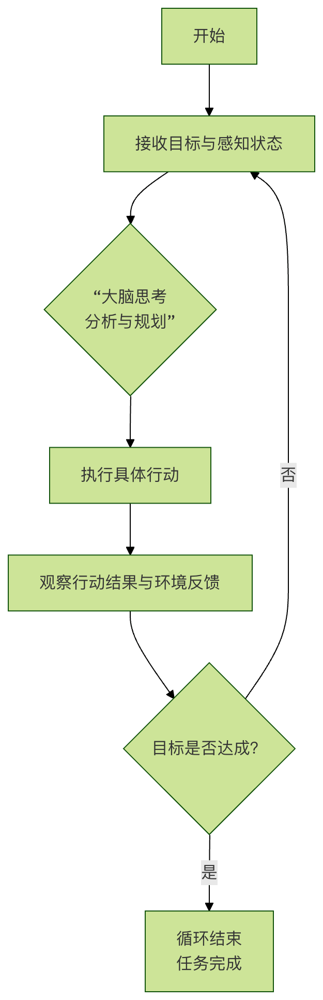

## Python 实现 AI Agent


在深入代码之前，让我们先建立一个清晰的认知，可以把 AI Agent 想象成一个**拥有大脑和手脚的智能程序。**

- 大脑（核心）：一个能够**理解、推理和决策的模型（比如大型语言模型 LLM）** 。它负责处理信息，制定计划。
- 感知（输入）：Agent 通过感官获取外部信息，如用户的指令、数据库查询结果、网页内容、传感器数据等。
- 行动（输出）：Agent 通过手脚影响外部世界，例如调用一个函数、发送一封邮件、在屏幕上输出文本、控制机械臂等。
- 目标：Agent 的一切行为都围绕着一个明确的目标展开，比如：帮我查一下北京明天的天气。

其核心工作流程是一个经典的 **感知-思考-行动 循环**，如下图所示：



## 简单的测试案例
```
agent-demo/
  agent.py        # 主实现（下面给出）
  tools.py        # 工具实现（可单独文件）
  memory.py       # 简单记忆实现（可单独文件）
  README.md
```
实例
```python
"""
agent.py - 极简 AI Agent 原型（可直接运行）
说明：
- LLM 部分用一个非常简单的"规则回答器"模拟，实际接入 LLM 时替换 LLMInterface.generate(...)
- 包含组件：LLM 抽象、大脑(解析/决策)、规划器、工具注册器、内存、执行器
"""

from typing import Any, Dict, List, Callable
import time

# -----------------------------
# Memory（非常轻量）
# -----------------------------
class Memory:
    def __init__(self):
        self.short = {}   # 当前会话上下文
        self.long = {}    # 长期偏好/联系人等

    def get_short(self, k, default=None):
        return self.short.get(k, default)

    def set_short(self, k, v):
        self.short[k] = v

    def get_long(self, k, default=None):
        return self.long.get(k, default)

    def set_long(self, k, v):
        self.long[k] = v

# -----------------------------
# LLM 抽象（替换点）
# -----------------------------
class LLMInterface:
    def generate(self, prompt: str) -> str:
        """
        这里给出一个非常简单的规则式模拟回答器。
        真实使用时：替换为 OpenAI/其它模型的调用代码，返回 model 文本。
        """
        # 极简解析示例：识别是否需要判断"下雨"
        if "是否下雨" in prompt or "下雨" in prompt:
            return "请先查询天气；如果有雨，请生成提醒并发送给目标联系人。"
        if "生成提醒" in prompt:
            return "请提醒小王：明天北京有雨，请带伞。"
        return "我理解了。"

# -----------------------------
# 工具注册与模拟工具
# -----------------------------
class ToolRegistry:
    def __init__(self):
        self.tools: Dict[str, Callable[..., Any]] = {}

    def register(self, name: str, fn: Callable[..., Any]):
        self.tools[name] = fn

    def call(self, name: str, *args, **kwargs):
        if name not in self.tools:
            raise ValueError(f"工具未注册: {name}")
        return self.tools[name](*args, **kwargs)

# 模拟工具：天气查询（真实情况会调用天气 API）
def mock_weather_api(city: str, date: str) -> Dict[str, Any]:
    # 简单规则：如果 city 包含 "北京" 且 date 包含 "明天"，返回下雨示例
    if "北京" in city and "明天" in date:
        return {"city": city, "date": date, "cond": "雨", "precip_mm": 5}
    return {"city": city, "date": date, "cond": "晴", "precip_mm": 0}

# 模拟工具：发送消息（真实情况会调用短信/邮件/企业微信等）
def mock_send_message(contact: str, message: str) -> bool:
    print(f"[发送消息] to={contact} message={message}")
    return True

# 模拟工具：简单搜索（示意）
def mock_search(query: str) -> str:
    return f"模拟搜索结果：关于 `{query}` 的信息摘要。"

# -----------------------------
# Planner / Executor
# -----------------------------
class SimplePlanner:
    def plan(self, goal: str) -> List[Dict[str, Any]]:
        """
        将目标拆解为步骤列表（非常简化的实现）
        每一步包含：action(工具名或内部动作)、params
        """
        steps = []
        # 例：若提示包含"天气"，生成两个步骤：查天气、判断并可能发提醒
        if "天气" in goal or "下雨" in goal:
            steps.append({"action": "query_weather", "params": {"city": "北京", "date": "明天"}})
            steps.append({"action": "decide_and_notify", "params": {"contact_name": "小王"}})
        else:
            steps.append({"action": "search", "params": {"query": goal}})
        return steps

class Executor:
    def __init__(self, tools: ToolRegistry, memory: Memory, llm: LLMInterface):
        self.tools = tools
        self.memory = memory
        self.llm = llm

    def run_step(self, step: Dict[str, Any]):
        action = step["action"]
        params = step.get("params", {})
        if action == "query_weather":
            res = self.tools.call("weather", params["city"], params["date"])
            self.memory.set_short("last_weather", res)
            return res
        if action == "decide_and_notify":
            weather = self.memory.get_short("last_weather", {})
            # 简单规则决策
            if weather.get("cond") == "雨":
                # 让 LLM 生成提醒文本（示例）
                prompt = f"基于天气信息：{weather}，生成一条发给{params['contact_name']}的提醒。"
                reminder = self.llm.generate(prompt)
                # 从长期记忆中获取联系方式
                contact = self.memory.get_long(params["contact_name"]) or "13800000000"
                ok = self.tools.call("send_message", contact, reminder)
                return {"notified": ok, "message": reminder}
            else:
                return {"notified": False, "reason": "天气晴朗"}
        if action == "search":
            return self.tools.call("search", params["query"])
        raise ValueError(f"未知动作: {action}")

# -----------------------------
# Agent 本体
# -----------------------------
class SimpleAgent:
    def __init__(self):
        self.memory = Memory()
        self.tools = ToolRegistry()
        self.llm = LLMInterface()
        self.planner = SimplePlanner()
        self.executor = Executor(self.tools, self.memory, self.llm)
        # 注册默认工具
        self.tools.register("weather", mock_weather_api)
        self.tools.register("send_message", mock_send_message)
        self.tools.register("search", mock_search)
        # 假设长期记忆里存了小王的联系方式
        self.memory.set_long("小王", "13911112222")

    def handle(self, user_prompt: str):
        # 1) 大脑解析（用 LLM 抽象）
        intent = self.llm.generate(user_prompt)
        # 2) 规划
        steps = self.planner.plan(user_prompt)
        # 3) 逐步执行
        results = []
        for step in steps:
            r = self.executor.run_step(step)
            results.append({"step": step, "result": r})
        # 4) 输出合并
        return {"intent": intent, "steps": results}

# -----------------------------
# 运行示例
# -----------------------------
if __name__ == "__main__":
    agent = SimpleAgent()
    task = "查一下明天北京的天气，如果下雨，帮我写个提醒并发给小王。"
    out = agent.handle(task)
    import json
    print(json.dumps(out, ensure_ascii=False, indent=2))
```
    
**说明：**
**1. LLM 抽象** ：LLMInterface.generate() 是可替换点。把这里换成对接 OpenAI、Claude 或本地 LLM 的代码即可。
**2. 规划器（Planner）**：负责把自然语言目标拆成有序步骤。入门可以用规则或模板；进阶可用 LLM 输出步骤并解析为动作。
**3. 工具层（Tools）**：每个工具是独立函数，统一注册到 ToolRegistry。真实项目中可能是 HTTP 请求、SDK 调用、数据库读写等。
**4. 记忆（Memory）**：区分短期/长期。短期用于当前任务中间结果，长期用于联系人、偏好等。
**5. 执行器（Executor）**：把步骤映射为工具调用并处理返回值、失败和重试逻辑。


## 构建你的第一个 AI Agent：任务规划助手
我们将构建一个 任务规划助手。它的目标是：根据用户给出的一个复杂任务（例如：我想去旅行），自动将其分解成一系列有序的、可执行的具体步骤。

目录结构如下：


### 第一步：搭建智能大脑
Agent 的大脑需要推理能力。我们将使用 OpenAI 的 GPT 模型（通过 API 调用）作为我们 Agent 的大脑。

你需要准备一个 OpenAI API 密钥，也可以使用 DeepSeek 的 API key，可以兼容。

本章节测试示例使用了 DeepSeek 的 API key， 我们可以先去 https://platform.deepseek.com/api_keys 申请 。
```
当然也可以使用，阿里百炼的 Coding Plan 套餐（比较便宜）：https://www.aliyun.com/benefit/scene/codingplan

兼容 OpenAI API 协议：

Base URL：https://coding.dashscope.aliyuncs.com/v1
API Key：填入 Coding Plan 套餐专属 API Key
Model：qwen3-coder-plus
兼容 Anthropic API 协议：

Base URL：https://coding.dashscope.aliyuncs.com/apps/anthropic
API Key：填入 Coding Plan 套餐专属 API Key
Model：qwen3-coder-plus
```

首先，安装必要的库：
```
pip3 install openai
```
可以使用以下代码测试使用运行成功：

实例
```python
import os
from openai import OpenAI


DEEPSEEK_API_KEY = "sk-xxxxxxx"  # 这里设置你申请的 key
DEEPSEEK_API_URL = "https://api.deepseek.com/v1"

client = OpenAI(
    api_key = DEEPSEEK_API_KEY,
    base_url = DEEPSEEK_API_URL)

response = client.chat.completions.create(
    model="deepseek-chat",
    messages=[
        {"role": "system", "content": "You are a helpful assistant"},
        {"role": "user", "content": "Hello"},
    ],
    stream=False
)

print(response.choices[0].message.content)
```
如果安装配置成功会输出类似如下内容：
```
Hello! How can I assist you today?
```
然后，让我们创建一个最简单的大脑模块：

brain.py 文件代码
```python
# brain.py
from openai import OpenAI
import os


DEEPSEEK_API_KEY = "sk-xxxxxxx"  # 这里设置你申请的 key
DEEPSEEK_API_URL = "https://api.deepseek.com/v1"

client = OpenAI(
    api_key = DEEPSEEK_API_KEY,
    base_url = DEEPSEEK_API_URL)

class AgentBrain:
    """Agent 的大脑，负责思考与决策"""
   
    def __init__(self, model="deepseek-chat"):
        self.model = model
   
    def think(self, prompt):
        """核心思考函数：接收提示，返回模型的思考结果"""
        try:
            # 使用客户端调用 Chat Completions API（v1.x 版本写法）
            response = client.chat.completions.create(
                model=self.model,
                messages=[{"role": "user", "content": prompt}],
                temperature=0.5,  # 控制创造性，越低越专注
                max_tokens=500    # 控制回复长度
            )
            # 提取模型返回的文本内容（v1.x 版本属性路径变更）
            reasoning = response.choices[0].message.content
            return reasoning.strip()
        except Exception as e:
            return f"思考过程出错: {e}"

# 简单测试一下大脑是否工作
if __name__ == "__main__":
    brain = AgentBrain()
    test_prompt = "你好，请简单介绍一下你自己。"
    print("测试提问：", test_prompt)
    print("大脑回复：", brain.think(test_prompt))
```
执行以上代码，输出结果大概如下：

测试提问： 你好，请简单介绍一下你自己。
大脑回复： 你好！我是DeepSeek，由深度求索公司创造的AI助手，很高兴认识你！&#x1f60a;

让我简单介绍一下自己：

**我的特点：**
**完全免费**：目前没有任何收费计划，你可以放心使用
**知识丰富**：知识截止到2024年7月，涵盖各个领域
**对话能力强**：支持128K上下文，可以进行长篇深入对话

**代码解析:**
1. 我们创建了一个 AgentBrain 类来封装与 LLM 的交互。
2. think 方法是核心，它接收一个字符串 prompt（提示词），将其发送给 GPT API。
3. temperature 参数很重要：设置为 0.5 能让 Agent 在创造性和稳定性之间取得平衡，适合做规划任务。
4. 最后返回模型生成的文本，这就是 Agent 思考的结果。

### 第二步：定义手脚：工具与行动
Agent 需要有执行能力。我们为它定义几个简单的工具（函数），让它能够动手做事。

tools.py 文件代码
```python
# tools.py
import datetime

class AgentTools:
    """Agent 可以使用的工具集合"""
   
    @staticmethod
    def search_web(query):
        """模拟网络搜索工具（此处为模拟）"""
        mock_results = {
            "旅行目的地推荐": "巴黎、东京、马尔代夫、云南丽江...",
            "北京天气": "明天晴，气温 15-25°C，微风。",
            "Python 教程": "推荐菜鸟教程等网站。"
        }
        for key, value in mock_results.items():
            if key in query:
                return f"[网络搜索] 关于 '{query}' 的结果：{value}"
        return f"[网络搜索] 未找到 '{query}' 的明确信息。"
   
    @staticmethod
    def make_schedule(steps):
        """制定日程计划工具"""
        schedule = "生成的日程计划：\n"
        for i, step in enumerate(steps, 1):
            schedule += f"{i}. {step}\n"
        return schedule
   
    @staticmethod
    def get_current_time():
        """获取当前时间工具"""
        now = datetime.datetime.now()
        return f"[系统时间] 现在是：{now.strftime('%Y-%m-%d %H:%M:%S')}"
   
    @staticmethod
    def calculate(expression):
        """简单计算器工具（安全版本，修复兼容性问题）"""
        try:
            # 1. 严格过滤非法字符（仅允许数字、基础运算符、括号、空格）
            allowed_chars = set("0123456789+-*/(). ")
            if not all(c in allowed_chars for c in expression):
                return "[计算器] 表达式包含非法字符，拒绝计算。"
           
            # 2. 简化安全校验：移除易出错的 ast.walk 逻辑，改用基础语法检查
            # 先替换空格，避免空表达式
            clean_expr = expression.strip().replace(" ", "")
            if not clean_expr:
                return "[计算器] 表达式不能为空。"
           
            # 3. 安全执行计算（限制内置函数，仅保留基础运算）
            # 自定义安全的全局环境，仅允许基础数学运算
            safe_globals = {
                '__builtins__': {},
                'pow': pow,
                'abs': abs
            }
            # 使用 eval 但严格限制环境，且已过滤非法字符，大幅降低风险
            result = eval(clean_expr, safe_globals)
            return f"[计算器] {expression} = {result}"
       
        except ZeroDivisionError:
            return "[计算器] 错误：除数不能为零。"
        except SyntaxError:
            return "[计算器] 表达式语法错误（如括号不匹配、运算符错误）。"
        except Exception as e:
            return f"[计算器] 计算错误: {str(e)}"

# 测试工具
if __name__ == "__main__":
    print(AgentTools.search_web("北京天气"))
    print(AgentTools.get_current_time())
    print(AgentTools.calculate("3 + 5 * 2"))       # 正常计算
    print(AgentTools.calculate("10 / 0"))          # 除零错误
    print(AgentTools.calculate("__import__('os').system('ls')"))  # 非法字符过滤
```
**代码解析**：

1. 每个 @staticmethod 都定义了一个 Agent 可以调用的工具。
2. search_web 目前是模拟的，真实场景需要接入真正的搜索 API。
3. make_schedule 用于将任务列表格式化为计划。
4. **重要安全提示**：calculate 工具中的 eval() 函数在真实产品中极其危险，必须用更安全的方式（如 ast.literal_eval）替换或彻底移除。这里仅为演示 Agent 如何调用函数。
### 第三步：组装 Agent：实现核心循环
现在，我们将大脑和工具组装起来，并实现核心的决策循环。我们将设计一个简单的规则：让大脑根据任务决定使用哪个工具。

实例
```python
# agent.py
from brain import AgentBrain
from tools import AgentTools

class SimpleAgent:
    """一个简单的任务规划 AI Agent"""
   
    def __init__(self):
        self.brain = AgentBrain()
        # 静态工具类无需实例化
        self.tools = AgentTools
        # 定义 Agent 知道的工具列表及其描述，用于提示大脑
        self.tool_descriptions = """
        你可以使用以下工具：
        1. 搜索工具：当你需要获取最新、未知的信息时使用，例如'搜索 北京天气'。
        2. 计划工具：当你需要将多个步骤整理成计划时使用，例如'制定计划 [步骤1，步骤2]'。
        3. 时间工具：当你需要知道当前时间时使用，指令就是'获取时间'。
        4. 计算工具：当你需要进行数学计算时使用，例如'计算 3+5*2'。
        """
   
    def run(self, user_task):
        """运行 Agent 的主循环"""
        print(f"&#x1f3af; 用户任务: {user_task}")
        print("=" * 40)
       
        # 第一步：感知与初步思考
        initial_prompt = f"""
        你的角色是一个任务规划助手。
        {self.tool_descriptions}
       
        用户的任务是：{user_task}
       
        请严格按照以下固定格式回答，不要添加额外内容：
        思考：[简要分析任务需要什么]
        工具：[选择要使用的工具名称，如果没有合适的就写'无']
        指令：[发送给该工具的具体指令内容]
        """
       
        initial_response = self.brain.think(initial_prompt)
        print("&#x1f9e0; 初始思考结果：")
        print(initial_response)
        print("-" * 20)
       
        # 第二步：解析思考结果，提取工具和指令（鲁棒性优化）
        lines = [line.strip() for line in initial_response.split('\n') if line.strip()]
        tool_to_use = "无"
        tool_instruction = ""
       
        for line in lines:
            if line.startswith("思考："):
                continue  # 跳过思考行
            elif line.startswith("工具："):
                tool_to_use = line.replace("工具：", "").strip()
            elif line.startswith("指令："):
                tool_instruction = line.replace("指令：", "").strip()
       
        # 第三步：执行行动
        result = self._use_tool(tool_to_use, tool_instruction)
        print("&#x1f6e0;&#xfe0f;  执行结果：")
        print(result)
        print("=" * 40)
       
        # 第四步：整合结果并反馈给用户
        final_prompt = f"""
        用户原始任务：{user_task}
        你已经进行了思考并使用了工具。
        思考过程：{initial_response}
        工具执行结果：{result}
       
        现在，请生成一段完整的、对用户的最终回复，直接给出有帮助的答案或计划，语言要自然友好。
        """
       
        final_response = self.brain.think(final_prompt)
        print("&#x1f4a1; 最终回复给用户：")
        print(final_response)
       
        return final_response
   
    def _use_tool(self, tool_name, instruction):
        """根据工具名称调用具体的工具函数"""
        # 统一工具名称匹配（兼容大小写/多余空格）
        tool_name = tool_name.strip()
       
        if tool_name == "搜索工具":
            return self.tools.search_web(instruction)
        elif tool_name == "计划工具":
            # 兼容中英文逗号、括号，处理空指令
            if not instruction:
                return "[计划工具] 未提供计划步骤，无法生成日程。"
            # 移除括号并拆分步骤（兼容 []/()/{} 括号）
            clean_instr = instruction.strip('[](){}').strip()
            # 同时支持中英文逗号拆分
            steps = [s.strip() for s in clean_instr.replace('，', ',').split(',') if s.strip()]
            return self.tools.make_schedule(steps)
        elif tool_name == "时间工具":
            return self.tools.get_current_time()
        elif tool_name == "计算工具":
            return self.tools.calculate(instruction)
        elif tool_name == "无":
            return "[系统] 无需使用工具，直接回答用户即可。"
        else:
            return f"[系统] 未知工具：{tool_name}，无法执行。"

# 运行我们的 Agent！
if __name__ == "__main__":
    print("&#x1f916; 启动 SimpleAgent...")
    my_agent = SimpleAgent()
   
    # 测试几个不同的任务
    test_tasks = [
        "我想去旅行，帮我规划一下需要准备什么",
        "现在几点了？",
        "计算一下 15 的平方加上 20 的三分之一是多少",
    ]
   
    for task in test_tasks:
        my_agent.run(task)
        print("\n" + "#" * 50 + "\n")
```
执行代码，输出类似如下：

启动 SimpleAgent...
用户任务: 我想去旅行，帮我规划一下需要准备什么
========================================
初始思考结果：
思考：用户需要规划旅行前的准备工作。这是一个通用任务，不需要最新信息或计算，但需要将多个准备步骤整理成一个清晰的计划。

工具：计划工具

指令：制定计划 [1. 确定目的地和旅行时间，2. 预订交通票（机票/火车票）和住宿，3. 准备旅行证件（身份证、护照、签证等），4. 安排行程和景点门票，5. 打包行李（衣物、洗漱用品、药品、充电器等），6. 安排家中事务（宠物、植物、邮件等），7. 兑换货币或准备支付方式，8. 购买旅行保险]
--------------------
执行结果：
...
**### 代码解析与运行流程：**
1. 初始化：Agent 创建了自己的大脑 (AgentBrain) 和工具箱 (AgentTools)。
2. 接收任务：run 方法启动，接收 user_task（如"我想去旅行"）。
3. 思考阶段：将任务和工具描述组合成 initial_prompt，发送给大脑。大脑返回的文本中包含了它选择的"工具"和给工具的"指令"。
4. 行动阶段：_use_tool 函数根据大脑的选择，调用对应的工具函数并返回结果。
5. 反馈与总结：将原始任务、思考过程和行动结果再次发送给大脑，让它生成一个对用户友好的最终回复。

运行这个程序，你会看到 Agent 如何一步步分析任务、选择工具、执行并给出答案。

## 实践练习：升级你的 Agent
你已经拥有了一个能跑通的 AI Agent！但这只是起点。尝试完成以下练习，让它变得更强大：

### 练习一：增加记忆功能
1. 目标：让 Agent 能记住对话历史。
2. 提示：在 SimpleAgent 类中添加一个 self.conversation_history = [] 列表。每次调用 brain.think 时，不仅发送当前提示，还将之前的历史对话也作为上下文发送。执行后，将新的对话回合（用户输入、AI 思考、工具结果）加入历史列表。

### 练习二：实现自动工具选择
1. 目标：让大脑的回复是标准的 JSON 格式，便于程序自动解析，而不是依赖文本提取。
2. 提示：修改提示词，要求大脑必须返回如 {"thought": "…"， "tool": "…"， "instruction": "…"} 的 JSON 字符串。然后在代码中使用 json.loads() 来解析，提高稳定性和准确性。

### 练习三：添加一个新工具
1. 目标：让 Agent 能处理待办事项。
2. 提示：在 AgentTools 类中添加 todo_list = [] 和两个新方法：add_todo(item) 和 show_todos()。在工具描述中告诉大脑这个新工具的存在，并更新 _use_tool 方法来调用它。


## 总结与展望
恭喜你！你已经成功构建了一个具备基本 感知-思考-行动 循环的 AI Agent。我们回顾一下关键点：

核心概念：AI Agent = 大脑（LLM） + 感知 + 行动 + 目标。
实现关键：
大脑：通过 API 调用 LLM（如 GPT）进行推理。
工具：将具体能力封装成函数，供 Agent 调用。
循环：用代码逻辑将思考、决策、执行串联起来。
这只是 AI Agent 世界的冰山一角。工业级框架如 LangChain、AutoGen 提供了更强大的工具集成、记忆管理、多 Agent 协作等功能。要深入探索，建议你：


