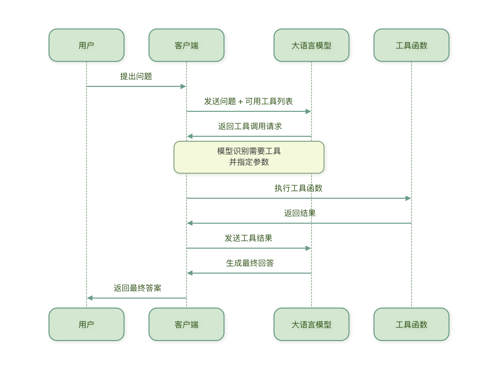
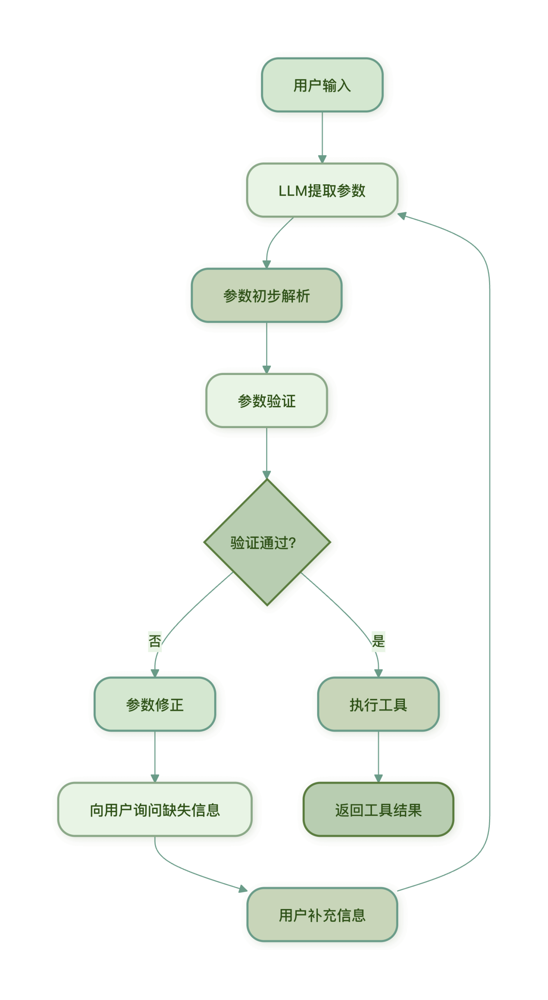

## 工具调用（Function Calling）
Function Calling（函数调用）是让 LLM 能够使用外部工具的核心机制。

Function Calling（函数调用）允许模型决定何时调用工具、调用哪个工具，以及传递什么参数。


### 为什么需要 Function Calling？
想象一下，LLM 是一个聪明但手无寸铁的顾问。它知道很多知识，但不能：

- 获取实时信息（如最新天气、股票价格）
- 执行计算（如复杂的数学运算）
- 操作外部系统（如发送邮件、读写文件）
Function Calling 为 LLM 提供了双手，让它能够突破自身限制，执行实际任务。


### Function Calling 的工作原理
Function Calling 的基本流程如下：



#### 核心概念
- 工具定义：描述一个工具的功能、参数和返回值
- 工具选择：LLM 根据用户问题选择合适的工具
- 参数提取：LLM 从问题中提取工具所需的参数
- 结果处理：将工具执行结果整合到最终回答中

#### 实例说明
假设我们有一个查询天气的工具，当用户问北京今天天气如何？时：

1. LLM 识别出需要调用天气查询工具
2. 从问题中提取参数：city="北京", date="今天"
3. 调用天气 API 获取数据
4. 将天气数据整合成友好的回答返回给用户

### 工具定义与描述编写
要让 LLM 正确使用工具，首先需要清晰地定义工具，好的工具定义应该像一份清晰的说明书，让 LLM 明白：
- 这个工具是做什么的？
- 什么时候使用它？
- 需要什么参数？
- 参数是什么格式？

#### 工具定义的结构
一个完整的工具定义通常包含以下部分：

实例
```python
# 工具定义示例结构
weather_tool = {
    "name": "get_weather",  # 工具名称
    "description": "获取指定城市的天气信息",  # 工具描述
    "parameters": {  # 参数定义
        "type": "object",
        "properties": {
            "city": {
                "type": "string",
                "description": "城市名称，如'北京'、'上海'"
            },
            "date": {
                "type": "string",
                "description": "日期，格式'YYYY-MM-DD'，或'今天'、'明天'",
                "enum": ["今天", "明天", "后天"]
            }
        },
        "required": ["city"]  # 必填参数
    }
}

```

#### 编写优质的工具描述
1. 描述要清晰具体
- 不好的描述：查询天气
- 好的描述：获取指定城市在特定日期的天气信息，包括温度、湿度、风速和天气状况（晴、雨、多云等）
2. 参数描述要详细
不好的参数描述：
```json
"city": {"type": "string"}
```
好的参数描述：
```json
"city": {
    "type": "string",
    "description": "完整的城市名称，如'北京市'、'上海市'。不要使用简称或拼音。"
}
```
3. 使用枚举限制选项
对于有限的选项，使用枚举（enum）帮助 LLM 理解：
```json
"unit": {
    "type": "string",
    "description": "温度单位",
    "enum": ["celsius", "fahrenheit"],
    "default": "celsius"
}
```
4. 提供示例值
在描述中提供示例，帮助 LLM 理解格式：
```json
"date": {
    "type": "string",
    "description": "日期，格式应为'YYYY-MM-DD'，例如'2024-06-15'"
}
```
#### 实用工具定义示例
1. 计算器工具
```json
calculator_tool = {
    "name": "calculate",
    "description": "执行数学计算，支持加减乘除、幂运算等基本运算",
    "parameters": {
        "type": "object",
        "properties": {
            "expression": {
                "type": "string",
                "description": "数学表达式，如'2 + 3 * 4'、'sqrt(16)'、'sin(30)'"
            }
        },
        "required": ["expression"]
    }
}
```

2. 搜索工具
```json
search_tool = {
    "name": "search_web",
    "description": "在互联网上搜索最新信息",
    "parameters": {
        "type": "object",
        "properties": {
            "query": {
                "type": "string",
                "description": "搜索关键词，尽量具体明确"
            },
            "num_results": {
                "type": "integer",
                "description": "返回结果数量，默认为5",
                "default": 5,
                "minimum": 1,
                "maximum": 10
            }
        },
        "required": ["query"]
    }
}
```

3. 文件操作工具
```json
file_tool = {
    "name": "read_file",
    "description": "读取指定文件的内容",
    "parameters": {
        "type": "object",
        "properties": {
            "file_path": {
                "type": "string",
                "description": "文件的完整路径，如'/home/user/document.txt'"
            },
            "encoding": {
                "type": "string",
                "description": "文件编码，默认为'utf-8'",
                "default": "utf-8"
            }
        },
        "required": ["file_path"]
    }
}
```

#### 工具定义的最佳实践
1. 名称简洁明确：使用动词开头，如 get_、calculate_、search_
2. 描述完整详细：说明工具的用途、适用场景和限制
3. 参数验证充分：定义参数类型、范围、格式要求
4. 提供默认值：为可选参数提供合理的默认值
5. 考虑错误情况：在描述中说明可能出现的错误和限制

#### 工具定义的验证
定义工具后，应该进行验证测试：
```python
def validate_tool_definition(tool_def):
    """验证工具定义是否完整"""
    required_fields = ["name", "description", "parameters"]

    for field in required_fields:
        if field not in tool_def:
            return False, f"缺少必要字段: {field}"

    # 检查参数结构
    if "properties" not in tool_def["parameters"]:
        return False, "参数定义缺少properties字段"

    return True, "工具定义完整"

# 测试验证
is_valid, message = validate_tool_definition(weather_tool)
print(f"验证结果: {is_valid}, 消息: {message}")

```

### 参数提取与验证
LLM 从用户问题中提取参数后，需要对这些参数进行验证和处理，确保工具能够正确执行。

#### 参数提取过程
当 LLM 决定调用工具时，它会分析用户输入，提取出工具所需的参数：
```
用户输入: "查询北京明天的天气温度"
工具: get_weather
提取参数: {"city": "北京", "date": "明天"}
```
#### 参数提取的挑战
参数提取可能遇到以下问题：
- 信息缺失：用户没有提供所有必要信息
- 格式不符：用户提供的格式与工具要求不符
- 歧义解析：同一信息可能有多种解释
- 上下文依赖：参数需要结合对话历史理解


#### 参数验证方法
1. 类型验证
确保参数类型符合要求：
```python
def validate_parameters(params, tool_def):
    """验证参数类型"""
    errors = []

    for param_name, param_def in tool_def["parameters"]["properties"].items():
        if param_name in params:
            param_value = params[param_name]
            expected_type = param_def.get("type")

            # 类型检查
            if expected_type == "string" and not isinstance(param_value, str):
                errors.append(f"参数'{param_name}'应为字符串类型")
            elif expected_type == "integer" and not isinstance(param_value, int):
                errors.append(f"参数'{param_name}'应为整数类型")
            elif expected_type == "number" and not isinstance(param_value, (int, float)):
                errors.append(f"参数'{param_name}'应为数字类型")
            elif expected_type == "boolean" and not isinstance(param_value, bool):
                errors.append(f"参数'{param_name}'应为布尔类型")

    return errors
```
2. 范围验证
检查参数值是否在允许范围内：
```python
def validate_range(params, tool_def):
    """验证参数范围"""
    errors = []

    for param_name, param_def in tool_def["parameters"]["properties"].items():
        if param_name in params:
            param_value = params[param_name]

            # 检查最小值
            if "minimum" in param_def and param_value < param_def["minimum"]:
                errors.append(f"参数'{param_name}'不能小于{param_def['minimum']}")

            # 检查最大值
            if "maximum" in param_def and param_value > param_def["maximum"]:
                errors.append(f"参数'{param_name}'不能大于{param_def['maximum']}")

            # 检查枚举值
            if "enum" in param_def and param_value not in param_def["enum"]:
                errors.append(f"参数'{param_name}'必须是{param_def['enum']}中的一个")

    return errors
```
3. 必填参数验证
确保所有必填参数都已提供：
```python
def validate_required(params, tool_def):
    """验证必填参数"""
    errors = []
    required_params = tool_def["parameters"].get("required", [])

    for param_name in required_params:
        if param_name not in params:
            errors.append(f"缺少必填参数: {param_name}")

    return errors
```


#### 完整的参数验证系统
实例
```python
class ParameterValidator:
    """参数验证器"""

    def __init__(self, tool_def):
        self.tool_def = tool_def

    def validate(self, params):
        """执行完整的参数验证"""
        all_errors = []

        # 检查必填参数
        required_errors = self.validate_required(params)
        all_errors.extend(required_errors)

        # 检查参数类型
        type_errors = self.validate_type(params)
        all_errors.extend(type_errors)

        # 检查参数范围
        range_errors = self.validate_range(params)
        all_errors.extend(range_errors)

        # 检查额外参数（未定义的参数）
        extra_errors = self.validate_extra(params)
        all_errors.extend(extra_errors)

        return len(all_errors) == 0, all_errors

    def validate_required(self, params):
        """验证必填参数"""
        errors = []
        required_params = self.tool_def["parameters"].get("required", [])

        for param_name in required_params:
            if param_name not in params or params[param_name] is None:
                errors.append(f"缺少必填参数: {param_name}")

        return errors

    def validate_type(self, params):
        """验证参数类型"""
        errors = []

        for param_name, param_value in params.items():
            if param_name in self.tool_def["parameters"]["properties"]:
                param_def = self.tool_def["parameters"]["properties"][param_name]
                expected_type = param_def.get("type")

                if expected_type == "string" and not isinstance(param_value, str):
                    errors.append(f"参数'{param_name}'应为字符串类型，实际为{type(param_value).__name__}")
                elif expected_type == "integer" and not isinstance(param_value, int):
                    errors.append(f"参数'{param_name}'应为整数类型，实际为{type(param_value).__name__}")
                elif expected_type == "number" and not isinstance(param_value, (int, float)):
                    errors.append(f"参数'{param_name}'应为数字类型，实际为{type(param_value).__name__}")
                elif expected_type == "boolean" and not isinstance(param_value, bool):
                    errors.append(f"参数'{param_name}'应为布尔类型，实际为{type(param_value).__name__}")

        return errors

    def validate_range(self, params):
        """验证参数范围"""
        errors = []

        for param_name, param_value in params.items():
            if param_name in self.tool_def["parameters"]["properties"]:
                param_def = self.tool_def["parameters"]["properties"][param_name]

                # 检查最小值
                if "minimum" in param_def and param_value < param_def["minimum"]:
                    errors.append(f"参数'{param_name}'不能小于{param_def['minimum']}")

                # 检查最大值
                if "maximum" in param_def and param_value > param_def["maximum"]:
                    errors.append(f"参数'{param_name}'不能大于{param_def['maximum']}")

                # 检查枚举值
                if "enum" in param_def and param_value not in param_def["enum"]:
                    errors.append(f"参数'{param_name}'必须是{param_def['enum']}中的一个")

        return errors

    def validate_extra(self, params):
        """检查未定义的额外参数"""
        errors = []
        defined_params = set(self.tool_def["parameters"]["properties"].keys())
        provided_params = set(params.keys())

        extra_params = provided_params - defined_params
        if extra_params:
            errors.append(f"提供了未定义的参数: {', '.join(extra_params)}")

        return errors

# 使用示例
validator = ParameterValidator(weather_tool)
params = {"city": "北京", "date": "明天", "extra": "不应该有的参数"}
is_valid, errors = validator.validate(params)

if is_valid:
    print("参数验证通过")
else:
    print("参数验证失败:")
    for error in errors:
        print(f"  - {error}")
```

#### 参数提取与验证的完整流程



#### 参数修正策略
当参数验证失败时，可以采取以下策略：

- 询问用户：直接向用户询问缺失或错误的参数
- 使用默认值：对于可选参数，使用预定义的默认值
- 智能推断：根据上下文推断合理的参数值
- 格式转换：将用户提供的格式转换为工具要求的格式
```python
def fix_parameters(params, errors, tool_def):
    """尝试修正参数错误"""
    fixed_params = params.copy()

    for error in errors:
        if "缺少必填参数" in error:
            param_name = error.split(": ")[1]
            # 尝试从上下文推断或使用默认值
            if param_name == "date":
                fixed_params[param_name] = "今天"  # 使用当天作为默认值

        elif "应为字符串类型" in error:
            param_name = error.split("'")[1]
            # 尝试转换为字符串
            fixed_params[param_name] = str(params[param_name])

    return fixed_params
```

### 错误处理与重试机制
在实际应用中，工具调用可能会失败。健全的错误处理和重试机制是构建可靠 AI Agent 的关键。

#### 常见的工具调用错误
- 网络错误：API 调用超时、连接失败
- 参数错误：参数验证失败、格式不正确
- 权限错误：API 密钥无效、权限不足
- 资源错误：服务不可用、达到调用限制
- 逻辑错误：工具内部逻辑错误

#### 错误处理策略
1. 分级错误处理
根据错误类型采取不同的处理策略：
```python
class ErrorHandler:
    """错误处理器"""

    def handle(self, error, context):
        """处理错误"""
        error_type = self.classify_error(error)

        if error_type == "network":
            return self.handle_network_error(error, context)
        elif error_type == "parameter":
            return self.handle_parameter_error(error, context)
        elif error_type == "authentication":
            return self.handle_auth_error(error, context)
        elif error_type == "resource":
            return self.handle_resource_error(error, context)
        else:
            return self.handle_unknown_error(error, context)

    def classify_error(self, error):
        """分类错误类型"""
        error_str = str(error).lower()

        if any(word in error_str for word in ["timeout", "connection", "network"]):
            return "network"
        elif any(word in error_str for word in ["parameter", "invalid", "missing"]):
            return "parameter"
        elif any(word in error_str for word in ["auth", "key", "permission"]):
            return "authentication"
        elif any(word in error_str for word in ["limit", "quota", "unavailable"]):
            return "resource"
        else:
            return "unknown"

    def handle_network_error(self, error, context):
        """处理网络错误"""
        return {
            "success": False,
            "error": "网络连接失败，请检查网络后重试",
            "retryable": True,
            "retry_after": 5  # 5秒后重试
        }

    def handle_parameter_error(self, error, context):
        """处理参数错误"""
        return {
            "success": False,
            "error": f"参数错误: {str(error)}",
            "retryable": False,
            "suggestion": "请检查输入参数是否正确"
        }

    # 其他错误处理方法类似...
```
2. 用户友好的错误消息
将技术性错误转换为用户能理解的消息：
```python
def user_friendly_error(error):
    """生成用户友好的错误消息"""
    error_map = {
        "timeout": "请求超时，请稍后重试",
        "connection_error": "网络连接失败，请检查网络",
        "invalid_api_key": "API 密钥无效，请检查配置",
        "rate_limit_exceeded": "调用频率过高，请稍后再试",
        "invalid_parameters": "输入参数不正确，请检查后重试"
    }

    error_str = str(error).lower()
    for key, message in error_map.items():
        if key in error_str:
            return message

    return "系统繁忙，请稍后重试"
```
#### 重试机制
对于可重试的错误，应该实现智能的重试策略：

1. 指数退避重试
```python
import time
import random

class ExponentialBackoffRetry:
    """指数退避重试"""

    def __init__(self, max_retries=3, base_delay=1, max_delay=30):
        self.max_retries = max_retries
        self.base_delay = base_delay
        self.max_delay = max_delay

    def retry(self, func, *args, **kwargs):
        """执行带重试的函数调用"""
        last_error = None

        for attempt in range(self.max_retries):
            try:
                return func(*args, **kwargs)

            except Exception as e:
                last_error = e

                # 检查是否可重试
                if not self.is_retryable(e):
                    raise

                # 最后一次尝试，不再重试
                if attempt == self.max_retries - 1:
                    break

                # 计算等待时间（指数退避 + 随机抖动）
                delay = min(
                    self.base_delay * (2 ** attempt) + random.uniform(0, 1),
                    self.max_delay
                )

                print(f"第{attempt + 1}次尝试失败，{delay:.1f}秒后重试...")
                time.sleep(delay)

        # 所有重试都失败
        raise last_error

    def is_retryable(self, error):
        """判断错误是否可重试"""
        error_str = str(error).lower()
        retryable_errors = ["timeout", "connection", "busy", "temporarily"]

        for retryable_error in retryable_errors:
            if retryable_error in error_str:
                return True

        return False

# 使用示例
retry = ExponentialBackoffRetry(max_retries=3)

def call_weather_api(city, date):
    """调用天气API（模拟可能失败）"""
    # 模拟API调用
    if random.random() < 0.3:  # 30%概率失败
        raise ConnectionError("API连接超时")
    return {"temperature": 25, "condition": "晴"}

try:
    result = retry.retry(call_weather_api, "北京", "今天")
    print(f"成功获取天气: {result}")
except Exception as e:
    print(f"获取天气失败: {e}")
```
2. 熔断器模式
防止连续失败导致系统雪崩：
```python
import time

class CircuitBreaker:
    """熔断器"""

    def __init__(self, failure_threshold=5, reset_timeout=60):
        self.failure_threshold = failure_threshold
        self.reset_timeout = reset_timeout
        self.failure_count = 0
        self.last_failure_time = None
        self.state = "closed"  # closed, open, half-open

    def execute(self, func, *args, **kwargs):
        """通过熔断器执行函数"""
        if self.state == "open":
            # 检查是否应该尝试恢复
            if self.should_try_reset():
                self.state = "half-open"
            else:
                raise Exception("熔断器开启，服务暂时不可用")

        try:
            result = func(*args, **kwargs)

            # 成功调用，重置状态
            if self.state == "half-open":
                self.state = "closed"
                self.failure_count = 0

            return result

        except Exception as e:
            self.record_failure()
            raise e

    def record_failure(self):
        """记录失败"""
        self.failure_count += 1
        self.last_failure_time = time.time()

        if self.failure_count >= self.failure_threshold:
            self.state = "open"

    def should_try_reset(self):
        """检查是否应该尝试重置"""
        if self.last_failure_time is None:
            return True

        elapsed = time.time() - self.last_failure_time
        return elapsed > self.reset_timeout

# 使用示例
breaker = CircuitBreaker(failure_threshold=3, reset_timeout=30)

def unreliable_service():
    """模拟不可靠的服务"""
    if random.random() < 0.5:
        raise Exception("服务异常")
    return "服务正常"

for i in range(10):
    try:
        result = breaker.execute(unreliable_service)
        print(f"调用{i+1}: {result}")
    except Exception as e:
        print(f"调用{i+1}: {e}")
        time.sleep(1)

```

### 完整的工具调用框架
结合上述所有组件，我们可以构建一个完整的工具调用框架：

实例
```python
class ToolExecutor:
    """工具执行器"""

    def __init__(self):
        self.tools = {}  # 注册的工具
        self.validator = ParameterValidator
        self.error_handler = ErrorHandler()
        self.retry = ExponentialBackoffRetry()
        self.breaker = CircuitBreaker()

    def register_tool(self, name, tool_def, func):
        """注册工具"""
        self.tools[name] = {
            "definition": tool_def,
            "function": func
        }

    def execute_tool(self, tool_name, params):
        """执行工具"""
        if tool_name not in self.tools:
            return {
                "success": False,
                "error": f"工具'{tool_name}'未注册"
            }

        tool_info = self.tools[tool_name]
        tool_def = tool_info["definition"]
        tool_func = tool_info["function"]

        # 验证参数
        validator = self.validator(tool_def)
        is_valid, errors = validator.validate(params)

        if not is_valid:
            return {
                "success": False,
                "error": "参数验证失败",
                "details": errors
            }

        # 通过熔断器执行（带重试）
        try:
            def execute_with_retry():
                return self.breaker.execute(
                    lambda: self.retry.retry(tool_func, **params)
                )

            result = execute_with_retry()

            return {
                "success": True,
                "result": result,
                "tool": tool_name
            }

        except Exception as e:
            # 错误处理
            error_response = self.error_handler.handle(e, {
                "tool": tool_name,
                "params": params
            })

            return {
                "success": False,
                "error": error_response["error"],
                "retryable": error_response.get("retryable", False),
                "suggestion": error_response.get("suggestion", "")
            }

    def handle_user_request(self, user_input):
        """处理用户请求（简化版）"""
        # 1. 让LLM选择工具和提取参数（这里简化处理）
        # 实际应用中，这里会调用LLM进行工具选择和参数提取

        # 模拟LLM的输出
        if "天气" in user_input:
            tool_name = "get_weather"
            # 简单提取城市（实际应用中LLM会做得更好）
            if "北京" in user_input:
                params = {"city": "北京", "date": "今天"}
            elif "上海" in user_input:
                params = {"city": "上海", "date": "今天"}
            else:
                params = {"city": "北京", "date": "今天"}  # 默认值
        else:
            return "抱歉，我无法处理这个请求"

        # 2. 执行工具
        result = self.execute_tool(tool_name, params)

        # 3. 生成最终回答
        if result["success"]:
            weather = result["result"]
            return f"{params['city']}今天天气：{weather['condition']}，温度{weather['temperature']}°C"
        else:
            return f"获取天气信息失败：{result['error']}"

# 使用示例
executor = ToolExecutor()

# 注册天气工具
def mock_weather_api(city, date):
    """模拟天气API"""
    # 模拟API调用延迟
    time.sleep(0.1)
    return {"temperature": 22, "condition": "多云"}

executor.register_tool("get_weather", weather_tool, mock_weather_api)

# 处理用户请求
response = executor.handle_user_request("北京今天天气怎么样？")
print(response)

```
