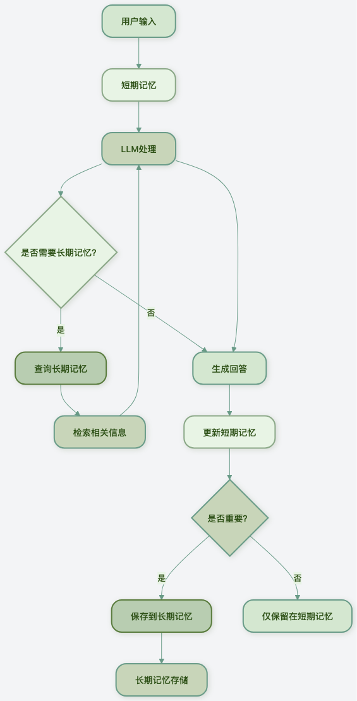
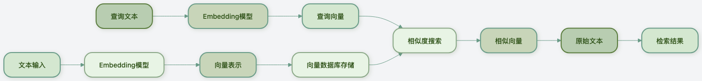
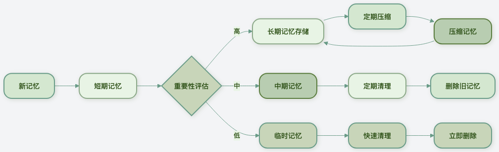

### 记忆系统设计
人类的记忆分为短期记忆和长期记忆，AI Agent 的记忆系统也采用了类似的设计。

理解这两种记忆的区别和用途，是构建智能 Agent 的基础。

#### 短期记忆：Agent 的工作记忆
短期记忆就像是 Agent 的工作台，存储当前对话的上下文和临时信息。

**特点：**
- 容量有限：通常只能保存最近的几次对话（如最近的 10-20 轮对话）
- 快速访问：读取和写入速度很快
- 临时性：对话结束后通常会被清除或压缩
- 上下文相关：直接影响当前的响应生成

**主要用途：**
- 保持对话的连贯性
- 存储当前任务的中间结果
- 记住用户在当前对话中提到的偏好

技术实现：
```python
class ShortTermMemory:
    """短期记忆实现"""

    def __init__(self, max_turns=10):
        self.max_turns = max_turns  # 最大对话轮数
        self.conversation_history = []  # 对话历史
        self.temporary_data = {}  # 临时数据存储

    def add_message(self, role, content):
        """添加消息到对话历史"""
        message = {"role": role, "content": content, "timestamp": time.time()}
        self.conversation_history.append(message)

        # 保持历史不超过最大长度
        if len(self.conversation_history) > self.max_turns:
            self.conversation_history.pop(0)

    def get_context(self):
        """获取对话上下文（用于发送给LLM）"""
        return self.conversation_history[-self.max_turns:]

    def store_temp(self, key, value):
        """存储临时数据"""
        self.temporary_data[key] = value

    def get_temp(self, key, default=None):
        """获取临时数据"""
        return self.temporary_data.get(key, default)

    def clear_temp(self):
        """清除临时数据"""
        self.temporary_data.clear()
```

#### 长期记忆：Agent 的知识库
长期记忆就像是 Agent 的档案室，存储重要的、需要长期保留的信息。

**特点：**
- 容量大：可以存储大量信息
- 持久化：信息会长期保存，不会自动清除
- 检索式访问：通过查询检索相关信息，而非顺序读取
- 结构化存储：信息通常以结构化方式存储，便于检索

**主要用途：**
- 存储用户的个人信息和偏好
- 积累知识和经验
- 记住重要的对话内容
- 保存任务执行结果


技术实现：
```python
class LongTermMemory:
    """长期记忆基类"""

    def __init__(self):
        self.memories = []  # 记忆条目列表

    def add_memory(self, content, metadata=None):
        """添加记忆"""
        memory = {
            "id": str(uuid.uuid4()),
            "content": content,
            "metadata": metadata or {},
            "timestamp": time.time(),
            "importance": 0.5  # 默认重要性
        }
        self.memories.append(memory)
        return memory["id"]

    def search_memories(self, query, limit=5):
        """搜索记忆（子类需要实现具体搜索逻辑）"""
        raise NotImplementedError

    def get_memory(self, memory_id):
        """获取特定记忆"""
        for memory in self.memories:
            if memory["id"] == memory_id:
                return memory
        return None

    def delete_memory(self, memory_id):
        """删除记忆"""
        self.memories = [m for m in self.memories if m["id"] != memory_id]
```
**对比分析**
| 特性 | 短期记忆 | 长期记忆 |
| --- | --- | --- |
| 容量 | 小（KB 级） | 大（GB 级甚至更大） |
| 持久性 | 临时（对话级别） | 持久（长期保存） |
| 访问方式 | 顺序访问 | 检索式访问 |
| 速度 | 快 | 相对较慢 |
| 主要用途 | 对话上下文 | 知识积累 |
| 实现复杂度 | 简单 | 复杂 |


#### 记忆系统架构
一个完整的记忆系统通常同时包含短期和长期记忆：


#### 对话历史管理
有效的对话历史管理是确保 AI Agent 能够进行连贯、有意义对话的关键。LLM 的上下文长度有限，需要智能地管理哪些历史信息应该保留、哪些可以丢弃。

##### 对话历史的挑战
- 上下文长度限制：大多数 LLM 有固定的 token 限制（如 4K、8K、16K、32K 等）
- 信息重要性不同：不是所有历史对话都同样重要
- 相关性随时间变化：越近的对话通常越相关
- 累积成本：更长的上下文意味着更高的 API 调用成本


##### 基本的对话历史管理
```python
class ConversationManager:
    """对话管理器"""

    def __init__(self, max_context_length=4000):
        self.max_context_length = max_context_length  # 最大token数
        self.history = []  # 完整的对话历史
        self.active_context = []  # 当前活跃的上下文

    def add_exchange(self, user_input, assistant_response):
        """添加一轮对话"""
        self.history.append({
            "user": user_input,
            "assistant": assistant_response,
            "timestamp": time.time()
        })

    def build_context(self, current_query, include_history=True):
        """构建当前查询的上下文"""

        if not include_history or not self.history:
            # 没有历史或不需要历史，只返回当前查询
            return [{"role": "user", "content": current_query}]

        # 从最近的对话开始，逐步添加历史，直到达到长度限制
        context = []
        context_length = self.estimate_tokens(current_query)

        # 添加当前查询
        context.insert(0, {"role": "user", "content": current_query})

        # 从最近到最远添加历史
        for exchange in reversed(self.history):
            user_tokens = self.estimate_tokens(exchange["user"])
            assistant_tokens = self.estimate_tokens(exchange["assistant"])

            # 检查是否会超出限制
            if context_length + user_tokens + assistant_tokens > self.max_context_length:
                break

            # 添加助理回复（在用户输入之前）
            context.insert(0, {"role": "assistant", "content": exchange["assistant"]})
            context.insert(0, {"role": "user", "content": exchange["user"]})

            context_length += user_tokens + assistant_tokens

        return context

    def estimate_tokens(self, text):
        """粗略估计文本的token数量（实际应用中应使用准确的tokenizer）"""
        # 简单估算：英文约0.75单词/token，中文约1-2字符/token
        if self.is_chinese(text):
            return len(text) // 2  # 中文每2字符约1个token
        else:
            words = len(text.split())
            return int(words * 1.3)  # 英文每单词约1.3个token

    def is_chinese(self, text):
        """判断文本是否主要为中文"""
        chinese_chars = sum(1 for c in text if '\u4e00' <= c <= '\u9fff')
        return chinese_chars / max(len(text), 1) > 0.3

    def clear_history(self):
        """清空对话历史"""
        self.history.clear()
        self.active_context.clear()

 ```

##### 智能历史选择策略
不是所有历史对话都同样重要。智能的历史选择可以提高上下文的使用效率：

1. 基于时间的衰减
```python
def time_based_selection(history, current_time, max_items=10):
    """基于时间的选择：越近的对话权重越高"""
    scored_items = []

    for item in history:
        # 计算时间衰减分数（越近分数越高）
        time_diff = current_time - item["timestamp"]
        time_score = max(0, 1 - time_diff / 3600)  # 1小时内完全保留，之后衰减

        # 结合其他因素（如对话长度、重要性标记等）
        total_score = time_score

        scored_items.append((total_score, item))

    # 按分数排序，选择分数最高的
    scored_items.sort(key=lambda x: x[0], reverse=True)
    return [item for score, item in scored_items[:max_items]]
```
2. 基于相关性的选择
```python
from sklearn.metrics.pairwise import cosine_similarity

def relevance_based_selection(history, current_query, embedding_model, max_items=5):
    """基于与当前查询相关性的选择"""
    if not history:
        return []

    # 计算当前查询的向量
    query_embedding = embedding_model.encode(current_query)

    scored_items = []

    for item in history:
        # 将历史对话内容转换为向量
        content = item["user"] + " " + item["assistant"]
        content_embedding = embedding_model.encode(content)

        # 计算余弦相似度
        similarity = cosine_similarity([query_embedding], [content_embedding])[0][0]

        scored_items.append((similarity, item))

    # 按相似度排序，选择最相关的
    scored_items.sort(key=lambda x: x[0], reverse=True)
    return [item for similarity, item in scored_items[:max_items]]
```
3. 混合选择策略
```python
class SmartHistorySelector:
    """智能历史选择器"""

    def __init__(self, embedding_model=None):
        self.embedding_model = embedding_model

    def select_history(self, history, current_query, max_context_length=3000):
        """智能选择历史对话"""

        selected = []
        current_length = 0

        # 策略1：总是包含最近的一轮对话
        if history:
            recent = history[-1]
            recent_length = self.estimate_length(recent)
            if recent_length <= max_context_length:
                selected.append(recent)
                current_length += recent_length

        # 策略2：基于相关性的选择
        if self.embedding_model and len(history) > 1:
            relevant = self.select_by_relevance(history[:-1], current_query, 3)
            for item in relevant:
                item_length = self.estimate_length(item)
                if current_length + item_length <= max_context_length:
                    selected.append(item)
                    current_length += item_length

        # 策略3：如果还有空间，按时间顺序添加
        remaining_space = max_context_length - current_length
        if remaining_space > 100:  # 至少100token的空间
            for item in history:
                if item not in selected:
                    item_length = self.estimate_length(item)
                    if item_length <= remaining_space:
                        selected.append(item)
                        remaining_space -= item_length

        # 按时间顺序排序
        selected.sort(key=lambda x: x["timestamp"])
        return selected

    def select_by_relevance(self, history, query, max_items):
        """基于相关性选择"""
        # 简化实现，实际应使用向量相似度
        query_lower = query.lower()
        scored = []

        for item in history:
            content = (item["user"] + " " + item["assistant"]).lower()
            # 简单关键词匹配
            score = sum(1 for word in query_lower.split() if word in content)
            scored.append((score, item))

        scored.sort(key=lambda x: x[0], reverse=True)
        return [item for score, item in scored[:max_items]]

    def estimate_length(self, exchange):
        """估计对话长度"""
        return len(exchange["user"]) + len(exchange["assistant"])
```

#####对话历史压缩
当对话历史太长时，可以对其进行压缩，保留核心信息：
```python
class HistoryCompressor:
    """对话历史压缩器"""

    def __init__(self, llm_client):
        self.llm = llm_client

    def compress_conversation(self, conversation_history, max_summary_length=500):
        """压缩对话历史"""

        if len(conversation_history) <= 2:
            return conversation_history  # 太短不需要压缩

        # 将对话历史转换为文本
        conversation_text = self.history_to_text(conversation_history)

        # 使用LLM生成摘要
        prompt = f"""
请将以下对话历史压缩为一个简短的摘要，保留核心信息和重要细节：

对话历史：
{conversation_text}

摘要要求：
1. 不超过{max_summary_length}字
2. 保留用户的主要需求和助理的关键回答
3. 忽略问候语、重复内容和无关细节

摘要：
"""

        summary = self.llm.generate(prompt, max_tokens=max_summary_length)

        # 创建压缩后的历史（摘要 + 最近几轮对话）
        compressed_history = [
            {
                "role": "system",
                "content": f"之前的对话摘要：{summary}"
            }
        ]

        # 保留最近的1-2轮对话以保持连贯性
        for exchange in conversation_history[-2:]:
            compressed_history.append({
                "role": "user" if exchange["role"] == "user" else "assistant",
                "content": exchange["content"]
            })

        return compressed_history

    def history_to_text(self, history):
        """将对话历史转换为文本"""
        lines = []
        for exchange in history:
            role = "用户" if exchange["role"] == "user" else "助理"
            lines.append(f"{role}: {exchange['content']}")
        return "\n".join(lines)

```

### 向量数据库应用
向量数据库是长期记忆系统的核心技术，它允许 Agent 基于语义相似度检索相关信息，而不仅仅是关键词匹配。

#### 什么是向量数据库？
向量数据库专门存储和检索向量（embeddings）。在 AI Agent 的语境中：
- 文本 → 向量：通过 embedding 模型将文本转换为高维向量
- 相似度 → 距离：相似的文本有相近的向量，可以通过向量距离衡量相似度
- 检索 → 最近邻搜索：寻找与查询向量最相似的向量

#### 向量数据库的工作流程



#### 使用向量数据库实现长期记忆
1. 安装必要的库
```bash
# 安装 embedding 模型和向量数据库
pip install sentence-transformers  # 用于生成embeddings
pip install chromadb  # 轻量级向量数据库
```
2. 创建向量记忆系统
```python
import chromadb
from sentence_transformers import SentenceTransformer
import uuid
import time

class VectorMemory:
    """基于向量数据库的记忆系统"""

    def __init__(self, persist_directory="./memory_db"):
        # 初始化 embedding 模型
        self.embedding_model = SentenceTransformer('paraphrase-multilingual-MiniLM-L12-v2')

        # 初始化 ChromaDB
        self.client = chromadb.PersistentClient(path=persist_directory)
        self.collection = self.client.get_or_create_collection(
            name="agent_memories",
            metadata={"description": "AI Agent 的长期记忆"}
        )

    def add_memory(self, content, metadata=None, importance=0.5):
        """添加记忆到向量数据库"""

        # 生成 embedding
        embedding = self.embedding_model.encode(content).tolist()

        # 准备元数据
        full_metadata = {
            "timestamp": time.time(),
            "importance": importance,
            "content_length": len(content)
        }
        if metadata:
            full_metadata.update(metadata)

        # 生成唯一ID
        memory_id = str(uuid.uuid4())

        # 添加到数据库
        self.collection.add(
            documents=[content],
            embeddings=[embedding],
            metadatas=[full_metadata],
            ids=[memory_id]
        )

        return memory_id

    def search_memories(self, query, n_results=5, min_similarity=0.3):
        """搜索相关记忆"""

        # 生成查询的 embedding
        query_embedding = self.embedding_model.encode(query).tolist()

        # 在向量数据库中搜索
        results = self.collection.query(
            query_embeddings=[query_embedding],
            n_results=n_results,
            include=["documents", "metadatas", "distances"]
        )

        # 处理结果
        memories = []
        if results["documents"]:
            for i in range(len(results["documents"][0])):
                similarity = 1 - results["distances"][0][i]  # 转换距离为相似度

                if similarity >= min_similarity:
                    memory = {
                        "content": results["documents"][0][i],
                        "metadata": results["metadatas"][0][i],
                        "similarity": similarity,
                        "id": results["ids"][0][i]
                    }
                    memories.append(memory)

        # 按相似度排序
        memories.sort(key=lambda x: x["similarity"], reverse=True)
        return memories

    def get_relevant_context(self, query, max_memories=3):
        """获取与查询相关的记忆作为上下文"""

        memories = self.search_memories(query, n_results=max_memories)

        if not memories:
            return ""

        # 构建上下文字符串
        context_parts = []
        for i, memory in enumerate(memories):
            content = memory["content"]
            similarity = memory["similarity"]
            timestamp = memory["metadata"]["timestamp"]

            # 格式化时间
            time_str = time.strftime("%Y-%m-%d %H:%M", time.localtime(timestamp))

            context_parts.append(
                f"[相关记忆 {i+1}，相似度：{similarity:.2f}，时间：{time_str}]\n{content}"
            )

        return "\n\n".join(context_parts)

    def delete_memory(self, memory_id):
        """删除记忆"""
        self.collection.delete(ids=[memory_id])

    def get_all_memories(self, limit=100):
        """获取所有记忆（按时间倒序）"""
        # 注意：ChromaDB 没有直接的获取所有功能
        # 这里通过搜索一个通用查询来获取
        results = self.collection.query(
            query_embeddings=[self.embedding_model.encode(" ").tolist()],  # 空查询
            n_results=limit
        )

        memories = []
        if results["documents"]:
            for i in range(len(results["documents"][0])):
                memory = {
                    "content": results["documents"][0][i],
                    "metadata": results["metadatas"][0][i],
                    "id": results["ids"][0][i]
                }
                memories.append(memory)

        # 按时间倒序排序
        memories.sort(key=lambda x: x["metadata"]["timestamp"], reverse=True)
        return memories
```
3. 使用向量记忆的完整示例
```python
class AgentWithMemory:
    """带有记忆系统的AI Agent"""

    def __init__(self, llm_client):
        self.llm = llm_client
        self.short_term_memory = ShortTermMemory(max_turns=10)
        self.long_term_memory = VectorMemory()

    def process_query(self, user_query):
        """处理用户查询"""

        # 1. 从长期记忆中检索相关信息
        relevant_context = self.long_term_memory.get_relevant_context(user_query)

        # 2. 构建完整的上下文
        short_term_context = self.short_term_memory.get_context()

        # 3. 准备系统提示词
        system_message = "你是一个有帮助的AI助手。"
        if relevant_context:
            system_message += f"\n\n相关背景信息：\n{relevant_context}"

        # 4. 调用LLM生成回答
        messages = [{"role": "system", "content": system_message}]
        messages.extend(short_term_context)
        messages.append({"role": "user", "content": user_query})

        response = self.llm.chat_completion(messages)

        # 5. 更新短期记忆
        self.short_term_memory.add_message("user", user_query)
        self.short_term_memory.add_message("assistant", response)

        # 6. 判断是否应该保存到长期记忆
        if self.should_save_to_long_term(user_query, response):
            self.save_to_long_term(user_query, response)

        return response

    def should_save_to_long_term(self, user_query, response):
        """判断是否应该保存到长期记忆"""
        # 简单的启发式规则
        important_keywords = ["偏好", "喜欢", "不喜欢", "重要", "记住", "下次", "经常"]

        query_lower = user_query.lower()
        response_lower = response.lower()

        # 检查是否包含重要关键词
        for keyword in important_keywords:
            if keyword in query_lower or keyword in response_lower:
                return True

        # 检查是否是关于个人信息
        personal_keywords = ["我叫", "我是", "我住在", "我的电话", "我的邮箱"]
        for keyword in personal_keywords:
            if keyword in query_lower:
                return True

        return False

    def save_to_long_term(self, user_query, response):
        """保存到长期记忆"""
        # 将对话作为一条记忆保存
        memory_content = f"用户：{user_query}\n助理：{response}"
        metadata = {
            "type": "conversation",
            "user_query": user_query[:100],  # 截断以避免过长
            "response_length": len(response)
        }

        self.long_term_memory.add_memory(memory_content, metadata)

# 使用示例
if __name__ == "__main__":
    # 创建带记忆的Agent
    agent = AgentWithMemory(llm_client)

    # 模拟对话
    conversations = [
        "你好，我叫张三，住在北京",
        "我喜欢编程和阅读",
        "我不喜欢早起",
        "今天天气怎么样？",
        "我的编程偏好是什么？"  # 这个问题应该能检索到之前的记忆
    ]

    for query in conversations:
        print(f"\n用户: {query}")
        response = agent.process_query(query)
        print(f"助理: {response[:100]}...")  # 只打印前100字符

```

#### 向量数据库的优化技巧
选择合适的 embedding 模型：

- 多语言支持：paraphrase-multilingual-MiniLM-L12-v2
- 英文优化：all-MiniLM-L6-v2
- 高质量：text-embedding-ada-002（OpenAI）
- 元数据过滤：利用向量数据库的元数据过滤功能提高检索精度

```python
# 使用元数据过滤
results = collection.query(
    query_embeddings=[query_embedding],
    n_results=5,
    where={"type": "personal_preference"},  # 只检索个人偏好类型的记忆
    where_document={"$contains": "编程"}  # 只检索包含"编程"的文档
)
```

**混合搜索**：结合向量搜索和关键词搜索
```python
def hybrid_search(query, vector_memory, keyword_weight=0.3):
    """混合搜索：结合向量相似度和关键词匹配"""

    # 向量搜索
    vector_results = vector_memory.search_memories(query, n_results=10)

    # 关键词搜索（简化实现）
    keyword_results = []
    query_words = set(query.lower().split())

    # 这里简化实现，实际应从数据库检索
    all_memories = vector_memory.get_all_memories(limit=100)
    for memory in all_memories:
        content_words = set(memory["content"].lower().split())
        common_words = query_words & content_words
        keyword_score = len(common_words) / max(len(query_words), 1)

        if keyword_score > 0:
            memory["keyword_score"] = keyword_score
            keyword_results.append(memory)

    # 合并结果
    all_results = {}
    for result in vector_results:
        result_id = result["id"]
        all_results[result_id] = {
            "vector_score": result["similarity"],
            "keyword_score": 0,
            "content": result["content"],
            "metadata": result["metadata"]
        }

    for result in keyword_results:
        result_id = result["id"]
        if result_id in all_results:
            all_results[result_id]["keyword_score"] = result["keyword_score"]
        else:
            all_results[result_id] = {
                "vector_score": 0,
                "keyword_score": result["keyword_score"],
                "content": result["content"],
                "metadata": result["metadata"]
            }

    # 计算综合分数
    final_results = []
    for result_id, result in all_results.items():
        combined_score = (
            (1 - keyword_weight) * result["vector_score"] +
            keyword_weight * result["keyword_score"]
        )
        result["combined_score"] = combined_score
        final_results.append(result)

    # 按综合分数排序
    final_results.sort(key=lambda x: x["combined_score"], reverse=True)
    return final_results[:5]
```

### 记忆压缩与总结策略
随着对话的进行，记忆会不断累积。为了避免信息过载和减少资源消耗，需要定期对记忆进行压缩和总结。

#### 为什么需要记忆压缩？
- **节省存储空间：** 原始对话记录可能非常庞大，压缩后可以节省大量存储空间。
- **提高检索效率：** 压缩后的记忆更易于检索和处理，减少了搜索时间。
- **提取核心信息：** 去除冗余，保留精华，focus on the most important information.
- **减少计算成本：** 处理压缩记忆比处理原始记忆更高效，减少了计算资源的消耗。

#### 记忆压缩策略
1. 基于重要性的压缩
```python
class ImportanceBasedCompressor:
    """基于重要性的记忆压缩器"""

    def __init__(self, llm_client):
        self.llm = llm_client

    def compress_memories(self, memories, target_ratio=0.5):
        """压缩记忆，保留重要内容"""

        if len(memories) <= 1:
            return memories  # 记忆太少，不需要压缩

        # 评估每个记忆的重要性
        scored_memories = []
        for memory in memories:
            importance = self.evaluate_importance(memory)
            scored_memories.append((importance, memory))

        # 按重要性排序
        scored_memories.sort(key=lambda x: x[0], reverse=True)

        # 保留最重要的部分
        keep_count = max(1, int(len(memories) * target_ratio))
        compressed_memories = [memory for _, memory in scored_memories[:keep_count]]

        return compressed_memories

    def evaluate_importance(self, memory):
        """评估记忆的重要性"""
        content = memory["content"]
        metadata = memory.get("metadata", {})

        # 基于规则的重要性评估
        importance_score = 0.0

        # 1. 基于类型
        memory_type = metadata.get("type", "")
        if memory_type == "personal_info":
            importance_score += 0.8
        elif memory_type == "preference":
            importance_score += 0.7
        elif memory_type == "fact":
            importance_score += 0.5
        elif memory_type == "conversation":
            importance_score += 0.3

        # 2. 基于长度（适中的长度可能更重要）
        content_length = len(content)
        if 50 <= content_length <= 500:
            importance_score += 0.2
        elif content_length > 500:
            importance_score += 0.1

        # 3. 基于时间衰减（越新的记忆越重要）
        timestamp = metadata.get("timestamp", 0)
        if timestamp > 0:
            age_days = (time.time() - timestamp) / (24 * 3600)
            recency_score = max(0, 1 - age_days / 30)  # 30天内线性衰减
            importance_score += recency_score * 0.5

        # 4. 基于显式重要性标记
        explicit_importance = metadata.get("importance", 0.5)
        importance_score += explicit_importance * 0.5

        return min(importance_score, 1.0)  # 归一化到0-1
```
2. 基于聚类的压缩
将相似记忆聚类，然后总结每个聚类：
```python
from sklearn.cluster import KMeans
import numpy as np

class ClusterBasedCompressor:
    """基于聚类的记忆压缩器"""

    def __init__(self, embedding_model):
        self.embedding_model = embedding_model

    def compress_by_clustering(self, memories, n_clusters=None):
        """通过聚类压缩记忆"""

        if len(memories) <= 3:
            return memories  # 记忆太少，不需要聚类

        # 确定聚类数量
        if n_clusters is None:
            n_clusters = min(3, len(memories) // 2)

        # 获取所有记忆的embedding
        embeddings = []
        for memory in memories:
            embedding = self.embedding_model.encode(memory["content"])
            embeddings.append(embedding)

        embeddings = np.array(embeddings)

        # 执行K-means聚类
        kmeans = KMeans(n_clusters=n_clusters, random_state=42, n_init=10)
        labels = kmeans.fit_predict(embeddings)

        # 对每个聚类进行总结
        compressed_memories = []
        for cluster_id in range(n_clusters):
            # 获取该聚类的所有记忆
            cluster_memories = [
                memories[i] for i in range(len(memories)) if labels[i] == cluster_id
            ]

            if cluster_memories:
                # 总结该聚类的记忆
                summary = self.summarize_cluster(cluster_memories)
                compressed_memories.append(summary)

        return compressed_memories

    def summarize_cluster(self, cluster_memories):
        """总结一个聚类的记忆"""

        if len(cluster_memories) == 1:
            # 只有一个记忆，直接返回
            return cluster_memories[0]

        # 合并所有记忆内容
        all_content = "\n".join([m["content"] for m in cluster_memories])

        # 使用LLM生成总结（这里简化实现）
        # 实际应调用LLM生成高质量的总结
        summary_content = f"相关主题的{len(cluster_memories)}条记忆摘要：{all_content[:500]}..."

        # 合并元数据
        merged_metadata = {
            "type": "cluster_summary",
            "original_count": len(cluster_memories),
            "compressed": True,
            "timestamp": time.time()
        }

        return {
            "content": summary_content,
            "metadata": merged_metadata
        }
```

3. 增量总结策略
在对话过程中逐步总结，而不是一次性处理所有历史：
```python
class IncrementalSummarizer:
    """增量总结器"""

    def __init__(self, llm_client, summary_interval=5):
        self.llm = llm_client
        self.summary_interval = summary_interval  # 每多少轮对话总结一次
        self.conversation_buffer = []
        self.summaries = []

    def add_conversation(self, user_input, assistant_response):
        """添加对话到缓冲区"""

        self.conversation_buffer.append({
            "user": user_input,
            "assistant": assistant_response,
            "timestamp": time.time()
        })

        # 检查是否需要总结
        if len(self.conversation_buffer) >= self.summary_interval:
            self.create_summary()

    def create_summary(self):
        """创建总结"""

        if not self.conversation_buffer:
            return

        # 将对话缓冲区的所有内容总结为一段文字
        conversation_text = ""
        for exchange in self.conversation_buffer:
            conversation_text += f"用户: {exchange['user']}\n"
            conversation_text += f"助理: {exchange['assistant']}\n\n"

        # 使用LLM生成总结
        prompt = f"""
请将以下对话内容总结为一个简短的段落，保留核心信息和重要细节：

对话内容：
{conversation_text}

总结要求：
1. 不超过200字
2. 保留用户的主要需求和助理的关键回答
3. 忽略问候语、重复内容和无关细节

总结：
"""

        summary = self.llm.generate(prompt, max_tokens=200)

        # 保存总结
        self.summaries.append({
            "content": summary,
            "timestamp": time.time(),
            "original_count": len(self.conversation_buffer)
        })

        # 清空缓冲区
        self.conversation_buffer.clear()

    def get_context(self, include_recent=True, include_summaries=True):
        """获取上下文"""

        context_parts = []

        if include_summaries and self.summaries:
            # 添加所有总结
            for i, summary in enumerate(self.summaries[-3:]):  # 最多3个总结
                context_parts.append(f"[对话总结 {i+1}]\n{summary['content']}")

        if include_recent and self.conversation_buffer:
            # 添加最近的对话
            for exchange in self.conversation_buffer[-3:]:  # 最多3轮最近对话
                context_parts.append(f"用户: {exchange['user']}")
                context_parts.append(f"助理: {exchange['assistant']}")

        return "\n\n".join(context_parts)

```

#### 记忆生命周期管理
一个完整的记忆系统应该管理记忆的整个生命周期：


```python
class MemoryLifecycleManager:
    """记忆生命周期管理器"""

    def __init__(self):
        self.short_term = ShortTermMemory()
        self.long_term = VectorMemory()
        self.compressor = ImportanceBasedCompressor()

    def process_memory(self, content, initial_importance=0.5):
        """处理新记忆"""

        # 1. 先存入短期记忆
        self.short_term.store_temp("recent_memory", content)

        # 2. 评估重要性
        evaluated_importance = self.evaluate_importance(content, initial_importance)

        # 3. 根据重要性决定存储策略
        if evaluated_importance >= 0.8:
            # 高重要性：立即存入长期记忆
            self.long_term.add_memory(content, {"importance": evaluated_importance})
        elif evaluated_importance >= 0.5:
            # 中等重要性：标记为待处理
            self.queue_for_review(content, evaluated_importance)
        else:
            # 低重要性：仅保留在短期记忆，稍后清理
            pass

    def evaluate_importance(self, content, initial_importance):
        """评估记忆重要性"""
        # 这里可以实现更复杂的评估逻辑
        return initial_importance

    def queue_for_review(self, content, importance):
        """将记忆加入待处理队列"""
        # 实现队列逻辑
        pass

    def periodic_maintenance(self):
        """定期维护"""

        # 1. 压缩长期记忆
        all_memories = self.long_term.get_all_memories(limit=1000)
        if len(all_memories) > 100:
            compressed = self.compressor.compress_memories(all_memories, target_ratio=0.7)

            # 更新长期记忆（实际实现中可能需要更复杂的逻辑）
            # 这里简化处理

        # 2. 清理旧的低重要性记忆
        self.cleanup_old_memories()

    def cleanup_old_memories(self, max_age_days=30, min_importance=0.3):
        """清理旧记忆"""
        # 获取所有记忆
        all_memories = self.long_term.get_all_memories(limit=1000)
        current_time = time.time()

        for memory in all_memories:
            metadata = memory.get("metadata", {})
            timestamp = metadata.get("timestamp", 0)
            importance = metadata.get("importance", 0.5)

            # 计算记忆年龄
            age_days = (current_time - timestamp) / (24 * 3600)

            # 删除旧且不重要的记忆
            if age_days > max_age_days and importance < min_importance:
                self.long_term.delete_memory(memory["id"])

```