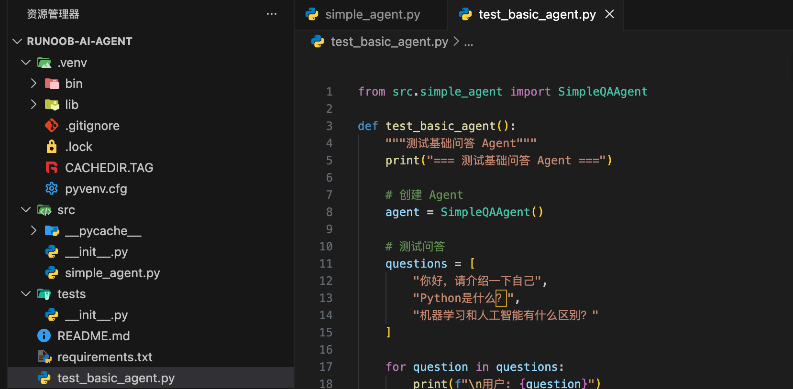
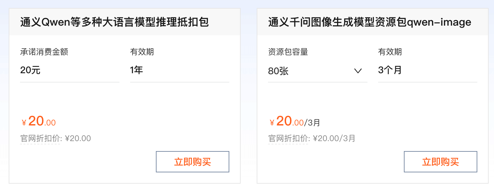

### AI Agent 问答实例
本章节我们将动手构建第一个真正的 AI Agent。

我们先从一个简单的问答 Agent 开始，逐步添加更多功能。


####项目结构准备
先创建目录 runoob-ai-agent：
```bash
mkdir runoob-ai-agent
```
进入目录runoob-ai-agent，使用 uv 命令创建虚拟环境：
```bash
cd runoob-ai-agent

# 创建名为 .venv 的虚拟环境（默认）
uv venv

# 激活环境（macOS/Linux）
source .venv/bin/activate

# 激活环境（Windows）
.venv\Scripts\activate
```

使用 uv 创建并激活虚拟环境，更多相关内容可以阅读 uv 教程。

创建项目目录结构：
```bash
runoob-ai-agent/
├── .env
├── .gitignore
├── requirements.txt
├── test_basic_agent.py
├── README.md
├── src/
│   ├── __init__.py
│   └── simple_agent.py
└── tests/
    └── __init__.py

```



##### 阿里百炼申请 API key
本章节要用到搜索功能，我们阿里千问模型，因为它自带搜索功能。

阿里云百炼的通义千问模型支持 OpenAI 兼容接口，您只需调整 API Key、BASE_URL 和模型名称，即可将原有 OpenAI 代码迁移至阿里云百炼服务使用。

- base_url：替换为 https://dashscope.aliyuncs.com/compatible-mode/v1
- api_key：替换为阿里云百炼 API Key
- model: 替换为 qwen3-max
参考地址：https://help.aliyun.com/zh/model-studio/compatibility-of-openai-with-dashscope

我们需要开通阿里云百炼模型服务并获得 API-KEY。


我们可以先使用阿里云主账号访问百炼模型服务平台：https://bailian.console.aliyun.com/，然后点击右上角登录，登录成功后点击右上角的齿轮⚙️图标，选择 API key，然后复制 API key，如果没有也可以创建 API key：


开通阿里云百炼不会产生费用，仅模型调用（超出免费额度后）、模型部署、模型调优会产生相应计费。

现在要使用 API，都需要按 token 来计费，还好都不贵，我们可以先购买个最便宜的包：阿里云百炼大模型服务平台。


```bash
也可以直接使用百炼的 Coding Plan 套餐：https://www.aliyun.com/benefit/scene/codingplan。

兼容 OpenAI API 协议：

Base URL：https://coding.dashscope.aliyuncs.com/v1
API Key：填入 Coding Plan 套餐专属 API Key
Model：qwen3-coder-plus
```


#### 创建基础 Agent 类：

实例
```python
# src/simple_agent.py
import os
from typing import List, Dict, Any
from openai import OpenAI
from dotenv import load_dotenv

# 加载环境变量
load_dotenv()

class SimpleQAAgent:
    """简单的问答 Agent"""

    def __init__(self, model: str = "qwen3-max"): # 设置默认为 DeepSeek 的 模型
        """
        初始化 Agent

        Args:
            model: 使用的模型名称，默认为 DeepSeek
        """
        # api_key = os.getenv("OPENAI_API_KEY")
        api_key = "sk-xxx" # 你申请的 API key
        base_url = "https://dashscope.aliyuncs.com/compatible-mode/v1"
        if not api_key:
            raise ValueError("请设置 OPENAI_API_KEY 环境变量")

        self.client = OpenAI(
                        api_key = api_key,
                        base_url = base_url)
        self.model = model
        self.conversation_history: List[Dict[str, str]] = []
        self.system_prompt = "你是一个有帮助的AI助手，请礼貌、准确地回答用户的问题。"

    def add_to_history(self, role: str, content: str):
        """添加消息到对话历史"""
        self.conversation_history.append({
            "role": role,
            "content": content
        })

        # 保持历史长度不超过10轮（防止token超限）
        if len(self.conversation_history) > 10:
            self.conversation_history = self.conversation_history[-10:]

    def ask(self, question: str) -> str:
        """
        向 Agent 提问

        Args:
            question: 用户的问题

        Returns:
            Agent 的回答
        """
        # 添加用户问题到历史
        self.add_to_history("user", question)

        # 准备消息列表
        messages = [
            {"role": "system", "content": self.system_prompt}
        ]
        messages.extend(self.conversation_history)

        try:
            # 调用 OpenAI API
            response = self.client.chat.completions.create(
                model=self.model,
                messages=messages,
                temperature=0.7,
                max_tokens=500
            )

            # 提取回答
            answer = response.choices[0].message.content

            # 添加助手回答到历史
            self.add_to_history("assistant", answer)

            return answer

        except Exception as e:
            error_msg = f"调用API时出错: {str(e)}"
            print(error_msg)
            return error_msg

    def clear_history(self):
        """清空对话历史"""
        self.conversation_history.clear()

```

创建一个测试脚本，测试基础 Agent：


```python
# test_basic_agent.py
from src.simple_agent import SimpleQAAgent

def test_basic_agent():
    """测试基础问答 Agent"""
    print("=== 测试基础问答 Agent ===")

    # 创建 Agent
    agent = SimpleQAAgent()

    # 测试问答
    questions = [
        "你好，请介绍一下自己",
        "Python是什么？",
        "机器学习和人工智能有什么区别？"
    ]

    for question in questions:
        print(f"\n用户: {question}")
        answer = agent.ask(question)
        print(f"助理: {answer}")

    # 测试对话连贯性
    print("\n=== 测试对话连贯性 ===")
    agent.clear_history()

    # 第一轮
    q1 = "我最喜欢的颜色是蓝色"
    a1 = agent.ask(q1)
    print(f"用户: {q1}")
    print(f"助理: {a1}")

    # 第二轮（应该能记住之前的对话）
    q2 = "我刚才说我最喜欢什么颜色？"
    a2 = agent.ask(q2)
    print(f"\n用户: {q2}")
    print(f"助理: {a2}")

    print("\n测试完成！")

if __name__ == "__main__":
    test_basic_agent()
```


运行测试：
```bash
python test_basic_agent.py

=== 测试基础问答 Agent ===

用户: 你好，请介绍一下自己
runoob
助理: 你好！我是通义千问（Qwen），是阿里巴巴集团自主研发的超大规模语言模型。我可以帮助你回答问题、创作文字，比如写故事、写公文、写邮件、写剧本、逻辑推理、编程等等，还能表达观点，玩游戏等。如果你有任何问题或需要帮助，随时告诉我！

用户: Python是什么？
助理: 你好！Python 是一种**高级、解释型、通用的编程语言**，由荷兰程序员 **吉多·范罗苏姆（Guido van Rossum）** 于1991年首次发布。它的设计哲学强调代码的**可读性**和**简洁性**，语法清晰简洁，使得初学者也能快速上手。
...
这个基础 Agent 有几个明显的局限性：

只能回答训练数据中的知识
无法获取实时信息
不能执行计算
不能操作外部系统
```
这正是我们需要为 Agent 添加工具的原因。

### 添加搜索工具
千问自带搜索功能，传递 enable_search: true 参数可启用联网搜索功能。
```python
# 导入依赖与创建客户端...
completion = client.chat.completions.create(
    # 需使用支持联网搜索的模型
    model="qwen3-max",
    messages=[{"role": "user", "content": "杭州明天天气如何"}],
    # 由于 enable_search 非 OpenAI 标准参数，使用 Python SDK 需要通过 extra_body 传入（使用Node.js SDK 需作为顶层参数传入）
    extra_body={"enable_search": True}
)
```
文档说明：https://help.aliyun.com/zh/model-studio/web-search

### 集成搜索工具的 Agent
现在我们将搜索工具集成到 Agent 中，src 目录下创建 agent_with_search.py 文件：

实例
```python
# src/agent_with_search.py
import os
from openai import OpenAI
from dotenv import load_dotenv

load_dotenv()


class AgentWithSearch:
    """基于 Qwen 内置联网搜索能力的 Agent"""

    def __init__(self, model: str = "qwen3-max"):
        api_key = "sk-xxx"
        base_url = "https://dashscope.aliyuncs.com/compatible-mode/v1"

        if not api_key:
            raise ValueError("请设置 OPENAI_API_KEY 环境变量（DashScope Key）")

        self.client = OpenAI(
            api_key=api_key,
            base_url=base_url
        )
        self.model = model

        self.system_prompt = """
你是一个有帮助的 AI 助手。

当问题涉及实时信息、最新事件或需要事实核查的内容时，
你可以通过联网搜索获取最新信息，并在回答中说明信息来源于网络。
"""

    def ask(self, question: str) -> str:
        messages = [
            {"role": "system", "content": self.system_prompt},
            {"role": "user", "content": question}
        ]

        try:
            response = self.client.chat.completions.create(
                model=self.model,
                messages=messages,
                temperature=0.7,
                max_tokens=800,
                extra_body={
                    "enable_search": True
                }
            )

            return response.choices[0].message.content

        except Exception as e:
            return f"错误: {repr(e)}"

    def interactive_chat(self):
        print("=== Qwen 联网搜索 Agent ===")
        print("输入 quit / exit 结束对话")

        while True:
            question = input("\n你: ").strip()
            if question.lower() in {"quit", "exit"}:
                break

            print("助理:", self.ask(question))
```

#### 测试搜索 Agent

根目录下创建 test_search_agent.py 文件：

实例
```python
# test_search_agent.py
from src.agent_with_search import AgentWithSearch

def test_search_agent():
    agent = AgentWithSearch()

    questions = [
        "今天北京的天气怎么样？",
        "最新的科技新闻有哪些？",
        "2024年奥运会举办地是哪里？",
        "Python 是什么？"
    ]

    for q in questions:
        print(f"\n用户: {q}")
        print("助理:", agent.ask(q)[:300], "...")

if __name__ == "__main__":
    test_search_agent()

运行测试：
```bash
python test_search_agent.py
用户: 今天北京的天气怎么样？
助理: 今天是2026年2月7日，星期六。根据最新天气预报信息，北京今天的天气情况如下：

- **天气状况**：多云转晴  
- **气温范围**：最低气温约 **-9℃**，最高气温约 **2℃**（部分区域如海淀区记录为 **-5℃ ~ 5℃**）  
- **风向风力**：白天到夜间有 **东北风1级**，部分地区午后转为 **南风转西北风，小于3级**  
- **空气质量**：**37（优）**  
- **穿衣建议**：建议穿棉衣、冬大衣、皮夹克、厚呢外套、羽绒服等厚重保暖衣物，并佩戴手套、帽子等防寒配件  
...
```