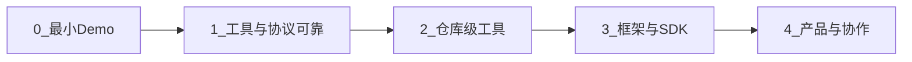

# ai-agent-simplest

本目录用**最少代码**演示「对话 + 工具循环 + LLM」的 AI Agent 骨架，并说明如何从玩具脚本**逐步进化**到接近 **Claude Code**、**OpenClaw** 一类「在真实仓库里干活」的编程 Agent。

更细的原理说明见 [ai-agent-simplest.md](ai-agent-simplest.md)。

---

## 最小 AI Agent 由哪几部分组成

可以把最小实现拆成 **5 块**（与本目录 [minimal_agent.py](minimal_agent.py) / [simple-claude-code.py](simple-claude-code.py) 一一对应）：

| 部分 | 作用 |
|------|------|
| **1. 对话状态（Conversation）** | 列表或消息流，至少包含 `system`（角色与规则）与多轮 `user` / `assistant`。工具反馈也要进入同一条上下文（本示例用 `user` + `tool_result(...)` 文本模拟）。 |
| **2. 工具协议（Tool Protocol）** | 约定模型如何「发起工具调用」：例如单行 `tool: name({JSON})`，或厂商提供的 **原生 tool / function calling**（JSON schema）。 |
| **3. 工具注册与执行（Registry + Dispatch）** | 名字 → 可调用函数；把模型给的参数解析成 Python 调用，返回结构化结果再写回对话。 |
| **4. 双循环（Chat Loop × Agent Loop）** | **外层**：人机多轮输入；**内层**：同一用户指令下「LLM → 解析工具 → 执行 → 再 LLM」直到本轮不再调用工具（ReAct 式）。 |
| **5. LLM 客户端** | 一次 `messages.create`（或等价 API）即「单次生成」；**思维链（CoT）**多在模型内部完成，不必在应用里单独写一层循环。 |

没有 **(2)(3)**，只是聊天机器人；没有 **(4)** 内层循环，只能一步工具、无法多步纠错。

---

## 如何变成「基本可用」的 AI Agent

在「能跑通」之上，要让 Agent **日常可依赖**，通常要补：

- **可靠的工具调用**：文本协议易解析失败；生产上多用 **API 原生 tool use** + schema 校验，或对模型输出做重试 / 修复（repair）与限步数（max tool rounds）。
- **密钥与配置**：环境变量或配置文件（见 [.env.example](.env.example)），禁止把密钥写进仓库。
- **错误与边界**：工具异常、路径不存在、JSON 非法时返回明确 `error` 字段，避免静默失败。
- **成本与安全**：限制 `max_tokens`、工作目录、可执行命令白名单；涉及 **读/写文件、执行 shell** 时默认假设在**不可信输入**下会出事，需要沙箱或人工确认。
- **可观测性**：打印或记录每轮「模型原文 → 工具名与参数 → 结果」，否则难以调试。

本目录 [minimal_agent.py](minimal_agent.py) 偏向**教学**（两个无害小工具）；[simple-claude-code.py](simple-claude-code.py) 演示**真实文件操作**，更接近「编程 Agent」但仍需你自行加固安全策略。

---

## 进化阶段（建议路线）

下面是一条由浅入深的**阶梯**，每一层都可在上一层基础上增量添加。



| 阶段 | 目标 | 典型能力 |
|------|------|----------|
| **0. 最小 Demo** | 证明「双循环 + 工具」闭环 | 无害工具（时间、计算）、自定义 `tool:` 文本协议、[minimal_agent.py](minimal_agent.py) |
| **1. 基本可用** | 能稳定完成小任务 | 原生 tool calling 或强约束协议、限步数、错误返回、环境变量配置 |
| **2. 仓库级编程 Agent** | 在真实项目里改代码 | 读/写/列文件、路径解析、可编辑块替换；[simple-claude-code.py](simple-claude-code.py) 量级 |
| **3. 框架化与生态** | 少造轮子、易扩展 | LangChain / LangGraph 等（[langchain_claude_code.py](langchain_claude_code.py)、[langgraph_claude_code.py](langgraph_claude_code.py)）；或官方 Agent SDK（[test_claude_agent_sdk.py](test_claude_agent_sdk.py)）；插件、MCP 等对接外部工具 |
| **4. 产品形态** | 接近桌面/团队工具 | 终端 **Bash**、**Git**、测试与 CI、子任务/子代理、审批流、与 IDE/聊天产品集成；多会话、持久化策略与团队规范（如仓库内 `AGENTS.md`） |

「深度」变体（[deep_agent_claude_code.py](deep_agent_claude_code.py)）通常指在 **(3)** 上叠规划、记忆或多步分解，仍离不开同一套 **对话 + 工具** 内核。

---

## 进化到类似 Claude Code、OpenClaw 的 AI Agent

**Claude Code** 一类工具的核心特征可以概括为：**以代码库为工作环境**、**长上下文 + 多轮工具**、**文件与终端能力**、**在真实目录里迭代直到任务完成**。  

**OpenClaw** 等平台则进一步强调：**可编排的工作流**、**多种工具组合**（如 shell、读写文件、浏览器、联网检索）、通过 **ACP** 等与 **Claude Code、Codex、Gemini CLI** 等外部编码工具协同，并支持 **AGENTS.md** 等规范把团队规则写进仓库。

从本目录的「最小五块」走到这类系统，通常要**额外**具备（不必一次做完）：

1. **环境感知**：工作区根目录、`.gitignore`、项目结构；必要时索引或摘要，而不是单次塞满全库。
2. **强工具集**：除文件外，**可审计的 shell**、测试命令、包管理器调用；失败时把 stderr 喂回模型。
3. **会话与记忆策略**：多轮会话 ID、跨轮摘要、或「仅当前任务」的轻量状态，平衡成本与效果。
4. **协作与治理**：代码审查流、PR 集成、权限分级、敏感操作确认；大型任务拆给**子 Agent** 并行或串行。
5. **产品层**：CLI / IDE 插件 / Web；与团队聊天工具集成；文档与 Playbook（如 OpenClaw 生态中的工作流说明）。

本仓库脚本刻意保持短小，用于对照 **「Agent = 对话状态 + 工具循环 + 模型」**；到达 **Claude Code / OpenClaw** 量级时，复杂度主要在 **工具、安全、产品与工程集成**，而不是多一个神秘的「新循环」。

---

## 本目录文件一览

| 文件 | 说明 |
|------|------|
| [minimal_agent.py](minimal_agent.py) | 最小可运行示例（双工具、环境变量配置） |
| [simple-claude-code.py](simple-claude-code.py) | 读/列/编辑文件的「类 Claude Code」极简骨架 |
| [langchain_claude_code.py](langchain_claude_code.py) / [langgraph_claude_code.py](langgraph_claude_code.py) | 框架封装同一思路 |
| [test_claude_agent_sdk.py](test_claude_agent_sdk.py) | Claude Agent SDK 示例 |
| [deep_agent_claude_code.py](deep_agent_claude_code.py) | 更深一层编排示例 |
| [requirements.txt](requirements.txt) | Python 依赖 |
| [.env.example](.env.example) | 环境变量模板 |
| [ai-agent-simplest.md](ai-agent-simplest.md) | 原理：三循环、CoT/ToT、与代码对照 |

安装与运行示例：

```bash
cd ai-agent-simplest
pip install -r requirements.txt
cp .env.example .env
# 编辑 .env 填入 ANTHROPIC_API_KEY
python minimal_agent.py
```

---

## 参考（外部）

- ReAct：*Synergizing Reasoning and Acting in Language Models*（推理与行动交替的经典表述）。
- Claude Code：Anthropic 的终端编程助手产品（能力与模型、工具深度集成）。
- OpenClaw：Agent 平台与工作流、工具插件、ACP 与外部编码工具协同（见 [OpenClaw 文档与 Playbook](https://docs.openclaw.ai/) 等公开资料）。

以上名称与特性以各产品官方说明为准；本 README 只做学习路径上的**类比与能力拆解**。
