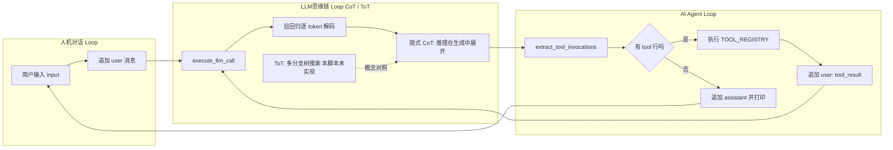

# 最简单的 AI Agent 编程助手：工作原理

本文说明本目录最小实现（以 `[simple-claude-code.py](simple-claude-code.py)` 为主）如何组织「对话—工具—模型」三类循环，以及 **Chain-of-Thought（CoT）**、**Tree-of-Thought（ToT）** 与 **ReAct 式 Agent** 的关系与边界。同目录下的 LangChain / Claude Agent SDK 变体只是同一思想的框架封装，核心仍是：**维护对话状态 → 调 LLM →（可选）执行工具并把结果写回对话**。

---

## 1. 总览：一条数据流

1. **会话开始**：构造 `conversation`，首条为 `system`（内含工具说明），见 `run_coding_agent_loop` 中初始化（约 188–192 行）。
2. **用户发话**：外层循环读取终端输入，追加一条 `user` 消息（约 193–201 行）。
3. **单次任务的内层循环**：调用 `execute_llm_call`（约 167–184 行）→ 用 `extract_tool_invocations` 解析回复（约 142–164 行）。
4. **若无工具调用**：打印助手回复，追加 `assistant` 消息，**跳出内层**，等待下一轮用户输入（约 205–211 行）。
5. **若有工具调用**：执行 `TOOL_REGISTRY` 中对应函数，把结果以 `user` 消息形式写成 `tool_result(...)` 追加到 `conversation`（约 212–227 行），**不跳出内层**，再次调用 LLM，直到某次回复中不再包含 `tool:` 行。

---

## 2. 三个 Loop：概念与代码对应

| 概念                | 英文常称                    | 含义                                                              | 在本项目中的位置                                            |
| ----------------- | ----------------------- | --------------------------------------------------------------- | --------------------------------------------------- |
| **人机对话 Loop**     | Chat / Session Loop     | **会话级**：多轮用户输入，长期保留完整 `conversation`                            | 外层 `while True` + `input()`（约 193–201 行）            |
| **AI Agent Loop** | Agent / Tool-use Loop   | **任务级**：在**一次**用户指令下，可能多步「模型输出工具调用 → 执行 → 结果喂回」直到本轮「收工」         | 内层 `while True`（约 202–227 行）                        |
| **LLM 思维链 Loop**  | Decoding / CoT·ToT（概念层） | **单次 API 调用内部**：自回归逐 token 生成；模型可在同一回复里先分析再输出 `tool:`，属**隐式**推理 | `execute_llm_call` → `messages.create`（约 177–184 行） |

### 2.1 人机对话 Loop（Chat Loop）

- **作用**：把「多轮聊天」与「单次用户任务」分开——每当你输入一行，就在历史里多一条 `user`，内层 Agent 循环负责把**这一条指令**做到底（可能需要多次工具）。
- **代码锚点**：`run_coding_agent_loop` 外层 `while True`（约 193 行起），`KeyboardInterrupt` / `EOFError` 时退出（约 196–197 行）。

### 2.2 AI Agent Loop（与 ReAct 的关系）

- **作用**：实现 **Reasoning + Acting** 交替：模型提议动作（这里是结构化 `tool:` 行）→ 环境执行工具 → 观测写回对话 → 再推理。这与论文 **ReAct**（*Synergizing Reasoning and Acting in Language Models*, Yao et al., 2022）中的 **Thought → Action → Observation** 循环同构；本脚本用自定义文本协议代替框架里的 Tool Calling JSON。
- **代码锚点**：内层 `while True`（约 202 行起）；无工具时 `break` 回到外层（约 211 行）；有工具时只追加 `tool_result` 并继续内层（约 224–227 行）。
- **与「思维链 Loop」的区分**：Agent Loop 是**程序里显式写的 `while`**，每一步边界清晰；CoT/ToT 更多描述**单次或多次生成内容**的推理形态（见下节）。

### 2.3 LLM 思维链 Loop（CoT / ToT）— 深入说明与主要文献

#### （1）自回归解码这一层（所有调用共有）

每次 `messages.create` 返回前，服务端对模型做 **token 级自回归生成**：隐状态随序列推进，这是**物理上**的「最内层循环」，一般不需要在应用代码里再写一层循环。

#### （2）Chain-of-Thought（CoT）

- **含义**：让模型在给出最终答案前，生成**中间推理步骤**（自然语言），以提升复杂算术、常识与符号推理表现。
- **代表工作**：Wei et al., *Chain-of-Thought Prompting Elicits Reasoning in Large Language Models*（NeurIPS 2022）。后续还有 **Least-to-Most**、**Self-Consistency**（对多条 CoT 链投票）等扩展。
- **在本脚本中**：没有在 prompt 里写「Let's think step by step」等固定模板；若模型在输出 `tool:` 之前写了分析段落，可视为 **隐式 CoT**。协议仍要求「需要工具时整段只有一行 `tool: ...`」（见 `SYSTEM_PROMPT` 约 136–137 行），因此**显式长链推理**与**单行工具协议**需要二选一或改协议才能兼顾。

#### （3）Tree-of-Thought（ToT）

- **含义**：在解空间上维护**多分支**（树）：对不同「思路」分别扩展，用搜索（如 BFS/DFS）+ 估值（模型自评或启发式）**剪枝与回溯**，适合谜题、规划等需要探索的结构化问题。
- **代表工作**：Yao et al., *Tree of Thoughts: Deliberate Problem Solving with Large Language Models*（2023）。
- **与本脚本差异**：当前实现是 **单线** Agent 循环（一次只沿 `conversation` 主路径前进），**没有**多假设并行扩展、没有显式评分器与搜索策略，因此 **ToT 并未在本仓库中实现**；若要 ToT，需在 Agent 外层增加「分支采样—评估—选择」的控制逻辑，成本与复杂度显著高于本「200 行」演示。

#### （4）小结表

| 机制          | 是否在本脚本中「作为算法模块」实现                 | 典型论文                    |
| ----------- | --------------------------------- | ----------------------- |
| ReAct 式工具循环 | **是**（内层 `while` + `tool_result`） | Yao et al., 2022, ReAct |
| CoT         | **否**（可出现为模型自发行为；未强制模板）           | Wei et al., 2022, CoT   |
| ToT         | **否**                             | Yao et al., 2023, ToT   |

---

## 3. 其他关键点

### 3.1 System 与工具协议

- `**SYSTEM_PROMPT`**（约 130–139 行）约定：需要工具时，回复**恰好一行** `tool: TOOL_NAME({JSON_ARGS})`，JSON 紧凑、双引号；工具结果以 `tool_result(...)` 形式由用户侧注入（约 137、226 行）。
- `**get_full_system_prompt`**（约 122–127 行）把 `TOOL_REGISTRY` 里每个工具的 docstring 与签名拼进提示词，相当于**简易版工具 schema**。

### 3.2 工具注册与派发

- `**TOOL_REGISTRY`**（约 105–110 行）映射名字到 Python 可调用对象。
- 执行处分支 `read_file` / `list_files` / `edit_file`（约 212–223 行），参数从 JSON 里 `args.get(...)` 取出。

### 3.3 对话状态

- 所有上下文在 `**conversation` 列表**中；`system` 单独抽出传给 API（约 171–175 行）。
- 工具结果伪装成 `**role: user`** 的 `tool_result(JSON)`（约 224–227 行），这样下一轮模型仍按「多轮 chat」格式消费消息，无需单独的 `tool` role 类型（与原生 Anthropic tool-use 消息格式不同，但思想一致）。

### 3.4 解析器

- `**extract_tool_invocations**`（约 142–164 行）按行查找 `tool:`，解析括号内 JSON。Agent **稳定性强依赖**模型是否严格遵守单行格式；若模型输出多行或无效 JSON，解析失败则可能被当成「无工具」，行为依赖模型与重试策略（本脚本未实现自动纠错）。

### 3.5 与同目录其他文件的对比

- `**test_claude_agent_sdk.py`**：使用 `claude_agent_sdk.query` 与 `ClaudeAgentOptions(allowed_tools=...)`，循环与工具调度在 **SDK 内部**。
- `**langchain_claude_code.py`**：使用 LangChain `create_agent` 等，循环在 **框架内部**。
- **本质相同**：仍是「对话历史 + LLM + 工具反馈」，只是封装层次不同。

### 3.6 实现细节与安全提示（简要）

- **密钥与配置**：应用使用环境变量或配置文件提供 API 密钥，避免把密钥写进仓库；`[simple-claude-code.py](simple-claude-code.py)` 中若存在硬编码占位，应改为读取 `os.environ` 等（见文件顶部注释示例）。
- `**max_tokens`**（约 180 行）：限制单次回复长度；复杂任务可能需要调大或拆分子任务。
- `**resolve_abs_path**`（约 28–35 行）：相对路径相对当前工作目录解析，运行目录不同会影响读写位置。
- **工具能力**：`read_file` / `list_files` / `edit_file` 能直接改文件系统，仅应在可信环境中使用，或外加权限与白名单。

---

## 4. 一句话总结

- **人机对话 Loop**管「多轮聊天」；**AI Agent Loop**管「一条指令下的多步工具」；**LLM 思维链**在最小脚本里主要体现在**单次生成的隐式推理**与**自回归解码**，**CoT/ToT 作为独立算法并未实现**，而 **ReAct 风格的工具循环**与代码中的内层 `while` 是直接对应的。

